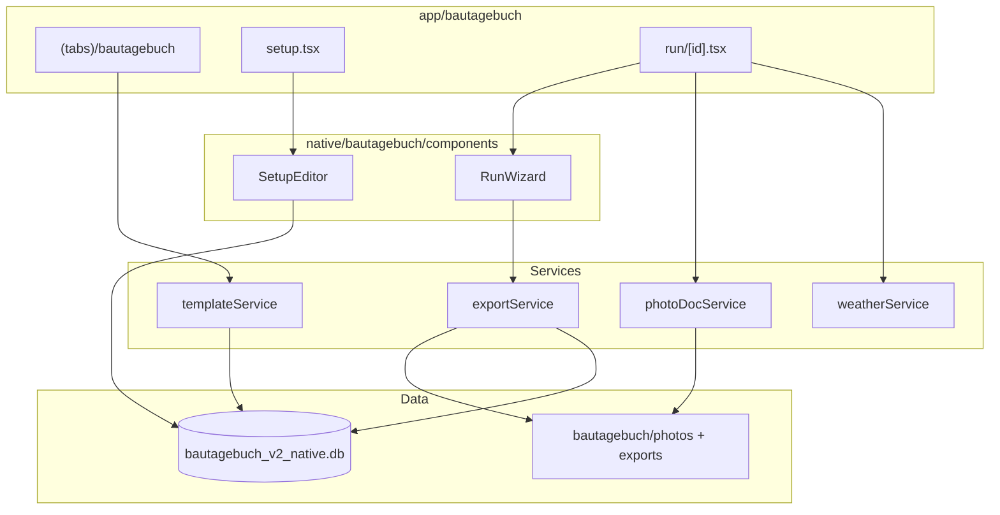

# Bautagebuch — Technische IST-Dokumentation (Expo APK)

> **Stand:** Juli 2026  
> **Zweck:** Vollständige Beschreibung des **elektronischen Bautagebuchs (eBTB)** in der **BÜW-Toolbox Expo-App** für Weiterentwicklung ohne Quellcode-Zugriff.  
> **Scope:** Ausschließlich die native Android-APK (`expo-toolbox/` Modul Bautagebuch). Keine PWA, kein WebView.

---

## Inhaltsverzeichnis

1. [Projektübersicht](#1-projektübersicht)
2. [UI/UX](#2-uiux)
3. [Navigation](#3-navigation)
4. [Funktionen](#4-funktionen)
5. [Datenmodell](#5-datenmodell)
6. [Datenhaltung](#6-datenhaltung)
7. [Template & Setup](#7-template--setup)
8. [Komponenten](#8-komponenten)
9. [State Management](#9-state-management)
10. [Services](#10-services)
11. [Backup & Integrität](#11-backup--integrität)
12. [Sicherheit & Berechtigungen](#12-sicherheit--berechtigungen)
13. [Bekannte Probleme](#13-bekannte-probleme)
14. [Architektur](#14-architektur)
15. [Zusammenfassung](#15-zusammenfassung)

---

## 1. Projektübersicht

### 1.1 Zweck der Anwendung

Das **Bautagebuch** ist ein Modul innerhalb der **BÜW-Toolbox Expo-App** zur Erfassung und zum Export von **elektronischen Bautagebüchern (eBTB)** auf Basis der PDF-Vorlage **Vorlage-eBTB.pdf**.

Kernworkflow:

1. Tab **Bautagebuch** öffnen → Builtin-Template wird geladen
2. Optional: **Setup-Editor** (Felder, Tabellen, Labels)
3. **Neues BTB** starten → Run-Wizard (Sektionen + Fotodokumentation)
4. PDF exportieren (BTB / Fotodoku / komplett) und teilen
5. Exporte auf der Startseite verwalten

### 1.2 Zielgruppe

- Bauleitung, Polier, Projektleitung auf Android-Geräten
- Nutzer der BÜW-Toolbox (zweites Werkzeug neben SiteReport)

### 1.3 Aktueller Entwicklungsstand

| Bereich | Status |
|---------|--------|
| Builtin eBTB-Template (Download) | ✅ |
| PDF-AcroForm-Scan | ✅ |
| Setup-Editor mit Autosave | ✅ |
| BTB-Run-Wizard | ✅ |
| Tabellen (Personal, Leistung) | ✅ |
| Wetter-Sync (Open-Meteo + GPS) | ✅ |
| Fotodokumentation (Kamera) | ✅ |
| PDF-Export (3 Modi) + Share | ✅ |
| Export-Cache auf Home | ✅ |
| BTB-Liste (KW-Gruppierung) | ✅ |
| Live-PDF-Vorschau (Split-Panel) | ❌ (nur Preview-Button) |
| BTB löschen / umbenennen | ❌ (`softDeleteRun` existiert, keine UI) |
| Mehrfach-Löschen | ❌ |
| Pflichtfelder blockieren Export | ❌ (nur Fortschritts-Dots) |
| Galerie für Fotos | ❌ (nur Kamera) |
| XLSX-Export | ❌ |
| Signatur-Erfassung | ❌ |
| Cloud-Sync | ❌ |

### 1.4 Verwendete Technologien

| Technologie | Version (ca.) | Verwendung |
|-------------|---------------|------------|
| Expo SDK | ~57 | Framework |
| React Native | 0.86.x | UI |
| expo-sqlite | ~57 | SQLite |
| expo-file-system | ~57 | PDF, Fotos, Exporte |
| expo-image-picker | ~57 | Kamera |
| expo-image-manipulator | ~57 | Foto-Kompression |
| expo-sharing | ~57 | PDF teilen |
| expo-location | ~57 | GPS für Wetter |
| pdf-lib | 1.17.x | PDF-Export |
| Portierte PWA-Libs | — | `etb-template.js`, `setup-model.js`, `pdf-export.js`, `photo-doc.js` |

### 1.5 Projektstruktur

```
expo-toolbox/
├── app/
│   ├── (tabs)/bautagebuch/index.tsx     # Home (Tab)
│   ├── bautagebuch/setup.tsx            # Setup-Editor
│   └── bautagebuch/run/[id].tsx         # Run-Wizard + Export
├── src/native/bautagebuch/
│   ├── db/database.ts                   # SQLite
│   ├── types.ts
│   ├── components/
│   │   ├── SetupEditor.tsx
│   │   ├── RunWizard.tsx
│   │   └── RunValuesPreview.tsx
│   ├── hooks/useSetupAutosave.ts
│   ├── services/
│   │   ├── templateService.ts
│   │   ├── exportService.ts
│   │   ├── photoDocService.ts
│   │   └── weatherService.ts
│   └── lib/
│       ├── etb-template.js
│       ├── setup-model.js
│       ├── pdf-export.js
│       ├── photo-doc.js
│       ├── pdf-scan-lite.ts
│       └── time-format.js
```

**DB-Datei:** `bautagebuch_v2_native.db`  
**Speicherroot:** `{documentDirectory}bautagebuch/`

---

## 2. UI/UX

### 2.1 Design

- Nutzt **Shared Mobile Components** (`Screen`, `PrimaryButton`, `TextField`, `ListItem`, `Fab`, `EmptyState`)
- Design Tokens aus `src/constants/theme.ts` (wie SiteReport/Toolbox)
- Einspaltiges Layout (kein Split-Panel wie PWA)

### 2.2 Home — `app/(tabs)/bautagebuch/index.tsx`

| Bereich | Inhalt |
|---------|--------|
| Header | „Bautagebuch" / „Elektronisches Bautagebuch (eBTB)" |
| Neues BTB | Textfeld **Bezeichnung** + **BTB starten** |
| Setup | Button **Setup-Editor öffnen** |
| Exporte | Liste mit **PDF teilen** / **Löschen** |
| BTB-Liste | Nach **Kalenderwoche** gruppiert (`ListItem`) |
| FAB | `+` → neues BTB (wie Button) |
| Empty State | Wenn keine Läufe |
| Pull-to-Refresh | Ja |

### 2.3 Setup — `app/bautagebuch/setup.tsx`

- `SetupEditor`-Komponente
- Autosave via `useSetupAutosave` (420 ms Debounce)
- **Setup abschließen** → Status `ready`, zurück
- **PDF-Vorschau** (leeres Setup) via `exportSetupPreviewPdf`

### 2.4 Run — `app/bautagebuch/run/[id].tsx`

- `RunWizard` — Sektionsnavigation, Felder, Tabellen, Wetter, Fotos
- Footer-Buttons:
  - **PDF Vorschau** (`previewRunPdf`, Modus BTB)
  - **Export BTB** / **Export Fotodoku** / **Export komplett**
- Kein permanenter PDF-Split-Screen

---

## 3. Navigation

### 3.1 Expo Router

```
(tabs)/bautagebuch/index          → Tab Home
bautagebuch/setup                 → Stack (showBack)
bautagebuch/run/[id]              → Stack (showBack)
```

Registriert in `app/_layout.tsx` (Stack) und `app/(tabs)/_layout.tsx` (Tab).

### 3.2 Flow

```
Tab Home ──BTB starten──► Run Screen
Tab Home ──Setup-Editor──► Setup Screen
Tab Home ──ListItem tap──► Run Screen
Setup ──zurück/abschließen──► Tab Home
Run ──zurück──► Tab Home
```

---

## 4. Funktionen

### 4.1 Template

| Aspekt | Detail |
|--------|--------|
| Service | `templateService.ensureBuiltinTemplate()` |
| Download | `{toolboxWebBaseUrl}/bautagebuch/templates/Vorlage-eBTB.pdf` |
| Speicher | `bautagebuch/templates/{templateId}.pdf` |
| Scan | `scanTemplatePdfLite()` (pdf-lib, vereinfacht vs. PWA) |
| Setup | `buildEtbSetupModel()` — Version **6** |
| Aktiv | `getActiveTemplateBundle()` — genau ein Builtin-Template |

### 4.2 BTB-Run

| Aspekt | Detail |
|--------|--------|
| Erstellung | `createRun({ templateId, title, setupVersion: 6 })` |
| Titel | `BTB YYYY-MM-DD - {Bezeichnung}` |
| Persistenz | `updateRun()` bei jeder Änderung (values, sectionIndex, photoDoc, status) |
| Sektionen | `buildRunSections(setupModel)` + synthetische `photo-doc`-Sektion |
| Tabellen | `__tableRows:{tableId}` für sichtbare Zeilen |
| Uhrzeit | `normalizeClockTime()` für Beginn/Ende |

### 4.3 Wetter

| Aspekt | Detail |
|--------|--------|
| Service | `weatherService.syncWeatherValues()` |
| GPS | `expo-location` |
| API | Open-Meteo |
| Felder | `Dropdown6`, `Text11`, `Text12` (per `fieldName` in Wetter-Sektion) |
| UI | Button in Run-Wizard, nicht automatisch |

### 4.4 Fotodokumentation

| Aspekt | Detail |
|--------|--------|
| Service | `photoDocService.capturePhotoDocEntry()` |
| Quelle | **Nur Kamera** (`launchCameraAsync`) |
| Kompression | 1600 px Breite, JPEG 0.75 |
| Pfad | `bautagebuch/photos/{runId}/{entryId}.jpg` |
| DB | `photo_assets` + `runs.photoDocJson` |
| Entfernen | Nur aus `photoDoc.entries` — **kein Datei-/DB-Cleanup** |

### 4.5 Export

| Modus | `BautagebuchExportMode` | Datei-Suffix |
|-------|------------------------|--------------|
| BTB | `'btb'` | (keins) |
| Fotodoku | `'photo'` | `_Fotodoku` |
| Kombiniert | `'merged'` | `_komplett` |

- Ausgabe: `bautagebuch/exports/{safeTitle}{suffix}.pdf`
- Share: `expo-sharing` (Android Share Sheet)
- Run-Status → `completed` + `completedAt`
- Ein Export-Record pro `runId` (`upsertExportByRun`)

### 4.6 Nicht in UI verfügbar

- BTB/Run löschen (`softDeleteRun` in DB, ungenutzt)
- Run umbenennen
- Galerie-Fotoauswahl
- Signatur (`Signature1` übersprungen)
- Custom Template Upload

---

## 5. Datenmodell

### 5.1 SQLite `bautagebuch_v2_native.db`

Kein Migrations-Framework — `CREATE TABLE IF NOT EXISTS` bei Init.

### 5.2 Tabelle `templates`

| Spalte | Typ | Pflicht |
|--------|-----|---------|
| `templateId` | TEXT PK | ja |
| `templateName` | TEXT | ja |
| `fileName` | TEXT | ja |
| `templateKind` | TEXT | |
| `mimeType` | TEXT | ja |
| `sizeBytes` | INTEGER | |
| `pageCount` | INTEGER | |
| `pdfPath` | TEXT | ja (lokaler Pfad) |
| `status` | TEXT | `draft` \| `ready` |
| `createdAt`, `updatedAt` | TEXT ISO | ja |
| `deleted_at` | TEXT | Soft-Delete |

### 5.3 Tabelle `detected_fields`

| Spalte | Typ |
|--------|-----|
| `id` | TEXT PK (`{templateId}::{fieldId}`) |
| `templateId`, `fieldId`, `fieldName`, `labelCandidate` | TEXT |
| `type` | TEXT |
| `optionsJson` | TEXT (JSON-Array) |
| `page`, `orderIndex` | INTEGER |
| `rectJson` | TEXT \| null |
| `createdAt`, `updatedAt` | TEXT |

### 5.4 Tabelle `setup_models`

| Spalte | Typ |
|--------|-----|
| `templateId` | TEXT PK |
| `status` | TEXT |
| `version` | INTEGER |
| `setupModelJson` | TEXT (volles JSON) |
| `createdAt`, `updatedAt` | TEXT |

### 5.5 Tabelle `runs`

| Spalte | Typ |
|--------|-----|
| `runId` | TEXT PK |
| `templateId` | TEXT |
| `title` | TEXT |
| `setupVersion` | INTEGER |
| `valuesJson` | TEXT (JSON-Object) |
| `sectionIndex` | INTEGER |
| `status` | TEXT (`draft` \| `completed` \| `deleted`) |
| `photoDocJson` | TEXT (`PhotoDocMeta`) |
| `createdAt`, `updatedAt`, `completedAt` | TEXT |
| `deleted_at` | TEXT |

### 5.6 Tabelle `exports`

| Spalte | Typ |
|--------|-----|
| `exportId` | TEXT PK |
| `runId` | TEXT |
| `fileName` | TEXT |
| `filePath` | TEXT |
| `exportedAt` | TEXT |
| `deleted_at` | TEXT |

### 5.7 Tabelle `photo_assets`

| Spalte | Typ |
|--------|-----|
| `id` | TEXT PK |
| `runId`, `entryId` | TEXT |
| `mimeType` | TEXT |
| `localPath` | TEXT |
| `sizeBytes` | INTEGER |
| `status` | TEXT (default `ready`) |
| `createdAt`, `updatedAt`, `deleted_at` | TEXT |

### 5.8 TypeScript-Typen (`types.ts`)

- `BautagebuchRun`, `BautagebuchExport`, `BautagebuchTemplate`, `DetectedField`
- `PhotoDocEntry`, `PhotoDocMeta`
- `BautagebuchRunStatus`: `'draft' | 'completed' | 'deleted'`

### 5.9 Wert-Schlüssel

Identisch zur PWA:

| Schlüssel | Beispiel |
|-----------|----------|
| `field:{fieldId}` | `field:Date1` |
| `cell:{tableId}:{rowId}:{columnId}` | Zellwerte |
| `__tableRows:{tableId}` | Zeilenanzahl |

---

## 6. Datenhaltung

| Pfad (unter `documentDirectory`) | Inhalt |
|----------------------------------|--------|
| `SQLite/bautagebuch_v2_native.db` | Hauptdatenbank |
| `bautagebuch/templates/` | Template-PDF |
| `bautagebuch/photos/{runId}/` | Foto-JPEGs |
| `bautagebuch/exports/` | Export-PDFs |
| `bautagebuch/previews/` | Setup-Vorschau-PDFs |
| `backups/bautagebuch_v2_native_backup_{stamp}.db` | DB-Backup (Toolbox) |

---

## 7. Template & Setup

### 7.1 Setup-Modell

Gleiche Logik wie PWA (`etb-template.js`, `ETB_SETUP_VERSION = 6`):

- **Kopfdaten** (`header`)
- **Witterung** (`weather`)
- **Baustellenbesetzung** (`table_main_personal`) — 7×7
- **Leistungsblock** (`table_detail_blocks`)
- **Abschluss** (`closing`) — Signatur übersprungen

### 7.2 SetupEditor

- Einzelfeld-Gruppen bearbeiten (Label, required, skipped, reorder)
- Tabellen-Spalten bearbeiten
- Validierung: `validateSetupModel()`
- Autosave: `useSetupAutosave` → `saveSetupModel()`

---

## 8. Komponenten

| Komponente | Datei | Rolle |
|----------|-------|-------|
| `SetupEditor` | `components/SetupEditor.tsx` | Setup-Bearbeitung |
| `RunWizard` | `components/RunWizard.tsx` | Run-UI: Sektionen, Felder, Tabellen, Fotos |
| `RunValuesPreview` | `components/RunValuesPreview.tsx` | Read-only Werte-Vorschau |

**Shared:** `Screen`, `PrimaryButton`, `TextField`, `ListItem`, `Fab`, `EmptyState` aus `src/components/mobile/`.

> `SetupEditor`, `RunWizard`, `RunValuesPreview` nutzen `@ts-nocheck`.

---

## 9. State Management

| Ansatz | Verwendung |
|--------|------------|
| React `useState` | Alle Screens |
| `useCallback` / `useEffect` | Laden, Refresh |
| `useSetupAutosave` | Debounced Setup-Persistenz |
| Kein globaler Store | — |

---

## 10. Services

### 10.1 `templateService.ts`

| Funktion | Beschreibung |
|----------|--------------|
| `ensureBuiltinTemplate()` | Download, Scan, Setup, Persistenz |
| `getActiveTemplateBundle()` | `{ template, setupModel, templateId }` |

### 10.2 `exportService.ts`

| Funktion | Beschreibung |
|----------|--------------|
| `exportRunPdf(runId, mode)` | PDF erzeugen, speichern, teilen |
| `previewRunPdf(runId)` | BTB-Vorschau |
| `exportSetupPreviewPdf(templateId)` | Leeres Setup-PDF |
| `shareCachedExport(exportId)` | Aus Cache teilen / regenerieren |
| `deleteCachedExport(exportId)` | Datei + DB soft-delete |

### 10.3 `photoDocService.ts`

| Funktion | Beschreibung |
|----------|--------------|
| `capturePhotoDocEntry(runId)` | Kamera → Kompression → Speichern |
| `readPhotoBytes(localPath)` | Bytes für PDF-Export |

### 10.4 `weatherService.ts`

| Funktion | Beschreibung |
|----------|--------------|
| `syncWeatherValues()` | GPS + Open-Meteo → `{ weather, tempMin, tempMax }` |

### 10.5 Export-Pipeline

```
exportRunPdf(runId, mode)
  → buildRunPdfBytes()
      → getRun, getActiveTemplateBundle, getTemplate
      → Template-PDF von pdfPath lesen
      → prepareEntries: photoPath → bytes
      → mode 'photo': buildPhotoDocPdfBytes
      → mode 'btb'/'merged': buildFinalPdfBytes(template, setupModel, values)
      → mode 'merged': mergeBtbWithPhotoDoc
  → writeRunExport → bautagebuch/exports/
  → upsertExportByRun
  → Sharing.shareAsync (wenn nicht nur Preview)
  → updateRun status completed
```

---

## 11. Backup & Integrität

### 11.1 Toolbox-Backup

SiteReport/Bautagebuch teilen sich `backupService.ts`:

| Aspekt | Detail |
|--------|--------|
| DB-Datei | `bautagebuch_v2_native.db` |
| Prefix | `bautagebuch_v2_native_backup_` |
| Trigger | `app_background` (primär); Bautagebuch ruft Backup **nicht** direkt auf |
| Rotation | MAX **3** Stamps |
| Fotos/Export-PDFs | **Nicht** im Backup — nur SQLite |

### 11.2 Integrität

- Toolbox-weit: `integrityService.runStartupIntegrityCheck()` (Haupt-DB `buew_toolbox.db`)
- Bautagebuch-spezifische Integrity-Checks: **nicht separat** (anders als PWA `offline-integrity.js`)
- Restore: `restoreDatabaseFromBackup()` stellt alle drei Toolbox-DBs wieder her

---

## 12. Sicherheit & Berechtigungen

| Permission (Android) | Zweck | Abfrage |
|----------------------|-------|---------|
| `CAMERA` | Fotodokumentation | `requestCameraPermissionsAsync()` |
| `ACCESS_FINE_LOCATION` | Wetter-Sync | `expo-location` |
| `ACCESS_COARSE_LOCATION` | Wetter-Sync | `expo-location` |
| `INTERNET` | Template-Download, Open-Meteo | Installationszeit |

| Prinzip | Umsetzung |
|---------|-----------|
| Offline-Kerndaten | SQLite + lokale Dateien |
| Keine Accounts | — |
| Keine Analytics | — |
| Template-Download | Einmalig von konfigurierter Web-URL |
| Export-Teilen | Android Share Sheet (Nutzer wählt Ziel) |

---

## 13. Bekannte Probleme

| ID | Beschreibung | Schwere |
|----|--------------|---------|
| E1 | Kein Run-Löschen in UI | Mittel |
| E2 | Foto-Löschen ohne Datei-Cleanup | Mittel |
| E3 | `photo_assets` nur Write, kein Delete | Niedrig |
| E4 | Pflichtfelder blockieren Export nicht | Mittel |
| E5 | Nur Kamera, keine Galerie | Niedrig |
| E6 | Keine Live-PDF-Vorschau (Split) | UX |
| E7 | `setupVersion: 6` hardcoded bei `createRun` | Niedrig |
| E8 | Signatur übersprungen | Feature-Lücke |
| E9 | Kein SQLite-Migrations-Framework | Mittel |
| E10 | Dropdown-Optionen oft leer (Scan-Lite) | Niedrig |

---

## 14. Architektur



### 14.1 Code-Sharing mit PWA

Folgende Module sind **portiert** aus `bautagebuch-v2/src/lib/`:

- `etb-template.js`, `setup-model.js`, `pdf-export.js`, `photo-doc.js`, `time-format.js`

Anpassungen: Native ersetzt Browser-APIs (`expo-file-system`, `expo-image-manipulator` statt Canvas).

---

## 15. Zusammenfassung

### Was funktioniert

| Feature | Status |
|---------|:------:|
| eBTB-Template laden | ✅ |
| Setup-Editor | ✅ |
| Run-Wizard | ✅ |
| Tabellen & Spezialfelder | ✅ |
| Wetter-Sync | ✅ |
| Fotodokumentation (Kamera) | ✅ |
| PDF-Export (3 Modi) | ✅ |
| Export teilen & verwalten | ✅ |
| KW-gruppierte BTB-Liste | ✅ |

### Was fehlt (vs. PWA)

| Feature | PWA | Expo |
|---------|:---:|:----:|
| Live-PDF-Split-Vorschau | ✅ | ❌ |
| BTB löschen / umbenennen | ✅ | ❌ |
| Pflichtfelder → Export-Sperre | ✅ | ❌ |
| Galerie-Fotos | ✅ | ❌ |
| IndexedDB-eigenes Backup/Restore | ✅ | ⚠️ Toolbox-DB-Backup |
| XLSX | ❌ | ❌ |

### Wichtige Dateien

| Screen | Datei | Route |
|--------|-------|-------|
| Home | `(tabs)/bautagebuch/index.tsx` | `/(tabs)/bautagebuch` |
| Setup | `bautagebuch/setup.tsx` | `/bautagebuch/setup` |
| Run | `bautagebuch/run/[id].tsx` | `/bautagebuch/run/:id` |

---

*Ende der IST-Dokumentation (Bautagebuch Expo APK)*
