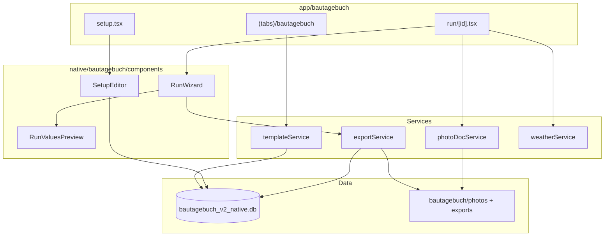

# Bautagebuch — Technische IST-Dokumentation (Expo APK)

> **Stand:** Juli 2026 (erweiterte technische Referenz, Parität mit SiteReport-Doku)  
> **Zweck:** Vollständige Beschreibung des **elektronischen Bautagebuchs (eBTB)** in der **BÜW-Toolbox Expo-App** für Weiterentwicklung ohne Quellcode-Zugriff.  
> **Scope:** Ausschließlich die native Android-APK (`expo-toolbox/` Modul Bautagebuch). Keine PWA, kein WebView.

---

## Inhaltsverzeichnis

1. [Projektübersicht](#1-projektübersicht)
2. [UI/UX](#2-uiux)
3. [Navigation](#3-navigation)
4. [Funktionen](#4-funktionen)
5. [Datenmodell](#5-datenmodell)
6. [Datenhaltung](#6-datenhaltung)
7. [Template & Setup](#7-template--setup)
8. [Komponenten](#8-komponenten)
9. [State Management](#9-state-management)
10. [Services](#10-services)
11. [Backup & Integrität](#11-backup--integrität)
12. [Sicherheit & Berechtigungen](#12-sicherheit--berechtigungen)
13. [Bekannte Probleme](#13-bekannte-probleme)
14. [Architektur](#14-architektur)
15. [Verbesserungspotential](#15-verbesserungspotential)
16. [Zusammenfassung](#16-zusammenfassung)
17. [Build- und Laufzeitumgebung](#17-build--und-laufzeitumgebung)
18. [App-Konfiguration](#18-app-konfiguration)
19. [Vollständiges SQLite-Datenmodell](#19-vollständiges-sqlite-datenmodell)
20. [Datenfluss und Lifecycle](#20-datenfluss-und-lifecycle)
21. [Fehlerhandling](#21-fehlerhandling)
22. [Backup- und Restore-System](#22-backup--und-restore-system)
23. [Export-Spezifikation](#23-export-spezifikation)
24. [Datenschutz und Berechtigungen](#24-datenschutz-und-berechtigungen)
25. [Performance und Skalierung](#25-performance-und-skalierung)

---

## 1. Projektübersicht

### 1.1 Zweck der Anwendung

Das **Bautagebuch** ist ein Modul innerhalb der **BÜW-Toolbox Expo-App** zur Erfassung und zum Export von **elektronischen Bautagebüchern (eBTB)** auf Basis der PDF-Vorlage **Vorlage-eBTB.pdf**.

Kernworkflow:

1. Tab **Bautagebuch** öffnen → Builtin-Template wird geladen (Download von Toolbox-Web-URL)
2. Optional: **Setup-Editor** (Felder, Tabellen, Labels, Pflicht/Skip)
3. **Neues BTB** starten → Run-Wizard (Sektionen + Fotodokumentation)
4. PDF exportieren (BTB / Fotodoku / komplett) und per Share Sheet teilen
5. Exporte auf der Startseite verwalten (teilen, löschen)

Die App wird als **standalone Release-APK** verteilt (eingebettetes JS-Bundle).

### 1.2 Zielgruppe

- Bauleitung, Polier, Projektleitung auf Android-Geräten
- Nutzer der BÜW-Toolbox (zweites Werkzeug neben SiteReport)

### 1.3 Aktueller Entwicklungsstand

| Bereich | Status |
|---------|--------|
| Builtin eBTB-Template (Download) | ✅ |
| PDF-AcroForm-Scan (Lite) | ✅ |
| Setup-Editor mit Autosave | ✅ |
| BTB-Run-Wizard | ✅ |
| Tabellen (Personal, Leistung) | ✅ |
| Gewerk / Schicht Spezial-UI | ✅ |
| Wetter-Sync (Open-Meteo + GPS) | ✅ |
| Fotodokumentation (Kamera) | ✅ |
| PDF-Export (3 Modi) + Share | ✅ |
| Export-Cache auf Home | ✅ |
| BTB-Liste (KW-Gruppierung) | ✅ |
| Live-PDF-Vorschau (Split-Panel) | ❌ (nur Preview-Button + Share) |
| BTB löschen / umbenennen | ❌ (`softDeleteRun` existiert, keine UI) |
| Mehrfach-Löschen | ❌ |
| Pflichtfelder blockieren Export | ❌ (nur Fortschritts-Dots) |
| Galerie für Fotos | ❌ (nur Kamera) |
| Foto-Löschen mit Datei-Cleanup | ❌ |
| Bautagebuch-spezifische Integritätsprüfung | ❌ |
| XLSX-Export | ❌ |
| Signatur-Erfassung | ❌ |
| Cloud-Sync | ❌ |

**Fazit:** Die Expo-App hat **Kern-Parität** zur PWA (Template, Setup, Run, Export), aber **UX-Lücken** bei Run-Verwaltung, Pflichtfeld-Sperre, Live-Vorschau und Foto-Cleanup.

### 1.4 Verwendete Technologien

| Technologie | Version (ca.) | Verwendung |
|-------------|---------------|------------|
| Expo SDK | ~57 | Framework |
| React Native | 0.86.x | UI |
| React | 19.2.x | UI |
| TypeScript | 5.9.x | Typsicherheit (teilweise `@ts-nocheck` in Komponenten) |
| Expo Router | ~57 | File-based Navigation |
| expo-sqlite | ~57 | SQLite |
| expo-file-system | ~57 | PDF, Fotos, Exporte |
| expo-image-picker | ~57 | Kamera |
| expo-image-manipulator | ~57 | Foto-Kompression |
| expo-sharing | ~57 | Share Sheet |
| expo-location | ~57 | GPS für Wetter |
| pdf-lib | 1.17.x | PDF-Export |
| Portierte PWA-Libs | — | `etb-template.js`, `setup-model.js`, `pdf-export.js`, `photo-doc.js` |

**Nicht verwendet:** WebView, Redux, Zustand, pdfjs-dist (nur pdf-lib Lite-Scan).

### 1.5 APK-Build & Verteilung

| Aspekt | Detail |
|--------|--------|
| Projekt | `expo-toolbox/` |
| CI-Workflow | `.github/workflows/android-apk.yml` |
| Trigger | Push auf `main` bei Änderungen in `expo-toolbox/**` oder `shared/**` |
| Build | `npx expo prebuild --platform android` → `./gradlew assembleRelease` |
| Release-Asset | `buew-toolbox-<version>-<sha>.apk` |

Details: [`ANDROID_APK.md`](ANDROID_APK.md)

### 1.6 Projektstruktur

```
expo-toolbox/
├── app/
│   ├── _layout.tsx                      # Root Stack, DB-Init, ToastProvider
│   ├── (tabs)/
│   │   ├── index.tsx                    # Toolbox-Home
│   │   └── bautagebuch/index.tsx        # Bautagebuch-Home (Tab)
│   └── bautagebuch/
│       ├── setup.tsx                    # Setup-Editor
│       └── run/[id].tsx                 # Run-Wizard + Export
├── src/
│   ├── components/mobile/               # Shared UI (Screen, Button, …)
│   ├── constants/theme.ts               # Design Tokens
│   ├── hooks/useOfflineBootstrap.ts     # Backup/Restore Banner
│   ├── storage/backupService.ts         # Multi-DB-Backup
│   └── native/bautagebuch/
│       ├── db/database.ts               # SQLite + Typen
│       ├── types.ts
│       ├── components/
│       │   ├── SetupEditor.tsx
│       │   ├── RunWizard.tsx
│       │   └── RunValuesPreview.tsx
│       ├── hooks/useSetupAutosave.ts
│       ├── services/
│       │   ├── templateService.ts
│       │   ├── exportService.ts
│       │   ├── photoDocService.ts
│       │   └── weatherService.ts
│       └── lib/
│           ├── etb-template.js
│           ├── setup-model.js
│           ├── pdf-export.js
│           ├── photo-doc.js
│           ├── pdf-scan-lite.ts
│           └── time-format.js
├── app.config.js
└── package.json
```

**DB-Datei:** `bautagebuch_v2_native.db`  
**Speicherroot:** `{documentDirectory}bautagebuch/`

---

## 2. UI/UX

### 2.1 Design Tokens

Nutzt **Shared Mobile Components** und Tokens aus `expo-toolbox/src/constants/theme.ts` (identisch zu SiteReport/Toolbox):

| Token | Wert | Verwendung |
|-------|------|------------|
| `colors.bg` | `#F2F0EB` | Hintergrund |
| `colors.ink` | `#1A1916` | Primärtext |
| `colors.accent` | `#C44B32` | Primär-Aktion |
| `colors.panel` | `#FFFCF7` | Karten |
| Font | Space Grotesk | Gesamte App |

**Stil:** Einspaltiges natives Layout (kein Split-Panel wie PWA). Karten, ListItems, FAB.

---

### 2.2 Home — Bautagebuch-Tab

**Datei:** `app/(tabs)/bautagebuch/index.tsx`  
**Route:** `/(tabs)/bautagebuch`

#### Aufbau

1. **Header** — „Bautagebuch" / „Elektronisches Bautagebuch (eBTB)"
2. **Neues BTB** — `TextField` **Bezeichnung** + Button **BTB starten**
3. **Setup** — Button **Setup-Editor öffnen**
4. **Exporte** — Liste mit **PDF teilen** / **Löschen** (`ExportCard`-ähnlich via `ListItem`)
5. **BTB-Liste** — nach **Kalenderwoche** gruppiert
6. **FAB** — `+` startet neues BTB (wie Button)
7. **Empty State** — wenn keine Läufe

#### Interaktion

- Pull-to-Refresh
- Mount: `ensureBuiltinTemplate()`, `listRuns()`, `listExports()`
- Listeneintrag → `/bautagebuch/run/{runId}`
- Export teilen: `shareCachedExport(exportId)`
- Export löschen: `Alert` → `deleteCachedExport(exportId)`

---

### 2.3 Setup-Editor

**Datei:** `app/bautagebuch/setup.tsx` + `SetupEditor.tsx`  
**Route:** `/bautagebuch/setup`

#### Aufbau

1. **Modus-Tabs** — „Gruppen" (Einzel-Sektionen) / „Tabellen"
2. **Gruppen-Modus** — Sektionsliste, Feld-Editor (Label, Pflicht, Skip, ↑↓, Gruppe wechseln)
3. **Tabellen-Modus** — Tabellenliste, Spalten-Editor
4. **Footer** — PDF-Vorschau, Setup abschließen

#### Interaktion

- Autosave **420 ms** (`useSetupAutosave`)
- Statuszeile: „Änderungen werden gespeichert…"
- **Setup abschließen** → `flush()` → `validateSetupModel` → `saveSetupModel(..., 'ready')` → `router.back()`
- **PDF-Vorschau** → `exportSetupPreviewPdf()` → Share Sheet

---

### 2.4 Run-Wizard

**Datei:** `app/bautagebuch/run/[id].tsx` + `RunWizard.tsx`  
**Route:** `/bautagebuch/run/:id`

#### Aufbau

1. **Sektions-Dots** — Fortschritt (`todo` / `progress` / `done`)
2. **Aktive Sektion** — Felder, Tabellen, Spezial-UI
3. **RunValuesPreview** — Read-only Werte der aktuellen Sektion (kein PDF-Canvas)
4. **Footer** — Zurück / Weiter (letzte Sektion: „Fertig" — schließt Run nicht ab)
5. **Export-Bereich** (Screen-Footer):
   - **PDF Vorschau** (`previewRunPdf`)
   - **PDF exportieren** → Alert: Nur BTB / Nur Fotodoku / Zusammengeführt

#### Spezial-UI (RunWizard)

| Sektion | Verhalten |
|---------|-----------|
| `single:header` | Gewerk-Chips (`Text3`, `Text5–8`, exklusiv); Schicht-Checkboxen (`Check Box1–3`) |
| `single:weather` | Felder + Button **Wetter aktualisieren** |
| `table:*` | Dynamische Zeilen, Uhrzeit-Normalisierung bei Beginn/Ende |
| `photo-doc` | Ja/Nein-Chips, Kamera-Button, Vorschau, Entfernen |

#### Unterschied zur PWA

- **Kein** permanenter PDF-Split-Screen
- **Kein** Export-Block bei fehlenden Pflichtfeldern
- **Kein** Umbenennen/Löschen von Runs

---

## 3. Navigation

### 3.1 Expo Router Struktur

```
Root Stack (_layout.tsx) + ToastProvider
├── (tabs)
│   ├── index                    # Toolbox-Home
│   ├── sitereport/index
│   └── bautagebuch/index        # Bautagebuch-Home (Tab)
├── bautagebuch/setup
└── bautagebuch/run/[id]
```

Registriert in `app/_layout.tsx` (Stack) und `app/(tabs)/_layout.tsx` (Tab).

### 3.2 Screen-Hierarchie

```
Tab Home (Bautagebuch)
├── BTB starten / FAB ──► Run Screen
├── Setup-Editor ──► Setup Screen
├── ListItem tap ──► Run Screen
├── Export teilen/löschen (inline)
Setup ──zurück/abschließen──► Tab Home
Run ──zurück──► Tab Home
```

### 3.3 Deep Links

- `bautagebuch/setup`
- `bautagebuch/run/<id>`

---

## 4. Funktionen

### 4.1 Template

| Aspekt | Detail |
|--------|--------|
| Service | `templateService.ensureBuiltinTemplate()` |
| Download | `{toolboxWebBaseUrl}/bautagebuch/templates/Vorlage-eBTB.pdf` |
| Default-URL | `https://kclk08.github.io/buew-toolbox` |
| Speicher | `bautagebuch/templates/Vorlage-eBTB.pdf` |
| Scan | `scanTemplatePdfLite()` (pdf-lib only) |
| Setup | `buildEtbSetupModel()` — `ETB_SETUP_VERSION = 6` |
| Re-Init | Wenn `setupModel.version < 6` → erneuter Download/Scan |

### 4.2 BTB-Run

| Aspekt | Detail |
|--------|--------|
| Erstellung | `createRun({ templateId, title, setupVersion: 6 })` |
| Run-ID | `runv2_{Date.now()}_{random7}` |
| Titel | `BTB YYYY-MM-DD - {Bezeichnung}` |
| Persistenz | **Sofort** `updateRun()` bei jeder Änderung (kein Debounce) |
| Sektionen | `buildRunSections(setupModel)` + synthetische `photo-doc` |
| Tabellen | `__tableRows:{tableId}` für sichtbare Zeilen |
| Uhrzeit | `normalizeClockTime()` für Beginn/Ende |
| Abschluss | Nur via Export → `status: 'completed'`, `completedAt` |

### 4.3 Wetter

| Aspekt | Detail |
|--------|--------|
| Service | `weatherService.syncWeatherValues()` |
| GPS | `expo-location` (`Accuracy.Balanced`) |
| API | Open-Meteo (`current` + `daily`) |
| Felder | `Dropdown6`, `Text11`, `Text12` (per `fieldName` in Wetter-Sektion) |
| Mapping | WMO-Codes → deutsche Wetterbegriffe (hardcoded in `mapWeatherCode`) |

### 4.4 Fotodokumentation

| Aspekt | Detail |
|--------|--------|
| Service | `photoDocService.capturePhotoDocEntry(runId)` |
| Quelle | **Nur Kamera** (`launchCameraAsync`, quality 0.8) |
| Kompression | Breite **1600 px**, JPEG **0.75** |
| Pfad | `bautagebuch/photos/{runId}/photo_{timestamp}.jpg` |
| DB | `photo_assets` + `runs.photoDocJson` |
| Entfernen | Nur aus `photoDoc.entries` — **kein** Datei-/DB-Cleanup |

### 4.5 Export

| Modus | `BautagebuchExportMode` | Suffix |
|-------|------------------------|--------|
| BTB | `'btb'` | (keins) |
| Fotodoku | `'photo'` | `_Fotodoku` |
| Kombiniert | `'merged'` | `_komplett` |

- Ausgabe: `bautagebuch/exports/{safeTitle}{suffix}.pdf`
- `safeTitle`: sanitized, max. **80** Zeichen
- Share: `expo-sharing` (wenn verfügbar)
- Cache: `upsertExportByRun` — ein Export-Record pro `runId`

### 4.6 Nicht in UI verfügbar

- BTB/Run löschen (`softDeleteRun` in DB, ungenutzt)
- Run umbenennen
- Galerie-Fotoauswahl / Bild ersetzen
- Signatur (`Signature1` übersprungen)
- Custom Template Upload
- Pflichtfeld-Export-Sperre

---

## 5. Datenmodell

SQLite-Schema für Bautagebuch ist **stabil und ohne Migrations-Framework** (`CREATE TABLE IF NOT EXISTS`). Vollständige Beschreibung: **Kapitel 19**.

### 5.1 Kern-Typen (`types.ts`)

| Typ | Beschreibung |
|-----|--------------|
| `BautagebuchRun` | Run inkl. deserialisiertem `values` + `photoDoc` |
| `BautagebuchExport` | Export-Cache-Metadaten |
| `BautagebuchTemplate` | Template-Metadaten + `pdfPath` |
| `DetectedField` | Gescanntes AcroForm-Feld |
| `PhotoDocEntry` / `PhotoDocMeta` | Fotodokumentation |
| `BautagebuchRunStatus` | `'draft' \| 'completed' \| 'deleted'` |

### 5.2 Wert-Schlüssel

Identisch zur PWA:

| Schlüssel | Beispiel |
|-----------|----------|
| `field:{fieldId}` | `field:Date1` |
| `cell:{tableId}:{rowId}:{columnId}` | Zellwerte |
| `__tableRows:{tableId}` | Zeilenanzahl |

### 5.3 Soft Delete

- `softDeleteRun(runId)` setzt `deleted_at` + `status: 'deleted'`
- `listRuns()` / `getRun()` filtern via `isActive()` (leeres `deleted_at`)
- Export: `deleteExport(exportId)` soft-delete

---

## 6. Datenhaltung

### 6.1 SQLite

`bautagebuch_v2_native.db` — Pfad: `{documentDirectory}SQLite/bautagebuch_v2_native.db`  
**PRAGMA:** `foreign_keys = ON`, `journal_mode = WAL`

### 6.2 Dateispeicherung

| Pfad (relativ zu `documentDirectory`) | Inhalt |
|---------------------------------------|--------|
| `SQLite/bautagebuch_v2_native.db` | Hauptdatenbank |
| `bautagebuch/templates/` | Template-PDF |
| `bautagebuch/photos/{runId}/` | Foto-JPEGs |
| `bautagebuch/exports/` | Export-PDFs |
| `bautagebuch/previews/` | Setup-Vorschau-PDFs |
| `backups/bautagebuch_v2_native_backup_{stamp}.db` | DB-Backup |

### 6.3 Foto-Pipeline

```
launchCameraAsync
  → ImageManipulator (resize 1600px, compress 0.75, JPEG)
  → FileSystem.write → bautagebuch/photos/{runId}/photo_{ts}.jpg
  → savePhotoAsset() + photoDoc.entries update
```

---

## 7. Template & Setup

### 7.1 Setup-Modell

Gleiche Logik wie PWA (`etb-template.js`, `ETB_SETUP_VERSION = 6`):

| Sektion | sectionId |
|---------|-----------|
| Kopfdaten | `header` |
| Witterung | `weather` |
| Baustellenbesetzung | `table_main_personal` (7×7) |
| Leistungsblock | `table_detail_blocks` (1×5) |
| Abschluss | `closing` (Signatur skipped) |

### 7.2 SetupEditor

- Einzelfeld-Gruppen: Label, required, skipped, reorder, Gruppe wechseln (`Alert`)
- Tabellen: Spalten-Label, required, skipped
- Validierung: `validateSetupModel()` blockiert Abschluss
- Mutations: `mutateSetupModel()` aus `useSetupAutosave`

### 7.3 Scan-Unterschied (Lite)

`pdf-scan-lite.ts`: keine pdfjs, keine `rect`, keine `options`, alle Felder `page: 1` → Dropdown-Chips oft leer.

---

## 8. Komponenten

### 8.1 Bautagebuch (`src/native/bautagebuch/components/`)

| Komponente | Datei | Zweck |
|----------|-------|-------|
| `SetupEditor` | `SetupEditor.tsx` | Setup-Bearbeitung (Gruppen/Tabellen) |
| `RunWizard` | `RunWizard.tsx` | Run-UI: Sektionen, Felder, Tabellen, Fotos |
| `RunValuesPreview` | `RunValuesPreview.tsx` | Read-only Werte-Vorschau (Text) |

> Alle drei nutzen `@ts-nocheck`.

### 8.2 Shared Mobile (`src/components/mobile/`)

`Screen`, `PrimaryButton`, `TextField`, `ListItem`, `Fab`, `EmptyState`, `Card`

### 8.3 Screens

| Screen | Datei |
|--------|-------|
| Home | `app/(tabs)/bautagebuch/index.tsx` |
| Setup | `app/bautagebuch/setup.tsx` |
| Run | `app/bautagebuch/run/[id].tsx` |

---

## 9. State Management

| Ansatz | Verwendung |
|--------|------------|
| React `useState` | Alle Screens |
| `useCallback` / `useEffect` | Laden, Refresh |
| `useSetupAutosave` | Debounced Setup-Persistenz (420 ms) |
| Kein globaler Store | Run-State im Screen, sofort persistiert |

---

## 10. Services

### 10.1 `database.ts`

CRUD für templates, detected_fields, setup_models, runs, exports, photo_assets; `softDeleteRun`, `nowIso()`.

### 10.2 `templateService.ts`

| Funktion | Beschreibung |
|----------|--------------|
| `ensureBuiltinTemplate()` | Download, Scan, Setup, Persistenz |
| `getActiveTemplateBundle()` | `{ template, setupModel, templateId }` |

### 10.3 `exportService.ts`

| Funktion | Beschreibung |
|----------|--------------|
| `buildRunPdfBytes(runId, mode)` | PDF-Bytes generieren |
| `exportRunPdf(runId, mode)` | Schreiben + Share (Default: `merged`) |
| `previewRunPdf(runId)` | BTB-Vorschau + Share |
| `exportSetupPreviewPdf(templateId)` | Leeres Setup-PDF |
| `shareCachedExport(exportId)` | Aus Cache teilen / regenerieren |
| `deleteCachedExport(exportId)` | Datei löschen + soft-delete |

### 10.4 `photoDocService.ts`

| Funktion | Beschreibung |
|----------|--------------|
| `capturePhotoDocEntry(runId)` | Kamera → Kompression → Speichern |
| `readPhotoBytes(localPath)` | Bytes für PDF-Export |

### 10.5 `weatherService.ts`

| Funktion | Beschreibung |
|----------|--------------|
| `syncWeatherValues()` | GPS + Open-Meteo → `{ weather, tempMin, tempMax }` |

---

## 11. Backup & Integrität

### 11.1 Toolbox-Backup (Kurzübersicht)

Bautagebuch nutzt `backupService.ts` auf Toolbox-Ebene — **kein** eigenes IndexedDB-Backup.

| Aspekt | Detail |
|--------|--------|
| DB-Datei | `bautagebuch_v2_native.db` |
| Prefix | `bautagebuch_v2_native_backup_` |
| MAX_BACKUPS | **3** |
| MIN_INTERVAL | **60 s** |

Details: **Kapitel 22**.

### 11.2 Integrität

- Toolbox-weit: `integrityService.runStartupIntegrityCheck()` (Haupt-DB)
- **Keine** bautagebuch-spezifische Prüfung (anders als PWA `offline-integrity.js`)
- Restore: `restoreDatabaseFromBackup()` → `resetBautagebuchDatabaseConnection()`

---

## 12. Sicherheit & Berechtigungen

| Permission (Android) | Zweck | Abfrage |
|----------------------|-------|---------|
| `CAMERA` | Fotodokumentation | `requestCameraPermissionsAsync()` |
| `ACCESS_FINE_LOCATION` | Wetter-Sync | `expo-location` |
| `ACCESS_COARSE_LOCATION` | Wetter-Sync | `expo-location` |
| `INTERNET` | Template-Download, Open-Meteo | Installationszeit |

| Prinzip | Umsetzung |
|---------|-----------|
| Offline-Kerndaten | SQLite + lokale Dateien |
| Keine Accounts | — |
| Keine Analytics | — |
| Template-Download | Einmalig von konfigurierter Web-URL |
| Export | Android Share Sheet |

---

## 13. Bekannte Probleme

| ID | Beschreibung | Schwere |
|----|--------------|---------|
| E1 | Kein Run-Löschen in UI | Mittel |
| E2 | Foto-Löschen ohne Datei-Cleanup | Mittel |
| E3 | `photo_assets` nur Write, kein Delete | Niedrig |
| E4 | Pflichtfelder blockieren Export nicht | Mittel |
| E5 | Nur Kamera, keine Galerie | Niedrig |
| E6 | Keine Live-PDF-Vorschau (Split) | UX |
| E7 | `setupVersion: 6` hardcoded bei `createRun` | Niedrig |
| E8 | Signatur übersprungen | Feature-Lücke |
| E9 | Kein SQLite-Migrations-Framework | Mittel |
| E10 | Dropdown-Optionen oft leer (Scan-Lite) | Niedrig |
| E11 | `requiredAnyGroups` nicht an `sectionProgressState` übergeben | Niedrig |
| E12 | Sofortiges `updateRun` bei jeder Taste (kein Debounce) | Performance |

### Parität vs. PWA

| Feature | PWA | Expo |
|---------|:---:|:----:|
| Live-PDF-Split-Vorschau | ✅ | ❌ |
| BTB löschen / umbenennen | ✅ | ❌ |
| Pflichtfelder → Export-Sperre | ✅ | ❌ |
| Galerie-Fotos | ✅ | ❌ |
| Foto-Cleanup beim Löschen | ✅ | ❌ |
| Vollständiger PDF-Scan (pdfjs) | ✅ | ❌ |
| IndexedDB-eigenes Backup | ✅ | ⚠️ Toolbox-DB-Backup |

---

## 14. Architektur

### 14.1 Schichten

| Schicht | Verantwortung |
|---------|---------------|
| Screens (`app/bautagebuch/`) | Navigation, lokaler State |
| `components/` | Präsentation (SetupEditor, RunWizard) |
| `services/` | Template, Export, Fotos, Wetter |
| `db/database.ts` | Persistenz |
| `lib/*.js` | Portierte PDF/Setup-Logik |

### 14.2 Diagramm



### 14.3 Code-Sharing mit PWA

Portiert aus `bautagebuch-v2/src/lib/`:

- `etb-template.js`, `setup-model.js`, `pdf-export.js`, `photo-doc.js`, `time-format.js`

Anpassungen: Native ersetzt Browser-APIs; `photo-doc.js` erweitert für `Uint8Array`-Embeds.

---

## 15. Verbesserungspotential

- **Parität zur PWA:** Run löschen/umbenennen, Pflichtfeld-Sperre, Galerie
- **pdfjs-Scan** oder Optionen-Seed für Dropdowns
- **Live-PDF-Vorschau** (WebView oder native PDF-Renderer)
- **Foto-Cleanup** bei Entfernen + `deleteRunCascade` UI
- **Run-Autosave Debounce** (450 ms wie PWA)
- **Schema-Migrationen** (`PRAGMA user_version`)
- **Bautagebuch-Integritätsprüfung** analog PWA
- **Signatur-Widget**

---

## 16. Zusammenfassung

### Was funktioniert

| Feature | Status |
|---------|:------:|
| eBTB-Template laden | ✅ |
| Setup-Editor | ✅ |
| Run-Wizard | ✅ |
| Tabellen & Spezialfelder | ✅ |
| Wetter-Sync | ✅ |
| Fotodokumentation (Kamera) | ✅ |
| PDF-Export (3 Modi) | ✅ |
| Export teilen & verwalten | ✅ |
| KW-gruppierte BTB-Liste | ✅ |

### Was fehlt (vs. PWA)

- Live-PDF-Split-Vorschau
- BTB löschen / umbenennen / Mehrfach-Löschen
- Pflichtfelder blockieren Export
- Galerie-Fotos
- Vollständiger PDF-Scan
- Foto-Datei-Cleanup

### Nächste Schritte

1. Run-Verwaltung UI (`softDeleteRun` anbinden)
2. `requiredMissingCount` vor Export prüfen
3. On-Device-Test: Template-Download offline vs. online
4. Foto-Löschen mit `FileSystem.deleteAsync`

---

## 17. Build- und Laufzeitumgebung

> Werte aus `package.json`, CI-Workflow und Expo-Defaults. Nach SDK-Upgrade **zu prüfen**.

### 17.1 Entwicklungsumgebung

| Komponente | Version / Wert | Quelle |
|------------|----------------|--------|
| **Node.js** | **22** | GitHub Actions |
| **Paketmanager** | **npm** (`npm ci`) | CI |
| **TypeScript** | ~5.9.2 | `package.json` |
| **Expo SDK** | ~57.0.7 | `package.json` |
| **React Native** | 0.86.0 | `package.json` |
| **React** | 19.2.3 | `package.json` |

### 17.2 Android-Build (nach `expo prebuild`)

| Komponente | Version / Wert |
|------------|----------------|
| **Java (JDK)** | **17** |
| **Gradle** | **9.3.1** |
| **compileSdk / targetSdk** | **35** |
| **minSdk** | **24** |
| **Hermes** | aktiviert |
| **New Architecture** | aktiviert |

### 17.3 Build-Befehle

| Zweck | Befehl | Arbeitsverzeichnis |
|-------|--------|-------------------|
| Abhängigkeiten | `npm ci` | `expo-toolbox/` |
| Typecheck | `npm run typecheck` | `expo-toolbox/` |
| Dev-Server | `npm start` | `expo-toolbox/` |
| Release-APK | `./gradlew assembleRelease` | `expo-toolbox/android/` |

### 17.4 Laufzeit auf dem Gerät

| Aspekt | Detail |
|--------|--------|
| Betriebssystem | Android ≥ API 24 |
| Datenbank | `expo-sqlite`, `bautagebuch_v2_native.db` |
| Dateisystem | `expo-file-system` → `documentDirectory` |
| Template-Download | Erfordert **INTERNET** beim ersten Start |

---

## 18. App-Konfiguration

**Datei:** `expo-toolbox/app.config.js`  
Bautagebuch ist ein **Modul innerhalb der BÜW-Toolbox**.

### 18.1 Identität

| Eigenschaft | Wert |
|-------------|------|
| **App-Name** | `BÜW-Toolbox` |
| **Android Package** | `de.buew.toolbox` |
| **Scheme** | `buew-toolbox` |
| **version** | `1.0.0` |
| **userInterfaceStyle** | `light` |

### 18.2 Expo-Plugins (relevant für Bautagebuch)

| Plugin | Wirkung |
|--------|---------|
| `expo-router` | Navigation |
| `expo-sqlite` | SQLite |
| `expo-image-picker` | Kamera |
| `expo-location` | GPS (Wetter) |

### 18.3 Android-Berechtigungen

**Explizit in `app.config.js`:**

| Permission | Zweck |
|------------|-------|
| `CAMERA` | Fotodokumentation |
| `ACCESS_FINE_LOCATION` | Wetter-Sync |
| `ACCESS_COARSE_LOCATION` | Wetter-Sync |

**iOS (vorhanden, Fokus Android):**

| Key | Text |
|-----|------|
| `NSCameraUsageDescription` | Fotodokumentation |
| `NSLocationWhenInUseUsageDescription` | Wettererfassung Bautagebuch |

### 18.4 Umgebungsvariablen (`extra`)

| Variable | Default | Verwendung |
|----------|---------|------------|
| `EXPO_PUBLIC_TOOLBOX_WEB_BASE_URL` | `https://kclk08.github.io/buew-toolbox` | Template-Download-URL |
| `toolboxWebBaseUrl` | gleich | `templateService.TEMPLATE_URL` |

---

## 19. Vollständiges SQLite-Datenmodell

**Datenbankdatei:** `bautagebuch_v2_native.db`  
**Initialisierung:** `initBautagebuchDatabase()` → `getDb()`  
**Migrations-Framework:** **keines**

### 19.1 Tabelle `templates`

| Spalte | SQLite-Typ | Pflicht | Beschreibung |
|--------|------------|---------|--------------|
| `templateId` | TEXT PK | ja | `tplv2_{timestamp}` |
| `templateName` | TEXT | ja | `Vorlage-eBTB` |
| `fileName` | TEXT | ja | `Vorlage-eBTB.pdf` |
| `templateKind` | TEXT | | `builtin-etb` |
| `mimeType` | TEXT | ja | `application/pdf` |
| `sizeBytes` | INTEGER | | |
| `pageCount` | INTEGER | | Default 1 |
| `pdfPath` | TEXT | ja | Absoluter Pfad zur PDF |
| `status` | TEXT | | `draft` \| `ready` |
| `createdAt`, `updatedAt` | TEXT | ja | ISO-8601 |
| `deleted_at` | TEXT | | Soft-Delete |

### 19.2 Tabelle `detected_fields`

| Spalte | SQLite-Typ | Beschreibung |
|--------|------------|--------------|
| `id` | TEXT PK | `{templateId}::{fieldId}` |
| `templateId` | TEXT | |
| `fieldId` | TEXT | Slug aus Scan |
| `fieldName` | TEXT | AcroForm-Name |
| `labelCandidate` | TEXT | Humanized Name (Lite-Scan) |
| `type` | TEXT | Feldtyp |
| `optionsJson` | TEXT | JSON-Array (meist `[]` bei Lite-Scan) |
| `page` | INTEGER | Meist **1** |
| `orderIndex` | INTEGER | |
| `rectJson` | TEXT | Meist `null` |
| `createdAt`, `updatedAt` | TEXT | |

### 19.3 Tabelle `setup_models`

| Spalte | SQLite-Typ | Beschreibung |
|--------|------------|--------------|
| `templateId` | TEXT PK | |
| `status` | TEXT | `draft` \| `ready` |
| `version` | INTEGER | **6** |
| `setupModelJson` | TEXT | Vollständiges Setup-JSON |
| `createdAt`, `updatedAt` | TEXT | |

### 19.4 Tabelle `runs`

| Spalte | SQLite-Typ | Beschreibung |
|--------|------------|--------------|
| `runId` | TEXT PK | `runv2_{ts}_{rand}` |
| `templateId` | TEXT | |
| `title` | TEXT | `BTB YYYY-MM-DD - {Name}` |
| `setupVersion` | INTEGER | **6** |
| `valuesJson` | TEXT | JSON-Object |
| `sectionIndex` | INTEGER | Aktuelle Sektion |
| `status` | TEXT | `draft` \| `completed` \| `deleted` |
| `photoDocJson` | TEXT | `PhotoDocMeta` |
| `createdAt`, `updatedAt` | TEXT | |
| `completedAt` | TEXT | Nach Export |
| `deleted_at` | TEXT | Soft-Delete |

**Beispiel `valuesJson`:**

```json
{
  "field:Date1": "21.07.2026",
  "field:Text1": "Musterprojekt",
  "field:Text2": "Kazim Celik",
  "cell:table_main_personal:r1:c1": "BÜW GmbH",
  "__tableRows:table_main_personal": 2
}
```

**Beispiel `photoDocJson`:**

```json
{
  "enabled": true,
  "entries": [
    {
      "id": "photo_1721234567890",
      "createdAt": "2026-07-21T10:00:00.000Z",
      "mimeType": "image/jpeg",
      "localPath": "file:///.../bautagebuch/photos/runv2_.../photo_....jpg"
    }
  ],
  "updatedAt": "2026-07-21T10:05:00.000Z"
}
```

### 19.5 Tabelle `exports`

| Spalte | SQLite-Typ | Beschreibung |
|--------|------------|--------------|
| `exportId` | TEXT PK | `export_{runId}` oder `export_{ts}_…` |
| `runId` | TEXT | |
| `fileName` | TEXT | |
| `filePath` | TEXT | Absoluter Pfad |
| `exportedAt` | TEXT | ISO-8601 |
| `deleted_at` | TEXT | Soft-Delete |

**Beziehung:** Typischerweise **ein** Export-Record pro `runId` (`upsertExportByRun`).

### 19.6 Tabelle `photo_assets`

| Spalte | SQLite-Typ | Beschreibung |
|--------|------------|--------------|
| `id` | TEXT PK | `{runId}::{entryId}` |
| `runId` | TEXT | |
| `entryId` | TEXT | |
| `mimeType` | TEXT | `image/jpeg` |
| `localPath` | TEXT | Absoluter Dateipfad |
| `sizeBytes` | INTEGER | |
| `status` | TEXT | `ready` |
| `createdAt`, `updatedAt` | TEXT | |
| `deleted_at` | TEXT | |

### 19.7 Indizes

**Keine** SQL-Indizes definiert (im Gegensatz zu Dexie-Indexes in der PWA).

### 19.8 IDs und Zeitstempel

| Entität | Format | Generator |
|---------|--------|-----------|
| Run | `runv2_{Date.now()}_{random7}` | `createId('runv2')` |
| Template | `tplv2_{Date.now()}` | `templateService` |
| Export | `export_{runId}` | `writeRunExport` |
| Photo entry | `photo_{Date.now()}` | `photoDocService` |
| Photo asset | `{runId}::{entryId}` | `savePhotoAsset` |
| Setup model | `setupv2_{ts}_{rand}` | `etb-template.js` |
| Zeitstempel | ISO-8601 UTC | `nowIso()` |

---

## 20. Datenfluss und Lifecycle

### 20.1 Template-Initialisierung (App-Start / Home)

```
Tab Home Mount / Refresh
  ▼
initBautagebuchDatabase()  [app/_layout.tsx]
  ▼
ensureBuiltinTemplate()
  ├─ getTemplate (builtin-etb) exists && version >= 6?
  │     └─ ja → return cached
  ├─ fetch(TEMPLATE_URL)
  ├─ scanTemplatePdfLite(bytes)
  ├─ FileSystem.write → bautagebuch/templates/Vorlage-eBTB.pdf
  ├─ putTemplate() + saveDetectedFields()
  ├─ buildEtbSetupModel() + saveSetupModel(..., 'ready')
  └─ return { template, setupModel, templateId }
```

### 20.2 Neuer BTB-Run

```
Nutzer: Bezeichnung + „BTB starten"
  ▼
createRun({ templateId, title: "BTB YYYY-MM-DD - {name}", setupVersion: 6 })
  ▼
router.push(`/bautagebuch/run/${runId}`)
  ▼
Run Screen: getRun() + getActiveTemplateBundle()
  ▼
RunWizard: buildRunSections() + photo-doc Sektion
  ▼
Jede Änderung → updateRun({ values, sectionIndex, photoDoc })  [sofort]
```

### 20.3 Foto-Pipeline

```
RunWizard: Kamera-Button
  ▼
capturePhotoDocEntry(runId)
  ├─ requestCameraPermissionsAsync()
  ├─ launchCameraAsync({ quality: 0.8 })
  ├─ ImageManipulator: width 1600, compress 0.75
  ├─ write bautagebuch/photos/{runId}/photo_{ts}.jpg
  ├─ savePhotoAsset({ runId, entryId, localPath, ... })
  └─ return PhotoDocEntry
  ▼
Screen: photoDoc.entries.push → updateRun({ photoDoc })
```

**Löschen (aktuell):**

```
Entfernen-Button → entries.filter (nur JSON)
  ▼
updateRun({ photoDoc })
  ✗ Kein deletePhotoAsset / FileSystem.deleteAsync
```

### 20.4 Export-Pipeline

```
Alert: Export-Modus wählen
  ▼
exportRunPdf(runId, mode)
  ▼
buildRunPdfBytes(runId, mode)
  ├─ Template-PDF lesen (base64)
  ├─ prepareEntries: localPath → bytes
  ├─ mode 'btb'/'merged': buildFinalPdfBytes()
  ├─ mode 'photo'/'merged': buildPhotoDocPdfBytes()
  └─ mode 'merged': mergeBtbWithPhotoDoc()
  ▼
writeRunExport → bautagebuch/exports/{safeTitle}{suffix}.pdf
  ▼
upsertExportByRun()
  ▼
Sharing.shareAsync() (wenn verfügbar)
  ▼
updateRun({ status: 'completed', completedAt: nowIso() })
```

### 20.5 Setup-Autosave

```
SetupEditor onChange
  ▼
schedule(setupModel)  [420 ms debounce]
  ▼
saveSetupModel(templateId, model, 'draft')
```

---

## 21. Fehlerhandling

Bautagebuch nutzt **`Alert.alert`**, Inline-`error`-State und `throw` in Services.

### 21.1 Übersicht

| Fehlerfall | Ursache | Verhalten | Nutzer-Feedback | Recovery |
|------------|---------|-----------|-----------------|----------|
| **Kamera verweigert** | Permission denied | `capturePhotoDocEntry` wirft | `Alert` mit Meldung | Einstellungen → Berechtigung |
| **Kamera abgebrochen** | `result.canceled` | `null`, kein Foto | Kein Alert | Erneut aufnehmen |
| **GPS verweigert** | Location permission | `syncWeatherValues` wirft | Alert im Run-Screen | Berechtigung erteilen |
| **Template-Download fehl** | Kein Netzwerk | `ensureBuiltinTemplate` wirft | Fehler auf Home | Netzwerk + Retry |
| **Run nicht gefunden** | Ungültige ID | Screen-Fehler | Alert + `router.back()` | Zur Home-Liste |
| **Export Fehler** | PDF/IO | catch in Screen | `Alert` „Export fehlgeschlagen" | Erneut exportieren |
| **Share nicht verfügbar** | `isAvailableAsync() === false` | Datei geschrieben, kein Sheet | Kein Hinweis | Datei unter `exports/` manuell |
| **Setup ungültig** | `validateSetupModel` Fehler | Abschluss disabled | Fehlerliste in SetupEditor | Setup korrigieren |
| **SQLite Fehler** | DB gesperrt | throw | Alert | App neu starten; Backup-Restore |
| **Pflichtfelder fehlen** | — | **Export erlaubt** (Lücke vs. PWA) | Nur Dots `todo` | — |

### 21.2 Export-interne Fehlertoleranz

Identisch zur PWA: `buildFinalPdfBytes` ignoriert Einzelfeld-Fehler still; `buildPhotoDocPdfBytes` sammelt `issues[]` (max. 20).

### 21.3 Keine Error Boundaries

React Error Boundaries für Bautagebuch-Screens: **nicht implementiert**.

---

## 22. Backup- und Restore-System

Bautagebuch nutzt das **Toolbox-weite Backup** in `backupService.ts`. Bautagebuch ruft Backup **nicht direkt** auf.

### 22.1 Wann Backups erstellt werden

| Trigger | `BackupReason` | Quelle |
|---------|----------------|--------|
| App in Hintergrund | `app_background` | `useOfflineBootstrap` → `AppState` |
| Manuell | `manual` | `createDatabaseBackup()` (deprecated) |

**Throttling:** Max. 1 Backup / **60 Sekunden** (außer `manual`).

> **Hinweis:** PWA triggert zusätzlich bei `photo_added`, `record_deleted`, `status_change` — **nicht** in Expo-Bautagebuch-Code.

### 22.2 Was gesichert wird

Pro Backup-Stamp werden **drei SQLite-Dateien** kopiert:

| Datei | Prefix | Bautagebuch-relevant |
|-------|--------|---------------------|
| `buew_toolbox.db` | `buew_toolbox_backup_` | Nein |
| `sitereport_native.db` | `sitereport_native_backup_` | Nein |
| `bautagebuch_v2_native.db` | `bautagebuch_v2_native_backup_` | **Ja** |

**Nicht gesichert durch internes Backup:**

| Daten | Pfad | Hinweis |
|-------|------|---------|
| Foto-JPEGs | `bautagebuch/photos/` | Nur Pfade in DB |
| Export-PDFs | `bautagebuch/exports/` | Pfade in `exports`-Tabelle |
| Template-PDF | `bautagebuch/templates/` | Pfad in `templates.pdfPath` |

### 22.3 Speicherort & Rotation

| Eigenschaft | Wert |
|-------------|------|
| Verzeichnis | `{documentDirectory}backups/` |
| **MAX_BACKUPS** | **3** |
| Rotation | Alle drei DB-Dateien eines Stamps gemeinsam |

### 22.4 Restore-Ablauf

```
App-Start → integrityService.runStartupIntegrityCheck()
  ▼
getLatestBackupInfo() → OfflineStatusBanner
  ├─ Akzeptieren → restoreDatabaseFromBackup()
  │     ├─ resetBautagebuchDatabaseConnection()
  │     └─ Kopie → SQLite/bautagebuch_v2_native.db
  └─ Ablehnen → declinePendingRestore()
```

**Nach Restore:** `initBautagebuchDatabase()` erneut; Foto-/Export-Dateien müssen separat vorhanden sein.

---

## 23. Export-Spezifikation

Implementierung: portierte `pdf-export.js`, `photo-doc.js`, `setup-model.js`.

### 23.1 BTB-PDF (AcroForm)

| Eigenschaft | Wert |
|-------------|------|
| **Quelle** | `bautagebuch/templates/Vorlage-eBTB.pdf` |
| **Engine** | pdf-lib |
| **Feldzuordnung** | `collectPdfValueAssignments()` → `applyPdfFieldValue()` |
| **Kompakt-Schrift** | `Text63/64/66/67/70`, `table_detail_blocks:c1–c5` |
| **Seitenformat** | Wie Template |
| **Fehlertoleranz** | Pro-Feld try/catch, still |

### 23.2 Fotodokumentation-PDF

| Eigenschaft | Wert |
|-------------|------|
| **Seitenformat** | A4 — **595.28 × 841.89** pt |
| **Raster** | **2×2** = 4 Bilder/Seite |
| **Ränder** | **36** pt |
| **Schrift** | Helvetica / Helvetica-Bold |
| **Kompression (Capture)** | 1600 px, JPEG 0.75 |
| **Leer** | „Keine Bilder vorhanden." |

### 23.3 Merge

`mergeBtbWithPhotoDoc` — BTB-Seiten + Foto-Seiten anhängen; bei `enabled` ohne Bilder → BTB-only.

### 23.4 Dateinamen & Pfade

| Modus | Dateiname | Pfad |
|-------|-----------|------|
| BTB | `{safeTitle}.pdf` | `bautagebuch/exports/` |
| Fotodoku | `{safeTitle}_Fotodoku.pdf` | `bautagebuch/exports/` |
| Kombiniert | `{safeTitle}_komplett.pdf` | `bautagebuch/exports/` |
| Setup-Vorschau | `setup_preview_{templateId}.pdf` | `bautagebuch/previews/` |
| Run-Vorschau | wie BTB | temporär in `exports/` |

`safeTitle`: `[^\w\-äöüÄÖÜß]+` → `_`, max. 80 Zeichen.

### 23.5 Share-Verhalten

| Kontext | Share-Sheet |
|---------|-------------|
| `exportRunPdf` | Ja (wenn `Sharing.isAvailableAsync()`) |
| `previewRunPdf` | Ja (Titel „(Vorschau)") |
| `exportSetupPreviewPdf` | Ja |
| `shareCachedExport` | Ja |

MIME-Typ: `application/pdf`

---

## 24. Datenschutz und Berechtigungen

### 24.1 Grundprinzipien

| Prinzip | Umsetzung |
|---------|-----------|
| **Offline-first** | Kerndaten lokal (SQLite + Dateien) |
| **Keine Cloud** | Kein Sync-Backend |
| **Keine Accounts** | Kein Login |
| **Keine Analytics** | Kein Tracking |
| **Minimale Netzwerk-Nutzung** | Template-Download (einmalig), Open-Meteo (optional) |

### 24.2 Gespeicherte Daten

- Baustellen-Stammdaten, Personal, Leistungsbeschreibungen
- Fotos (`bautagebuch/photos/`)
- Template-PDF lokal

### 24.3 Berechtigungstabelle

| Permission | Zweck | Zeitpunkt |
|------------|-------|-----------|
| `CAMERA` | Fotodokumentation | `capturePhotoDocEntry()` |
| `ACCESS_FINE/COARSE_LOCATION` | Wetter | `syncWeatherValues()` |
| `INTERNET` | Template + API | Installationszeit |

### 24.4 Externe Dienste

| Dienst | Daten | Zweck |
|--------|-------|-------|
| GitHub Pages | Keine Nutzerdaten | Template-Hosting |
| Open-Meteo | Lat/Lon | Wetter |

### 24.5 Datenweitergabe

Export via **Android Share Sheet** — Nutzer wählt Ziel explizit.

---

## 25. Performance und Skalierung

> Keine dokumentierten Lasttests. Angaben basieren auf Architektur-Analyse.

### 25.1 Engpässe

| Bereich | Risiko | Ursache |
|---------|--------|---------|
| **Sofortiges `updateRun`** | Hoch bei schneller Eingabe | Jede Taste → SQLite-Schreibzugriff |
| **Export** | Hoch bei vielen Fotos | Alle Bilder als Bytes in Speicher |
| **Template in DB-Metadaten** | Niedrig | PDF als Datei, nicht in SQLite |
| **Scan-Lite** | Niedrig | Schneller, aber unvollständige Metadaten |
| **Keine SQL-Indizes** | Mittel bei vielen Runs | Full-Table-Scan bei `listRuns` |
| **Verwaiste Foto-Dateien** | Speicher | Kein Cleanup beim Entfernen |

### 25.2 Praktische Grenzen (Schätzung)

| Szenario | Erwartung | Status |
|----------|-----------|--------|
| Runs gesamt | Kein Limit im Code | *zu prüfen* |
| Fotos pro Run | Dutzende möglich | Speicher-abhängig |
| Export-Dauer | Sekunden bei vielen Fotos | CPU + I/O |
| Template-Download | Einmalig ~MB | Netzwerk |

### 25.3 Empfohlene Monitoring-Punkte

1. SQLite-Schreiblast bei Run-Eingabe (ohne Debounce)
2. Export-Zeit mit 10 / 30 Fotos
3. Größe `bautagebuch/photos/` vs. DB-Metadaten
4. Erster Start offline (Template fehlt)

---

## Anhang A: eBTB-Pflichtfelder (Setup)

**Einzel:** `Date1`, `Text1`, `Text2`, `Dropdown6`  
**Tabellen:** `table_main_personal` c1–c7; `table_detail_blocks` c1, c2, c4  
**Übersprungen:** `Text9`, `Signature1`, `table_detail_blocks:c3`

> In Expo blockieren fehlende Pflichtfelder den Export **nicht** — nur visuelle Dots.

---

## Anhang B: ID-Generierung

| Entität | Format |
|---------|--------|
| Run | `runv2_{timestamp}_{random7}` |
| Template | `tplv2_{timestamp}` |
| Export | `export_{runId}` |
| Photo entry | `photo_{timestamp}` |
| Photo asset | `{runId}::{entryId}` |
| Setup model | `setupv2_{timestamp}_{random}` |

---

## Anhang C: Dateipfade

| Pfad (relativ zu `documentDirectory`) | Inhalt |
|----------------------------------------|--------|
| `SQLite/bautagebuch_v2_native.db` | Hauptdatenbank |
| `bautagebuch/templates/Vorlage-eBTB.pdf` | Template |
| `bautagebuch/photos/{runId}/` | Foto-JPEGs |
| `bautagebuch/exports/` | Export-PDFs |
| `bautagebuch/previews/` | Setup-Vorschauen |
| `backups/bautagebuch_v2_native_backup_{stamp}.db` | DB-Backup |

---

## Anhang D: Screen-Route-Übersicht

| Screen | Datei | Route |
|--------|-------|-------|
| Home (Tab) | `(tabs)/bautagebuch/index.tsx` | `/(tabs)/bautagebuch` |
| Setup | `bautagebuch/setup.tsx` | `/bautagebuch/setup` |
| Run | `bautagebuch/run/[id].tsx` | `/bautagebuch/run/:id` |

---

## Anhang E: Service- und Komponenten-Übersicht

| Symbol | Datei | Verwendet in |
|--------|-------|--------------|
| `SetupEditor` | `components/SetupEditor.tsx` | setup.tsx |
| `RunWizard` | `components/RunWizard.tsx` | run/[id].tsx |
| `RunValuesPreview` | `components/RunValuesPreview.tsx` | RunWizard |
| `templateService` | `services/templateService.ts` | Home, Setup, Run, Export |
| `exportService` | `services/exportService.ts` | Run, Home |
| `photoDocService` | `services/photoDocService.ts` | Run |
| `weatherService` | `services/weatherService.ts` | Run |
| `useSetupAutosave` | `hooks/useSetupAutosave.ts` | setup.tsx |

---

*Ende der IST-Dokumentation (Bautagebuch Expo APK)*
