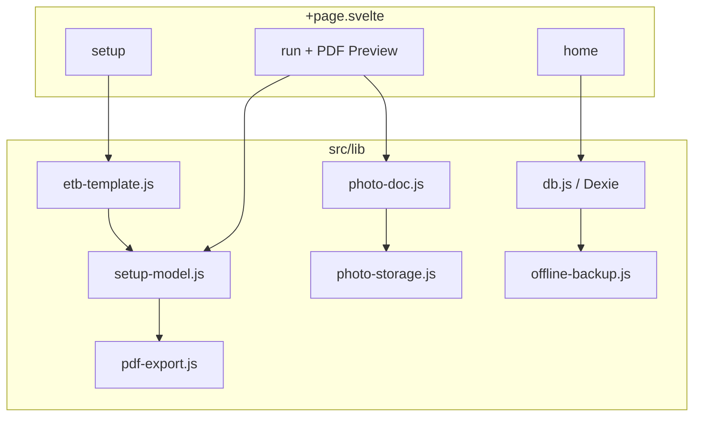

# Bautagebuch — Technische IST-Dokumentation (PWA)

> **Stand:** Juli 2026  
> **Zweck:** Vollständige Beschreibung des **elektronischen Bautagebuchs (eBTB)** als **Progressive Web App** für Weiterentwicklung ohne Quellcode-Zugriff.  
> **Scope:** Ausschließlich die PWA (`bautagebuch-v2/`). Keine Expo-App, kein WebView.

---

## Inhaltsverzeichnis

1. [Projektübersicht](#1-projektübersicht)
2. [UI/UX](#2-uiux)
3. [Navigation](#3-navigation)
4. [Funktionen](#4-funktionen)
5. [Datenmodell](#5-datenmodell)
6. [Datenhaltung](#6-datenhaltung)
7. [Template & Setup](#7-template--setup)
8. [Module & Komponenten](#8-module--komponenten)
9. [State Management](#9-state-management)
10. [Services & Export](#10-services--export)
11. [Offline, Backup & Integrität](#11-offline-backup--integrität)
12. [Sicherheit & Berechtigungen](#12-sicherheit--berechtigungen)
13. [Bekannte Probleme](#13-bekannte-probleme)
14. [Architektur](#14-architektur)
15. [Zusammenfassung](#15-zusammenfassung)

---

## 1. Projektübersicht

### 1.1 Zweck der Anwendung

Das **Bautagebuch (eBTB)** ist eine **offline-fähige PWA** zur digitalen Erfassung und zum Export von **elektronischen Bautagebüchern** auf Basis der offiziellen PDF-Vorlage **Vorlage-eBTB.pdf**.

Kernworkflow:

1. Beim ersten Start: Builtin-Template laden, PDF scannen, Setup-Modell erzeugen
2. Optional: Setup-Editor (Felder, Tabellen, Pflichtfelder, Labels)
3. Neues BTB starten → geführter **Run-Wizard** (Sektionen + Fotodokumentation)
4. Live-PDF-Vorschau während der Erfassung
5. Abschluss mit PDF-Export (BTB / Fotodoku / kombiniert)
6. BTB-Liste verwalten (öffnen, umbenennen, Mehrfach-Löschen)

### 1.2 Zielgruppe

- Bauleitung, Polier, Projektleitung auf Baustellen
- Nutzer mit Smartphone/Tablet im Browser
- Einbettung in **BÜW-Toolbox** unter `/buew-toolbox/bautagebuch/`

### 1.3 Aktueller Entwicklungsstand

| Bereich | Status |
|---------|--------|
| Builtin eBTB-Template | ✅ |
| PDF-AcroForm-Scan | ✅ |
| Setup-Editor | ✅ |
| BTB-Run-Wizard | ✅ |
| Tabellen (Personal, Leistung) | ✅ |
| Wetter-Sync (Open-Meteo) | ✅ |
| Fotodokumentation | ✅ |
| PDF-Export (3 Modi) | ✅ |
| Live-PDF-Vorschau | ✅ |
| BTB-Liste (KW-Gruppierung) | ✅ |
| Umbenennen / Mehrfach-Löschen | ✅ |
| IndexedDB-Backup & Restore | ✅ |
| Integritätsprüfung beim Start | ✅ |
| XLSX-Export | ❌ |
| Service Worker / Offline-Shell | ❌ (kein SW registriert) |
| Domain-Stores v4 (Projekte/Mängel) | ⚠️ Schema vorhanden, UI nutzt sie nicht |
| Cloud-Sync | ❌ |

### 1.4 Verwendete Technologien

| Technologie | Version | Verwendung |
|-------------|---------|------------|
| SvelteKit | 2.5.18 | Static SPA |
| Svelte | 4.2.18 | UI |
| Vite | 5.4.2 | Build |
| Dexie | 4.0.7 | IndexedDB |
| pdf-lib | 1.17.1 | PDF-Formularfüllung, Foto-PDF |
| pdfjs-dist | 4.8.69 | PDF-Vorschau, Feld-Scan |
| gh-pages | 6.3.0 | Deployment |

**Base Path:** `/buew-toolbox/bautagebuch` (`svelte.config.js`)

### 1.5 Projektstruktur

```
bautagebuch-v2/
├── src/
│   ├── app.html
│   ├── routes/
│   │   ├── +layout.svelte          # Globales Layout, CSS-Variablen
│   │   └── +page.svelte            # Gesamte App (~5.500 Zeilen)
│   └── lib/
│       ├── db.js                   # Dexie CRUD, Backup-Hooks
│       ├── etb-template.js         # eBTB-Setup-Modell (Version 6)
│       ├── setup-model.js          # Sektionen, Validierung, PDF-Mapping
│       ├── pdf-scan.js             # AcroForm-Scan + Canvas-Vorschau
│       ├── pdf-export.js           # PDF befüllen
│       ├── photo-doc.js            # Foto-PDF, Merge
│       ├── photo-storage.js        # Binär-Split photo_assets
│       ├── offline-backup.js       # IndexedDB-Snapshots
│       ├── offline-integrity.js    # Startup-Check
│       ├── time-format.js          # Uhrzeit-Normalisierung
│       ├── domain-schema.js        # v4-Stores (unbenutzt in UI)
│       ├── repositories/           # Domain-Repos (unbenutzt in UI)
│       ├── orphan-cleanup.js       # Report-only
│       └── soft-delete-purge.js    # Dry-run, Purge deaktiviert
├── static/
│   ├── manifest.webmanifest
│   └── templates/Vorlage-eBTB.pdf
├── svelte.config.js
└── package.json
```

---

## 2. UI/UX

### 2.1 Design

- Eigenes CSS in `+layout.svelte` und `+page.svelte` (nicht Toolbox-Design-Tokens)
- Zwei-Spalten-Layout im Run-Modus: Formular links, PDF-Vorschau rechts
- Sektions-Navigation mit Fortschritts-Punkten (`todo` / `progress` / `done`)
- Responsive für Tablet/Desktop; mobil nutzbar

### 2.2 Home (`view === 'home'`)

- Automatisches Laden der Builtin-Vorlage beim Mount
- Eingabe **Bezeichnung** → **Neues BTB**
- Button **Setup öffnen**
- BTB-Liste gruppiert nach **Kalenderwoche** (aus Datum im Titel oder `Date1`)
- Mehrfachauswahl + Löschen
- Umbenennen per `window.prompt`
- Link zurück zur Toolbox (`/buew-toolbox/`)
- Restore-Banner bei Integritätsfehler + verfügbarem Backup

### 2.3 Setup (`view === 'setup'`)

- Bearbeitung `setupModelDraft`: Einzelfeld-Gruppen + Tabellen
- Pro Feld: Label, Pflicht, Überspringen, Drag-Reorder, Gruppe wechseln
- PDF-Canvas-Vorschau mit Feld-Highlights
- Autosave alle **420 ms**
- **Zwischenspeichern** / **Setup abschließen** → Template-Status `ready`

### 2.4 Run (`view === 'run'`)

- Linkes Panel: aktive Sektion mit Eingabefeldern
- Rechtes Panel: **Live-PDF-Vorschau** (BTB + optional Fotodoku)
- Spezial-UI: **Gewerk** (Radio), **Schicht** (Checkboxen), **Witterung** (Sync-Button)
- Tabellen mit dynamischen sichtbaren Zeilen
- Sektion **Fotodokumentation** (Ja/Nein + Bildliste)
- Footer: Zurück / Weiter, **Abschließen** → Export-Dialog
- Export-Historie (Metadaten, kein Re-Download aus Liste)

---

## 3. Navigation

Keine SvelteKit-Unterrouten — nur **View-State** in `+page.svelte`:

```
view: 'home' | 'setup' | 'run'
```

```
home ──Setup öffnen──► setup ──abschließen──► home
home ──BTB starten / öffnen──► run ──zurück──► home
```

Externe URL: `/buew-toolbox/` (Toolbox-Startseite)

---

## 4. Funktionen

### 4.1 Template (Builtin eBTB)

| Aspekt | Detail |
|--------|--------|
| Quelle | `/buew-toolbox/bautagebuch/templates/Vorlage-eBTB.pdf` |
| Art | `builtin-etb`, einziges aktives Template |
| Scan | `scanTemplatePdf()` → `detected_fields` |
| Setup | `buildEtbSetupModel()` → `ETB_SETUP_VERSION = 6` |
| Sektionen | Kopfdaten, Witterung, Baustellenbesetzung (Tabelle), Leistungsblock (Tabelle), Abschluss |
| Pflichtfelder (Setup) | `Date1`, `Text1`, `Text2`, `Dropdown6` |
| Signatur | `Signature1` übersprungen |

### 4.2 BTB-Run (Lauf)

| Aspekt | Detail |
|--------|--------|
| Erstellung | `createRun()` — Titel `BTB YYYY-MM-DD - {Name}` |
| Werte | `field:{fieldId}`, `cell:{tableId}:{rowId}:{colId}`, `__tableRows:{tableId}` |
| Defaults | z. B. `Text2` = „Kazim Celik", Datumsfelder = heute |
| Autosave | 450 ms; Flush bei `beforeunload`, `visibilitychange`, `pagehide` |
| Status | `draft` → `completed` nach erfolgreichem Export |
| Löschen | `deleteRunCascade()` — Soft-Delete Run + Exports + photo_assets |

### 4.3 Wetter

| Aspekt | Detail |
|--------|--------|
| API | Open-Meteo (`api.open-meteo.com/v1/forecast`) |
| Ort | `navigator.geolocation` |
| Felder | `Dropdown6` (Wetter), `Text11` (Min-Temp), `Text12` (Max-Temp) |
| Mapping | WMO-Codes → Dropdown-Option per Keyword-Matching |

### 4.4 Fotodokumentation

| Aspekt | Detail |
|--------|--------|
| Aktivierung | `__photoDoc:enabled` = `yes` / `no` |
| Aufnahme | Datei-Input / Galerie (Browser) |
| Kompression | max. ~1900 px, JPEG ~0.78 |
| Speicher | Metadaten auf `runs.photoDoc`, Binär in `photo_assets` |
| PDF | 2×2-Raster A4 (`buildPhotoDocPdfBytes`) |

### 4.5 Export

| Modus | Beschreibung |
|-------|--------------|
| `btb_only` | Nur ausgefülltes eBTB-PDF |
| `photo_doc_only` | Nur Fotodokumentation |
| `btb_with_photo_doc` | Zusammengeführt (Standard) |

- **Blockiert** wenn `totalMissingRequired > 0`
- Download per Blob-URL
- Eintrag in `exports`-Tabelle (Metadaten)

### 4.6 Nicht implementiert

- XLSX / Excel
- Eigenes Template-Upload
- Signatur-Erfassung
- Cloud-Synchronisation
- Capacitor-Native-Shell (nicht aktiv genutzt)

---

## 5. Datenmodell

### 5.1 IndexedDB `BautagebuchV2`

**Dexie-Versionen:**

| Version | Neue Stores |
|---------|-------------|
| v1 | templates, detected_fields, setup_models, runs, exports |
| v2 | photo_assets |
| v3 | db_backups |
| v4 | projects, diary_entries, defects, notes, photos, documents, app_meta |

> **Hinweis:** v4-Domain-Stores sind für Shared/Expo-Parität vorbereitet; die PWA-UI nutzt nur v1–v3.

### 5.2 `templates`

| Feld | Typ | Beschreibung |
|------|-----|--------------|
| `templateId` | string (PK) | |
| `templateName` | string | |
| `fileName` | string | |
| `templateKind` | string | `builtin-etb` |
| `mimeType` | string | |
| `sizeBytes` | number | |
| `pageCount` | number | |
| `pdfBlob` | Blob | PDF-Binary |
| `status` | string | `draft` \| `ready` |
| `createdAt`, `updatedAt` | ISO | |
| `deleted_at` | ISO \| null | Soft-Delete |

### 5.3 `detected_fields`

| Feld | Typ |
|------|-----|
| `id` | `{templateId}::{fieldId}` |
| `templateId`, `fieldId`, `fieldName`, `labelCandidate` | string |
| `type` | string |
| `options` | string[] |
| `page`, `orderIndex` | number |
| `rect` | number[] \| null |

### 5.4 `setup_models`

| Feld | Typ |
|------|-----|
| `templateId` | PK |
| `status` | `draft` \| `ready` |
| `version` | number (6) |
| `setupModel` | JSON-Objekt |
| `createdAt`, `updatedAt` | ISO |

### 5.5 `runs`

| Feld | Typ |
|------|-----|
| `runId` | PK |
| `templateId` | string |
| `title` | string |
| `setupVersion` | number |
| `values` | object |
| `sectionIndex` | number |
| `status` | `draft` \| `completed` \| `deleted` |
| `photoDoc` | `{ enabled, entries[], updatedAt }` |
| `completedAt` | ISO |
| `createdAt`, `updatedAt` | ISO |
| `deleted_at` | ISO \| null |

### 5.6 `exports`

| Feld | Typ |
|------|-----|
| `exportId` | PK |
| `runId` | string |
| `fileName` | string |
| `exportedAt` | ISO |
| `deleted_at` | ISO \| null |

### 5.7 `photo_assets`

| Feld | Typ |
|------|-----|
| `id` | `{runId}::{entryId}` |
| `runId`, `entryId` | string |
| `mimeType` | string |
| `data` | ArrayBuffer |
| `sizeBytes` | number |
| `status` | string |
| `deleted_at` | ISO \| null |

### 5.8 Wert-Schlüssel (Run)

| Schlüssel | Beispiel | Inhalt |
|-----------|----------|--------|
| `field:{fieldId}` | `field:Text1` | Text / Boolean |
| `cell:{tableId}:{rowId}:{colId}` | `cell:table_main_personal:r1:c2` | Zellwert |
| `__tableRows:{tableId}` | `__tableRows:table_main_personal` | Sichtbare Zeilenanzahl |
| `__photoDoc:enabled` | | `yes` \| `no` |

---

## 6. Datenhaltung

| Speicher | Inhalt |
|----------|--------|
| IndexedDB `BautagebuchV2` | Alle strukturierten Daten |
| `photo_assets.data` | Foto-Binaries (getrennt von Run-JSON) |
| `templates.pdfBlob` | Template-PDF |
| Browser-Cache | Statische Assets nach erstem Laden |

**Kein** `localStorage` für Kerndaten.

---

## 7. Template & Setup

### 7.1 Setup-Modell-Struktur

```javascript
{
  modelId, version: 6, status, templateId, templateName, pageCount,
  single_sections: [{ sectionId, label, page, fields: [...] }],
  table_sections: [{ tableId, label, page, source, columns, rows }],
  createdAt, updatedAt
}
```

### 7.2 Validierung

- `validateSetupModel()` — Pflichtfelder, Tabellenstruktur
- `requiredMissingCount()` — für Fortschrittsanzeige und Export-Sperre

### 7.3 Initialisierung

`initializeBuiltinTemplate({ force })` auf Home-Mount:

1. PDF laden (fetch)
2. Felder scannen
3. Setup-Modell bauen (wenn Version < 6 oder `force`)
4. In Dexie persistieren

---

## 8. Module & Komponenten

| Modul | Datei | Hauptfunktionen |
|-------|-------|-----------------|
| DB | `db.js` | CRUD, Backup, Restore, Cascade-Delete |
| eBTB | `etb-template.js` | `buildEtbSetupModel`, Konstanten |
| Setup | `setup-model.js` | `buildRunSections`, `collectPdfValueAssignments`, `applyPdfFieldValue` |
| Scan | `pdf-scan.js` | `scanTemplatePdf`, `renderFieldPreview` |
| Export | `pdf-export.js` | `buildFinalPdfBytes` |
| Fotos | `photo-doc.js` | `compressPhotoDocImage`, `buildPhotoDocPdfBytes`, `mergeBtbWithPhotoDoc` |
| Foto-Speicher | `photo-storage.js` | `preparePhotoDocForStorage`, `hydratePhotoDoc` |
| Backup | `offline-backup.js` | `createIndexedDbBackup`, `restoreIndexedDbBackup` |
| Integrität | `offline-integrity.js` | `runBautagebuchIntegrityCheck` |

**UI:** Monolith `+page.svelte` — keine separaten Svelte-Komponenten-Dateien für Screens.

---

## 9. State Management

| Mechanismus | Verwendung |
|-------------|------------|
| Svelte `let` / reaktive Zuweisungen | Gesamter UI-State |
| `view`, `activeRun`, `setupModelDraft` | Hauptzustände |
| Dexie | Persistenz |
| Autosave-Timer | Setup 420 ms, Run 450 ms |
| Kein Redux/Pinia | — |

---

## 10. Services & Export

### 10.1 PDF-Pipeline

```
run.values + setupModel + template.pdfBlob
  → collectPdfValueAssignments()
  → buildFinalPdfBytes()          // AcroForm füllen
  → optional: buildPhotoDocPdfBytes()
  → optional: mergeBtbWithPhotoDoc()
  → Blob-Download + exports-Eintrag
```

### 10.2 Export-Dateiname

Aus Run-Titel abgeleitet (sanitized) + Suffix je Modus.

### 10.3 Fehlertoleranz

`buildFinalPdfBytes` fängt Einzelfeld-Fehler ab (still); Foto-Embed-Probleme → `issues[]` (max. 20).

---

## 11. Offline, Backup & Integrität

### 11.1 Offline-Verhalten

- Daten vollständig in IndexedDB
- **Kein** Service Worker — Offline nur nach vorherigem Seitenladen + Browser-Cache
- `manifest.webmanifest`: `display: standalone`

### 11.2 Backup

| Aspekt | Wert |
|--------|------|
| Store | `db_backups` |
| Max. Snapshots | **3** |
| Min. Intervall | **60 s** (außer `manual`) |
| Trigger | `photo_added`, `record_deleted`, `status_change`, `app_background`, `manual` |
| Foto-Binaries | **Ausgeschlossen** aus Snapshot (`includesPhotoBinaries: false`) |

### 11.3 Integrität

`ensureDbReady()` → `runBautagebuchIntegrityCheck()`:

- Tabellen vorhanden?
- Verwaiste `photo_assets`?
- Fehlende Binärdaten?

Bei fatalen Fehlern + Backup → `pendingRestoreOffer` (Nutzer muss bestätigen).

### 11.4 Restore

`confirmPendingRestore()` → `restoreIndexedDbBackup()` → `window.location.reload()`  
Foto-Binaries werden beim Restore gemerged/erhalten.

---

## 12. Sicherheit & Berechtigungen

| Aspekt | Detail |
|--------|--------|
| Datenhaltung | Lokal im Browser (IndexedDB) |
| Keine Accounts | — |
| Keine Analytics | — |
| Geolocation | Nur für Wetter-Sync (Nutzer-Prompt) |
| Open-Meteo | Externe HTTP-API (nur Wetter, keine personenbezogenen Daten gesendet außer Koordinaten) |
| Export | Blob-Download lokal |

---

## 13. Bekannte Probleme

| ID | Beschreibung | Schwere |
|----|--------------|---------|
| B1 | Monolithische `+page.svelte` (~5.500 Zeilen) | Wartung |
| B2 | Domain-Stores v4 ungenutzt | Info |
| B3 | Kein Service Worker | Offline-Shell |
| B4 | `executeSoftDeletePurge()` deaktiviert | Info |
| B5 | Signatur-Feld übersprungen | Feature-Lücke |
| B6 | Nur Builtin-Template | Feature-Lücke |
| B7 | `jumpToNextRequiredField` nicht verdrahtet | UI-Lücke |

---

## 14. Architektur



---

## 15. Zusammenfassung

### Was funktioniert

| Feature | Status |
|---------|:------:|
| eBTB-Template & Setup | ✅ |
| Run-Wizard mit Tabellen | ✅ |
| Wetter-Sync | ✅ |
| Fotodokumentation | ✅ |
| PDF-Export (3 Modi) | ✅ |
| Live-Vorschau | ✅ |
| BTB-Verwaltung (Löschen, Umbenennen) | ✅ |
| IndexedDB-Backup/Restore | ✅ |

### Was fehlt

- XLSX-Export
- Service Worker
- Signatur-Erfassung
- Custom Template Upload
- Nutzung der Domain-v4-Stores

### Deployment

```bash
cd bautagebuch-v2
npm run build
npm run deploy   # gh-pages → /buew-toolbox/bautagebuch
```

---

*Ende der IST-Dokumentation (Bautagebuch PWA)*
