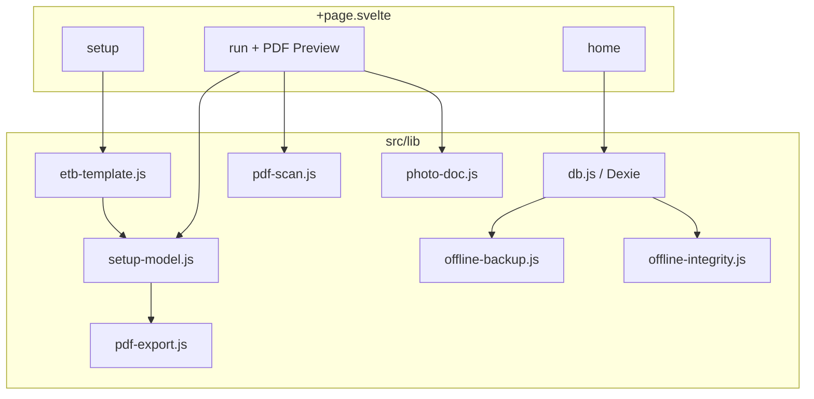

# Bautagebuch — Technische IST-Dokumentation (PWA)

> **Stand:** Juli 2026 (erweiterte technische Referenz, Parität mit SiteReport-Doku)  
> **Zweck:** Vollständige Beschreibung des **elektronischen Bautagebuchs (eBTB)** als **Progressive Web App** für Weiterentwicklung ohne Quellcode-Zugriff.  
> **Scope:** Ausschließlich die PWA (`bautagebuch-v2/`). Keine Expo-App, kein WebView.

---

## Inhaltsverzeichnis

1. [Projektübersicht](#1-projektübersicht)
2. [UI/UX](#2-uiux)
3. [Navigation](#3-navigation)
4. [Funktionen](#4-funktionen)
5. [Datenmodell](#5-datenmodell)
6. [Datenhaltung](#6-datenhaltung)
7. [Template & Setup](#7-template--setup)
8. [Module & Komponenten](#8-module--komponenten)
9. [State Management](#9-state-management)
10. [Services & Export](#10-services--export)
11. [Offline, Backup & Integrität](#11-offline-backup--integrität)
12. [Sicherheit](#12-sicherheit)
13. [Bekannte Probleme](#13-bekannte-probleme)
14. [Architektur](#14-architektur)
15. [Verbesserungspotential](#15-verbesserungspotential)
16. [Zusammenfassung](#16-zusammenfassung)
17. [Build- und Laufzeitumgebung](#17-build--und-laufzeitumgebung)
18. [App-Konfiguration](#18-app-konfiguration)
19. [Vollständiges IndexedDB-Datenmodell](#19-vollständiges-indexeddb-datenmodell)
20. [Datenfluss und Lifecycle](#20-datenfluss-und-lifecycle)
21. [Fehlerhandling](#21-fehlerhandling)
22. [Backup- und Restore-System](#22-backup--und-restore-system)
23. [Export-Spezifikation](#23-export-spezifikation)
24. [Datenschutz und Berechtigungen](#24-datenschutz-und-berechtigungen)
25. [Performance und Skalierung](#25-performance-und-skalierung)

---

## 1. Projektübersicht

### 1.1 Zweck der Anwendung

Das **Bautagebuch (eBTB)** ist eine **offline-fähige PWA** zur digitalen Erfassung und zum Export von **elektronischen Bautagebüchern** auf Basis der offiziellen PDF-Vorlage **Vorlage-eBTB.pdf**.

Kernworkflow:

1. Beim ersten Start: Builtin-Template laden, PDF scannen, Setup-Modell erzeugen
2. Optional: Setup-Editor (Felder, Tabellen, Pflichtfelder, Labels)
3. Neues BTB starten → geführter **Run-Wizard** (Sektionen + Fotodokumentation)
4. Live-PDF-Vorschau während der Erfassung (Split-Panel)
5. Abschluss mit PDF-Export (BTB / Fotodoku / kombiniert)
6. BTB-Liste verwalten (öffnen, umbenennen, Mehrfach-Löschen)

Die App wird als **statische SPA** auf GitHub Pages unter `/buew-toolbox/bautagebuch/` bereitgestellt.

### 1.2 Zielgruppe

- Bauleitung, Polier, Projektleitung auf Baustellen
- Nutzer mit Smartphone/Tablet im Browser
- Einbettung in **BÜW-Toolbox** unter `/buew-toolbox/bautagebuch/`

### 1.3 Aktueller Entwicklungsstand

| Bereich | Status |
|---------|--------|
| Builtin eBTB-Template | ✅ |
| PDF-AcroForm-Scan (pdf-lib + pdfjs) | ✅ |
| Setup-Editor mit Autosave | ✅ |
| BTB-Run-Wizard | ✅ |
| Tabellen (Personal, Leistung) | ✅ |
| Gewerk / Schicht Spezial-UI | ✅ |
| Wetter-Sync (Open-Meteo) | ✅ |
| Fotodokumentation (Galerie/Kamera) | ✅ |
| PDF-Export (3 Modi) | ✅ |
| Live-PDF-Vorschau (Canvas) | ✅ |
| BTB-Liste (KW-Gruppierung) | ✅ |
| Umbenennen / Mehrfach-Löschen | ✅ |
| Pflichtfelder blockieren Export | ✅ |
| IndexedDB-Backup & Restore | ✅ |
| Integritätsprüfung beim Start | ✅ |
| XLSX-Export | ❌ |
| Service Worker / Offline-Shell | ❌ (kein SW registriert) |
| Domain-Stores v4 (Projekte/Mängel) | ⚠️ Schema vorhanden, UI nutzt sie nicht |
| Signatur-Erfassung | ❌ (`Signature1` übersprungen) |
| Custom Template Upload | ❌ |
| Cloud-Sync | ❌ |

**Fazit:** Die PWA ist das **funktional vollständigste** Bautagebuch-Frontend (Live-Vorschau, Run-Verwaltung, Export-Sperre bei Pflichtfeldern). Verbleibende Lücken: Service Worker, XLSX, Signatur, Domain-v4-UI.

### 1.4 Verwendete Technologien

| Technologie | Version | Verwendung |
|-------------|---------|------------|
| SvelteKit | 2.5.18 | Static SPA |
| Svelte | 4.2.18 | UI (monolithisch in `+page.svelte`) |
| Vite | 5.4.2 | Build / Dev-Server |
| Dexie | 4.0.7 | IndexedDB |
| pdf-lib | 1.17.1 | PDF-Formularfüllung, Foto-PDF |
| pdfjs-dist | 4.8.69 | PDF-Vorschau, Feld-Scan, Widget-Metadaten |
| gh-pages | 6.3.0 | Deployment |

**Nicht verwendet:** Redux/Pinia, Service Worker, Capacitor-Shell (nicht aktiv), Cloud-Backend.

**Base Path:** `/buew-toolbox/bautagebuch` (`svelte.config.js`)

### 1.5 Build & Deployment

| Aspekt | Detail |
|--------|--------|
| Projekt | `bautagebuch-v2/` |
| Build | `npm run build` → `vite build` → `build/` |
| Deploy | `npm run deploy` → gh-pages nach `build/` |
| Dev-Server | `npm run dev` — Port **5173**, `host: true` |
| Template-PDF | `static/templates/Vorlage-eBTB.pdf` |

### 1.6 Projektstruktur

```
bautagebuch-v2/
├── src/
│   ├── app.html
│   ├── routes/
│   │   ├── +layout.svelte          # Globales Layout, CSS-Variablen
│   │   └── +page.svelte            # Gesamte App (~5.500 Zeilen)
│   └── lib/
│       ├── db.js                   # Dexie CRUD, Backup-Hooks
│       ├── etb-template.js         # eBTB-Setup-Modell (Version 6)
│       ├── setup-model.js          # Sektionen, Validierung, PDF-Mapping
│       ├── pdf-scan.js             # AcroForm-Scan + Canvas-Vorschau
│       ├── pdf-export.js           # PDF befüllen
│       ├── photo-doc.js            # Foto-PDF, Merge
│       ├── photo-storage.js        # Binär-Split photo_assets
│       ├── offline-backup.js       # IndexedDB-Snapshots
│       ├── offline-integrity.js    # Startup-Check
│       ├── time-format.js          # Uhrzeit-Normalisierung
│       ├── domain-schema.js        # v4-Stores (unbenutzt in UI)
│       ├── repositories/           # Domain-Repos (unbenutzt in UI)
│       ├── orphan-cleanup.js       # Report-only
│       └── soft-delete-purge.js    # Dry-run, Purge deaktiviert
├── static/
│   ├── manifest.webmanifest
│   └── templates/Vorlage-eBTB.pdf
├── svelte.config.js
├── vite.config.js
└── package.json
```

---

## 2. UI/UX

### 2.1 Design

- Eigenes CSS in `+layout.svelte` und `+page.svelte` (nicht Toolbox-Design-Tokens)
- **Zwei-Spalten-Layout** im Run-Modus: Formular links, PDF-Vorschau rechts
- Sektions-Navigation mit Fortschritts-Punkten (`todo` / `progress` / `done`)
- Responsive für Tablet/Desktop; mobil nutzbar (einspaltig bei schmalem Viewport)
- Keine Animationen/Haptik (Browser-PWA)

**UX-Prinzipien:**

- Geführter Run-Wizard mit sichtbarem Fortschritt pro Sektion
- Live-PDF-Vorschau synchron zur Eingabe
- Pflichtfelder blockieren Abschluss/Export
- Autosave ohne expliziten Speichern-Button im Run

---

### 2.2 Home (`view === 'home'`)

**Datei:** `src/routes/+page.svelte`

#### Aufbau

1. **Header** — „Bautagebuch" / „Elektronisches Bautagebuch (eBTB)"
2. **Neues BTB** — Textfeld **Bezeichnung** + Button **Neues BTB**
3. **Setup öffnen** — Wechsel zu Setup-View
4. **BTB-Liste** — gruppiert nach **Kalenderwoche** (`KW {n} · {Monat} {Jahr}`)
5. **Restore-Banner** — bei Integritätsfehler + verfügbarem Backup
6. **Link** — zurück zur Toolbox (`/buew-toolbox/`)

#### Interaktion

- Beim Mount: `initializeBuiltinTemplate({ force: false })`
- Listeneintrag tippen → Run öffnen
- Checkbox-Mehrfachauswahl + **Löschen** (`deleteRunCascade`)
- **Umbenennen** per `window.prompt` → `updateRun({ title })`
- Kein Pull-to-Refresh (Browser-Standard)

---

### 2.3 Setup (`view === 'setup'`)

#### Aufbau

1. **Navigation** — „Gruppen" (Einzel-Sektionen) / „Tabellen"
2. **Feld-Editor** — Label, Pflicht, Überspringen, Drag-Reorder, Gruppe wechseln
3. **PDF-Canvas-Vorschau** — Feld-Highlights (`renderFieldPreview`, max. Breite 860 px)
4. **Aktionen** — Zwischenspeichern, Setup abschließen, Zurück

#### Interaktion

- Autosave alle **420 ms** (`scheduleSetupAutosave`)
- **Setup abschließen** → `markTemplateReady()` → Status `ready` → Home
- **Zwischenspeichern** → `saveSetupModel(..., { status: 'draft' })`
- Validierung: `validateSetupModel()` — Fehler blockieren Abschluss

---

### 2.4 Run (`view === 'run'`)

#### Aufbau

1. **Linkes Panel** — aktive Sektion mit Eingabefeldern
2. **Rechtes Panel** — **Live-PDF-Vorschau** (Seitennavigation, Feld-Overlays)
3. **Sektions-Dots** — Fortschritt pro Sektion
4. **Footer** — Zurück / Weiter; auf letzter Sektion **Abschließen**

#### Sektions-Reihenfolge (`runSectionOrderRank`)

| Rang | Sektion | ID |
|------|---------|-----|
| 10 | Kopfdaten | `single:header` |
| 20 | Witterung | `single:weather` |
| 30 | Baustellenbesetzung | `table:table_main_personal` |
| 40 | Leistungsblock | `table:table_detail_blocks` |
| 50 | Abschluss | `single:closing` |
| 60 | Fotodokumentation | `photo-doc` (synthetisch) |

#### Spezial-UI

| Bereich | Verhalten |
|---------|-----------|
| **Gewerk** (`Text3`, `Text5–8`) | Radio/Dropdown — required-any-Gruppe (genau eines) |
| **Schicht** (`Check Box1–3`) | Checkboxen — required-any; nur eine gleichzeitig aktiv |
| **Witterung** | Button **Wetter aktualisieren** → Open-Meteo + Geolocation |
| **Tabellen** | Dynamische Zeilen via `__tableRows:{tableId}`; „Weitere Zeile hinzufügen" |
| **Uhrzeit** (`c2`/`c3` Personal) | `normalizeClockTime()` → `HH:MM` |
| **Fotodokumentation** | Ja/Nein Pflichtwahl; Galerie/Kamera; Thumbnails via Object-URLs |

#### Abschluss-Dialog

- Modus: **Nur BTB** / **Nur Fotodoku** / **Zusammengeführt** (Standard)
- **Blockiert** wenn `totalMissingRequired > 0`
- Nach Erfolg: `status: 'completed'`, `addExportRecord`, Export-Historie

---

## 3. Navigation

### 3.1 View-State (keine SvelteKit-Unterrouten)

**Datei:** `src/routes/+page.svelte`

```
view: 'home' | 'setup' | 'run'
```

### 3.2 Screen-Hierarchie

```
home
├── Setup öffnen ──► setup ──abschließen/zurück──► home
├── Neues BTB / Listeneintrag ──► run ──zurück──► home
└── Link ──► /buew-toolbox/ (extern)
```

### 3.3 URLs

| URL | Bedeutung |
|-----|-----------|
| `/buew-toolbox/bautagebuch/` | PWA-Einstieg (SPA) |
| `/buew-toolbox/bautagebuch/templates/Vorlage-eBTB.pdf` | Builtin-Template |
| `/buew-toolbox/` | Toolbox-Startseite |

> Es gibt **keine Deep Links** für einzelne Runs — Zustand nur in IndexedDB + View-State.

---

## 4. Funktionen

### 4.1 Template (Builtin eBTB)

| Aspekt | Detail |
|--------|--------|
| Quelle | `fetch('/buew-toolbox/bautagebuch/templates/Vorlage-eBTB.pdf')` |
| Art | `builtin-etb`, einziges aktives Template |
| Scan | `scanTemplatePdf()` → `detected_fields` |
| Setup | `buildEtbSetupModel()` → `ETB_SETUP_VERSION = 6` |
| Konstanten | `ETB_TEMPLATE_NAME = 'Vorlage-eBTB'` |

### 4.2 BTB-Run (Lauf)

| Aspekt | Detail |
|--------|--------|
| Erstellung | `createRun()` — ID `runv2_{ts}_{rand}`, Titel `BTB YYYY-MM-DD - {Name}` |
| Werte | `field:{fieldId}`, `cell:{tableId}:{rowId}:{colId}`, `__tableRows:{tableId}` |
| Defaults | `Text2` = „Kazim Celik"; Datumsfelder = heute |
| Autosave | **450 ms** Debounce; Flush bei `beforeunload`, `pagehide`, `visibilitychange` |
| Status | `draft` → `completed` nach erfolgreichem Export |
| Löschen | `deleteRunCascade()` — Soft-Delete Run + Exports + photo_assets |
| Umbenennen | `updateRun({ title })` via Prompt |

### 4.3 Wetter

| Aspekt | Detail |
|--------|--------|
| API | `https://api.open-meteo.com/v1/forecast` |
| Ort | `navigator.geolocation` (`timeout: 12000`, `maximumAge: 900000`) |
| Felder | `Dropdown6` (Wetter), `Text11` (Min-Temp), `Text12` (Max-Temp) |
| Mapping | WMO-Codes → Kategorien → Keyword-Match gegen Dropdown-Optionen |

### 4.4 Fotodokumentation

| Aspekt | Detail |
|--------|--------|
| Aktivierung | `__photoDoc:enabled` = `yes` / `no` (Pflichtwahl) |
| Aufnahme | `<input type="file" accept="image/*">` (Galerie/Kamera) |
| Kompression | max. **1900 px**, JPEG **0.78** |
| Speicher | Metadaten auf `runs.photoDoc`, Binär in `photo_assets` |
| Sofort-Persist | `updateRunPhotoDoc(..., { persistImmediately: true })` |
| PDF | 2×2-Raster A4 (`buildPhotoDocPdfBytes`) |

### 4.5 Export

| Modus | Konstante | Dateiname |
|-------|-----------|-----------|
| Nur BTB | `btb_only` | `{title}.pdf` |
| Nur Fotodoku | `photo_doc_only` | `{title}_Fotodoku.pdf` |
| Kombiniert | `btb_with_photo_doc` | `{title}.pdf` (merged) |

- **Blockiert** wenn `totalMissingRequired > 0`
- Download per Blob-URL
- `MAX_PDF_SIZE`: **40 MB**
- Eintrag in `exports`-Tabelle (Metadaten, kein Re-Download aus Liste)

### 4.6 Nicht implementiert

- XLSX / Excel
- Eigenes Template-Upload (UI)
- Signatur-Erfassung (`Signature1` skipped)
- Cloud-Synchronisation
- Capacitor-Native-Shell

---

## 5. Datenmodell

IndexedDB-Schema für Bautagebuch ist **über Dexie-Versionen versioniert** (v1–v4). Vollständige Beschreibung mit Beispielwerten: **Kapitel 19**.

### 5.1 Kern-Stores (aktiv genutzt)

| Store | PK | Beschreibung |
|-------|-----|--------------|
| `templates` | `templateId` | PDF-Blob + Metadaten |
| `detected_fields` | `id` | Gescannte AcroForm-Felder |
| `setup_models` | `templateId` | Setup-JSON (Version 6) |
| `runs` | `runId` | BTB-Läufe + `values` |
| `exports` | `exportId` | Export-Metadaten |
| `photo_assets` | `id` | Foto-Binaries (getrennt) |
| `db_backups` | `id` | IndexedDB-Snapshots |

### 5.2 Wert-Schlüssel (Run)

| Schlüssel | Beispiel | Inhalt |
|-----------|----------|--------|
| `field:{fieldId}` | `field:Text1` | Text / Boolean |
| `cell:{tableId}:{rowId}:{colId}` | `cell:table_main_personal:r1:c2` | Zellwert |
| `__tableRows:{tableId}` | `__tableRows:table_main_personal` | Sichtbare Zeilenanzahl |
| `__photoDoc:enabled` | | `yes` \| `no` |

### 5.3 Soft Delete

- Filter: `isActiveRecord()` → `!record.deleted_at`
- Runs: `status: 'deleted'` + `deleted_at`
- Exports/photo_assets: `deleted_at` bzw. `status: 'deleted'`
- Purge: `executeSoftDeletePurge()` **deaktiviert** (wirft Error)

---

## 6. Datenhaltung

### 6.1 IndexedDB

**Datenbankname:** `BautagebuchV2` (Dexie)

| Speicher | Inhalt |
|----------|--------|
| `templates.pdfBlob` | Template-PDF |
| `runs.values` | Formularwerte (JSON) |
| `photo_assets.data` | Foto-Binaries (ArrayBuffer) |
| `setup_models.setupModel` | Setup-Struktur |
| `db_backups.snapshot` | Tabellen-Snapshots |

**Kein** `localStorage` für Kerndaten.

### 6.2 Browser-Cache

Statische Assets (JS/CSS) nach erstem Laden im Browser-Cache. **Kein** Service Worker — Offline nur nach vorherigem Seitenladen.

### 6.3 Foto-Pipeline

```
File-Input / Galerie
  → compressPhotoDocImage (1900px, 0.78)
  → preparePhotoDocForStorage()
  → photo_assets (Binär) + runs.photoDoc (Metadaten)
```

---

## 7. Template & Setup

### 7.1 Setup-Modell-Struktur

```javascript
{
  modelId, version: 6, status, templateId, templateName, pageCount,
  single_sections: [{ sectionId, label, page, fields: [...] }],
  table_sections: [{ tableId, label, page, source, columns, rows }],
  createdAt, updatedAt
}
```

### 7.2 eBTB-Feststruktur (`etb-template.js`)

| Sektion | sectionId | Inhalt |
|---------|-----------|--------|
| Kopfdaten | `header` | Date1, Text1–9, Check Box1–3 |
| Witterung | `weather` | Dropdown6, Text11–13 |
| Baustellenbesetzung | `table_main_personal` | 7×7 Tabelle |
| Leistungsblock | `table_detail_blocks` | 1×5 Tabelle |
| Abschluss | `closing` | Text70, Text14–15, Date2, Signature1 (skipped) |

**Pflichtfelder:** `Date1`, `Text1`, `Text2`, `Dropdown6`  
**Übersprungen:** `Text9`, `Signature1`

### 7.3 Validierung

- `validateSetupModel()` — Struktur, eindeutige IDs, aktive Zellen
- `requiredMissingCount()` — für Fortschritt und Export-Sperre
- Tabellen: nur **erste sichtbare Zeile** für Pflichtprüfung

### 7.4 Initialisierung

`initializeBuiltinTemplate({ force })` auf Home-Mount:

1. PDF laden (fetch)
2. `scanTemplatePdf()` → Felder scannen
3. `buildEtbSetupModel()` (wenn Version < 6 oder `force`)
4. In Dexie persistieren

---

## 8. Module & Komponenten

### 8.1 Lib-Module

| Modul | Datei | Hauptfunktionen |
|-------|-------|-----------------|
| DB | `db.js` | CRUD, Backup, Restore, Cascade-Delete |
| eBTB | `etb-template.js` | `buildEtbSetupModel`, Konstanten |
| Setup | `setup-model.js` | `buildRunSections`, `collectPdfValueAssignments`, `applyPdfFieldValue` |
| Scan | `pdf-scan.js` | `scanTemplatePdf`, `renderFieldPreview` |
| Export | `pdf-export.js` | `buildFinalPdfBytes` |
| Fotos | `photo-doc.js` | `compressPhotoDocImage`, `buildPhotoDocPdfBytes`, `mergeBtbWithPhotoDoc` |
| Foto-Speicher | `photo-storage.js` | `preparePhotoDocForStorage`, `hydratePhotoDoc` |
| Backup | `offline-backup.js` | `createIndexedDbBackup`, `restoreIndexedDbBackup` |
| Integrität | `offline-integrity.js` | `runBautagebuchIntegrityCheck` |
| Zeit | `time-format.js` | `normalizeClockTime` |

### 8.2 UI

**Monolith:** `src/routes/+page.svelte` (~5.500 Zeilen) — keine separaten Screen-Komponenten.

| UI-Bereich | Implementierung |
|------------|-----------------|
| Home-Liste | Inline in `+page.svelte` |
| Setup-Editor | Inline + Canvas-Preview |
| Run-Wizard | Inline + Split-Panel |
| Export-Dialog | Inline Modal |

---

## 9. State Management

| Mechanismus | Verwendung |
|-------------|------------|
| Svelte `let` / reaktive Zuweisungen | Gesamter UI-State |
| `view`, `activeRun`, `setupModelDraft` | Hauptzustände |
| `runValues`, `sectionIndex` | Run-Eingaben |
| Dexie | Persistenz |
| Autosave-Timer | Setup **420 ms**, Run **450 ms** |
| Kein Redux/Pinia | — |

---

## 10. Services & Export

### 10.1 PDF-Pipeline (BTB)

```
run.values + setupModel + template.pdfBlob
  → collectPdfValueAssignments()
  → buildFinalPdfBytes()          // AcroForm füllen
  → optional: buildPhotoDocPdfBytes()
  → optional: mergeBtbWithPhotoDoc()
  → Blob-Download + exports-Eintrag
```

### 10.2 `db.js` API-Übersicht

| Funktion | Beschreibung |
|----------|--------------|
| `ensureOfflineDbReady()` | DB öffnen + Integrität |
| `listTemplates()` / `getTemplate()` | Template-CRUD |
| `saveDetectedFields()` / `getDetectedFields()` | Scan-Ergebnisse |
| `saveSetupModel()` / `getSetupModel()` | Setup persistieren |
| `markTemplateReady()` | Status `ready` + Backup |
| `createRun()` / `getRun()` / `listRuns()` / `updateRun()` | Run-CRUD |
| `deleteRunCascade()` | Soft-Delete inkl. Fotos |
| `addExportRecord()` / `listExports()` | Export-Metadaten |
| `requestOfflineBackup(reason)` | Manueller Backup-Trigger |
| `getPendingRestoreOffer()` / `confirmPendingRestore()` | Restore-Flow |

### 10.3 Fehlertoleranz Export

`buildFinalPdfBytes`: Einzelfeld-Fehler per try/catch still ignoriert.  
`buildPhotoDocPdfBytes`: `issues[]` max. 20 Einträge.

---

## 11. Offline, Backup & Integrität

### 11.1 Offline-Verhalten

- Daten vollständig in IndexedDB
- **Kein** Service Worker — Offline nur nach vorherigem Seitenladen
- `manifest.webmanifest`: `display: standalone`

### 11.2 Backup (Kurzübersicht)

| Aspekt | Wert |
|--------|------|
| Store | `db_backups` |
| Max. Snapshots | **3** |
| Min. Intervall | **60 s** (außer `manual`) |
| Foto-Binaries | **Ausgeschlossen** aus Snapshot |

Details: **Kapitel 22**.

### 11.3 Integrität

`ensureDbReady()` → `runBautagebuchIntegrityCheck()`:

- Tabellen vorhanden?
- Verwaiste `photo_assets`?
- Fehlende Binärdaten?

Bei fatalen Fehlern + Backup → `pendingRestoreOffer`.

---

## 12. Sicherheit

| Aspekt | Detail |
|--------|--------|
| Datenhaltung | Lokal im Browser (IndexedDB) |
| Keine Accounts | — |
| Keine Analytics | — |
| Geolocation | Nur für Wetter-Sync (Nutzer-Prompt) |
| Open-Meteo | Externe HTTP-API (Koordinaten, keine personenbezogenen Namen) |
| Export | Blob-Download lokal |
| Keine Verschlüsselung | IndexedDB unverschlüsselt |

---

## 13. Bekannte Probleme

| ID | Beschreibung | Schwere |
|----|--------------|---------|
| B1 | Monolithische `+page.svelte` (~5.500 Zeilen) | Wartung |
| B2 | Domain-Stores v4 ungenutzt | Info |
| B3 | Kein Service Worker | Offline-Shell |
| B4 | `executeSoftDeletePurge()` deaktiviert | Info |
| B5 | Signatur-Feld übersprungen | Feature-Lücke |
| B6 | Nur Builtin-Template | Feature-Lücke |
| B7 | `jumpToNextRequiredField` nicht verdrahtet | UI-Lücke |
| B8 | Backup ohne Foto-Binaries | Recovery-Risiko |
| B9 | Keine Deep Links für Runs | UX |

**Behoben / vorhanden vs. Expo:** Live-Vorschau, Run-Löschen, Umbenennen, Pflichtfeld-Sperre, Galerie-Fotos.

---

## 14. Architektur

### 14.1 Schichten

| Schicht | Verantwortung |
|---------|---------------|
| `+page.svelte` | UI, Navigation, lokaler State |
| `src/lib/*.js` | Business-Logik, PDF, Persistenz |
| Dexie / IndexedDB | Datenhaltung |
| Browser APIs | Geolocation, File-Input, Canvas |

### 14.2 Diagramm



---

## 15. Verbesserungspotential

- **Service Worker** für echte Offline-Shell
- **Komponenten-Aufspaltung** von `+page.svelte`
- **Domain-v4-UI** (Projekte, Mängel) aktivieren
- **Signatur-Erfassung** für `Signature1`
- **Custom Template Upload**
- **XLSX-Export**
- **Backup mit Foto-Binaries** (optional, Größenlimit beachten)
- **Deep Links** für Runs (`?runId=...`)
- **E2E-Tests** für Export-Pipeline

---

## 16. Zusammenfassung

### Was funktioniert

| Feature | Status |
|---------|:------:|
| eBTB-Template & Setup | ✅ |
| Run-Wizard mit Tabellen | ✅ |
| Gewerk / Schicht Spezial-UI | ✅ |
| Wetter-Sync | ✅ |
| Fotodokumentation (Galerie) | ✅ |
| PDF-Export (3 Modi) | ✅ |
| Live-PDF-Vorschau | ✅ |
| BTB-Verwaltung (Löschen, Umbenennen) | ✅ |
| Pflichtfelder → Export-Sperre | ✅ |
| IndexedDB-Backup/Restore | ✅ |

### Was fehlt

- XLSX-Export
- Service Worker
- Signatur-Erfassung
- Custom Template Upload
- Nutzung der Domain-v4-Stores
- Cloud-Sync

### Nächste Schritte

1. Service Worker für Offline-Betrieb
2. `+page.svelte` in Komponenten aufteilen
3. Signatur-Widget evaluieren
4. On-Device-Test: Export mit vielen Fotos (>40 MB Grenze)

---

## 17. Build- und Laufzeitumgebung

### 17.1 Entwicklungsumgebung

| Komponente | Version / Wert | Quelle |
|------------|----------------|--------|
| **Node.js** | 18+ empfohlen | *lokal zu prüfen* |
| **Paketmanager** | **npm** | `package-lock.json` |
| **SvelteKit** | 2.5.18 | `package.json` |
| **Svelte** | 4.2.18 | `package.json` |
| **Vite** | 5.4.2 | `package.json` |
| **Dexie** | 4.0.7 | `package.json` |
| **pdf-lib** | 1.17.1 | `package.json` |
| **pdfjs-dist** | 4.8.69 | `package.json` |

### 17.2 Build-Befehle

| Zweck | Befehl | Arbeitsverzeichnis |
|-------|--------|-------------------|
| Abhängigkeiten | `npm ci` | `bautagebuch-v2/` |
| Dev-Server | `npm run dev` | `bautagebuch-v2/` |
| Produktions-Build | `npm run build` | `bautagebuch-v2/` |
| Lokale Vorschau | `npm run preview` | `bautagebuch-v2/` |
| Deploy (gh-pages) | `npm run deploy` | `bautagebuch-v2/` |

### 17.3 Build-Ausgabe

| Aspekt | Detail |
|--------|--------|
| Adapter | `@sveltejs/adapter-static` |
| Ausgabeordner | `build/` |
| SPA-Fallback | `index.html` |
| Base Path | `/buew-toolbox/bautagebuch` |
| Relative Pfade | `kit.paths.relative: true` |

### 17.4 Dev-Server (`vite.config.js`)

| Einstellung | Wert |
|-------------|------|
| Host | `true` (LAN-Zugriff) |
| Port | **5173** |

### 17.5 Laufzeit im Browser

| Aspekt | Detail |
|--------|--------|
| Zielbrowser | Moderne Chromium/Firefox/Safari |
| IndexedDB | Pflicht |
| Canvas | Für PDF-Vorschau und Foto-Kompression |
| Geolocation | Optional (Wetter) |
| File API | Für Foto-Upload |

---

## 18. App-Konfiguration

### 18.1 SvelteKit (`svelte.config.js`)

| Eigenschaft | Wert |
|-------------|------|
| Adapter | `@sveltejs/adapter-static` |
| `pages` / `assets` | `build` |
| `fallback` | `index.html` |
| `paths.base` | `/buew-toolbox/bautagebuch` |
| `paths.relative` | `true` |

### 18.2 Web App Manifest (`static/manifest.webmanifest`)

| Eigenschaft | Wert |
|-------------|------|
| `name` | Bautagebuch |
| `short_name` | BTB |
| `display` | `standalone` |
| `start_url` | `.` (relativ zum Base Path) |
| Icons | `icon-192.png`, `icon-512.png` |

> **Hinweis:** Kein Service Worker registriert — Manifest allein aktiviert keinen Offline-Cache.

### 18.3 Statische Assets

| Pfad | Inhalt |
|------|--------|
| `static/templates/Vorlage-eBTB.pdf` | Offizielle eBTB-Vorlage |
| `static/manifest.webmanifest` | PWA-Manifest |
| `static/icons/` | App-Icons |

### 18.4 Konstanten (`etb-template.js`)

| Konstante | Wert |
|-----------|------|
| `ETB_TEMPLATE_KIND` | `builtin-etb` |
| `ETB_TEMPLATE_NAME` | `Vorlage-eBTB` |
| `ETB_TEMPLATE_FILE_NAME` | `Vorlage-eBTB.pdf` |
| `ETB_TEMPLATE_PUBLIC_URL` | `/buew-toolbox/bautagebuch/templates/Vorlage-eBTB.pdf` |
| `ETB_SETUP_VERSION` | **6** |

### 18.5 Deployment-Ziel

| Aspekt | Detail |
|--------|--------|
| Hosting | GitHub Pages |
| URL | `https://kclk08.github.io/buew-toolbox/bautagebuch/` |
| Toolbox-Einbettung | Link von `/buew-toolbox/` |

---

## 19. Vollständiges IndexedDB-Datenmodell

**Datenbankname:** `BautagebuchV2`  
**Zugriff:** Dexie (`src/lib/db.js`)  
**Versionierung:** Dexie Schema v1–v4

### 19.1 Dexie-Versionen

| Version | Neue Stores |
|---------|-------------|
| **v1** | `templates`, `detected_fields`, `setup_models`, `runs`, `exports` |
| **v2** | + `photo_assets` |
| **v3** | + `db_backups` |
| **v4** | + `projects`, `diary_entries`, `defects`, `notes`, `photos`, `documents`, `app_meta` |

### 19.2 Index-Definitionen

```
templates:       '&templateId, status, updatedAt, createdAt'
detected_fields: '&id, templateId, fieldId, page, orderIndex'
setup_models:  '&templateId, status, updatedAt'
runs:            '&runId, templateId, status, updatedAt, createdAt'
exports:         '&exportId, runId, exportedAt'
photo_assets:    '&id, runId, entryId, updatedAt'
db_backups:      '&id, createdAt'
```

Domain v4: siehe `domain-schema.js` (`DOMAIN_SCHEMA_VERSION = 2`).

### 19.3 Store `templates`

| Feld | Typ | Pflicht | Beschreibung |
|------|-----|---------|--------------|
| `templateId` | string (PK) | ja | `tplv2_{ts}_{rand}` |
| `templateName` | string | ja | Anzeigename |
| `fileName` | string | ja | `Vorlage-eBTB.pdf` |
| `templateKind` | string | ja | `builtin-etb` |
| `mimeType` | string | ja | `application/pdf` |
| `sizeBytes` | number | | Dateigröße |
| `pageCount` | number | | Seitenanzahl |
| `pdfBlob` | Blob | ja | PDF-Binary |
| `status` | string | ja | `draft` \| `ready` |
| `createdAt`, `updatedAt` | ISO | ja | Zeitstempel |
| `deleted_at` | ISO \| null | | Soft-Delete |

### 19.4 Store `detected_fields`

| Feld | Typ | Beschreibung |
|------|-----|--------------|
| `id` | string (PK) | `{templateId}::{fieldId}` |
| `templateId` | string | Referenz |
| `fieldId` | string | z. B. `date1-p1-o0` |
| `fieldName` | string | AcroForm-Name (`Date1`, `Text1`, …) |
| `labelCandidate` | string | Inferiertes Label |
| `type` | string | `text`/`checkbox`/`radio`/`dropdown`/`unsupported` |
| `options` | string[] | Dropdown/Radio-Optionen |
| `page` | number | PDF-Seite |
| `orderIndex` | number | Reihenfolge |
| `rect` | number[] \| null | `[x, y, w, h]` Widget-Position |

### 19.5 Store `setup_models`

| Feld | Typ | Beschreibung |
|------|-----|--------------|
| `templateId` | string (PK) | |
| `status` | string | `draft` \| `ready` |
| `version` | number | **6** |
| `setupModel` | object | Vollständiges Setup-JSON |
| `createdAt`, `updatedAt` | ISO | |

**Beispiel `setupModel.single_sections[0]`:**

```json
{
  "sectionId": "header",
  "label": "Kopfdaten",
  "page": 1,
  "fields": [
    {
      "fieldId": "Date1",
      "fieldName": "Date1",
      "label": "Datum",
      "type": "text",
      "required": true,
      "skipped": false
    }
  ]
}
```

### 19.6 Store `runs`

| Feld | Typ | Beschreibung |
|------|-----|--------------|
| `runId` | string (PK) | `runv2_{ts}_{rand}` |
| `templateId` | string | Referenz |
| `title` | string | `BTB YYYY-MM-DD - {Name}` |
| `setupVersion` | number | **6** |
| `values` | object | Formularwerte (siehe Schlüsselschema) |
| `sectionIndex` | number | Aktuelle Sektion |
| `status` | string | `draft` \| `completed` \| `deleted` |
| `photoDoc` | object | `{ enabled, entries[], updatedAt }` (hydrated) |
| `completedAt` | ISO | Nach Export |
| `createdAt`, `updatedAt` | ISO | |
| `deleted_at` | ISO \| null | Soft-Delete |

**Beispiel `values`:**

```json
{
  "field:Date1": "21.07.2026",
  "field:Text1": "Musterprojekt",
  "field:Text2": "Kazim Celik",
  "field:Dropdown6": "heiter",
  "cell:table_main_personal:r1:c1": "BÜW GmbH",
  "__tableRows:table_main_personal": 3,
  "__photoDoc:enabled": "yes"
}
```

### 19.7 Store `exports`

| Feld | Typ | Beschreibung |
|------|-----|--------------|
| `exportId` | string (PK) | `expv2_{ts}_{rand}` |
| `runId` | string | Referenz |
| `fileName` | string | Download-Dateiname |
| `exportedAt` | ISO | |
| `deleted_at` | ISO \| null | |

> Kein PDF-Binary in DB — nur Metadaten. Download erfolgt direkt beim Export.

### 19.8 Store `photo_assets`

| Feld | Typ | Beschreibung |
|------|-----|--------------|
| `id` | string (PK) | `{runId}::{entryId}` |
| `runId`, `entryId` | string | |
| `mimeType` | string | `image/jpeg` |
| `data` | ArrayBuffer | Foto-Binary |
| `sizeBytes` | number | |
| `status` | string | `ready` \| `deleted` |
| `deleted_at` | ISO \| null | |

### 19.9 Store `db_backups`

| Feld | Typ | Beschreibung |
|------|-----|--------------|
| `id` | string (PK) | `bak_{ts}_{rand}` |
| `label` | string | Backup-Grund |
| `createdAt` | ISO | |
| `includesPhotoBinaries` | boolean | immer `false` |
| `snapshot` | object | `{ [tableName]: rows[] }` |

### 19.10 IDs und Zeitstempel

| Entität | Format | Generator |
|---------|--------|-----------|
| Template | `tplv2_{Date.now()}_{random}` | `createId('tplv2')` |
| Run | `runv2_{Date.now()}_{random}` | `createId('runv2')` |
| Export | `expv2_{Date.now()}_{random}` | `createId('expv2')` |
| Backup | `bak_{Date.now()}_{random}` | `offline-backup.js` |
| Detected field | `{templateId}::{slug}-p{page}-o{order}` | `pdf-scan.js` |
| Photo asset | `{runId}::{entryId}` | `photo-storage.js` |
| Zeitstempel | ISO-8601 UTC | `nowIso()` |

---

## 20. Datenfluss und Lifecycle

### 20.1 Builtin-Template-Initialisierung

```
Home Mount
  ▼
initializeBuiltinTemplate({ force: false })
  ├─ fetch(Vorlage-eBTB.pdf)
  ├─ scanTemplatePdf(blob)
  │     ├─ pdf-lib: AcroForm-Felder
  │     └─ pdfjs: Widget-Rects, Labels, Optionen
  ├─ buildEtbSetupModel({ templateId, pageCount, detectedFields })
  ├─ putTemplate() + saveDetectedFields() + saveSetupModel()
  └─ UI: template bereit
```

### 20.2 Neuer BTB-Run

```
Nutzer: Bezeichnung + „Neues BTB"
  ▼
createRun({ templateId, title, setupVersion: 6 })
  │  runId, status: 'draft', values: {}
  ▼
view = 'run', activeRun geladen
  ▼
buildRunSectionsWithPhotoDoc() → Sektions-Navigation
  ▼
Nutzer füllt Felder → scheduleRunAutosave (450 ms)
  ▼
updateRun(runId, { values, sectionIndex, photoDoc })
  ▼
Live-Vorschau: renderFieldPreview() auf Canvas
```

### 20.3 Foto-Pipeline

```
File-Input (image/*)
  ▼
compressPhotoDocImage(file, { maxWidthOrHeight: 1900, quality: 0.78 })
  ▼
preparePhotoDocForStorage(runId, photoDoc, newEntry)
  ├─ photo_assets.put({ data: ArrayBuffer, ... })
  └─ runs.photoDoc.entries.push({ id, createdAt, ... })
  ▼
updateRunPhotoDoc(..., { persistImmediately: true })
  ├─ maybeBackup('photo_added') wenn Eintrag hinzugefügt
  └─ maybeBackup('record_deleted') wenn Eintrag entfernt
```

### 20.4 Export-Pipeline

```
„Abschließen" (totalMissingRequired === 0)
  ▼
buildFinalPdfBytes({ templateBlob, setupModel, runValues })
  ├─ collectPdfValueAssignments()
  └─ applyPdfFieldValue() pro Feld
  ▼
[Modus photo_doc_only] → buildPhotoDocPdfBytes()
[Modus btb_with_photo_doc] → mergeBtbWithPhotoDoc()
  ▼
Blob-Download + addExportRecord()
  ▼
updateRun({ status: 'completed', completedAt })
  ▼
view = 'home'
```

### 20.5 Löschen (Cascade)

```
deleteRunCascade(runId)
  ├─ runs: status='deleted', deleted_at
  ├─ exports: deleted_at
  ├─ photo_assets: status='deleted', deleted_at
  └─ maybeBackup('record_deleted')
```

---

## 21. Fehlerhandling

Die PWA nutzt **Inline-Fehlermeldungen**, `alert()`/`confirm()` und stille try/catch in Export-Modulen.

### 21.1 Übersicht

| Fehlerfall | Ursache | Verhalten | Nutzer-Feedback | Recovery |
|------------|---------|-----------|-----------------|----------|
| **PDF nicht lesbar** | Korruptes Template | Scan wirft Error | Fehlermeldung in UI | Template neu laden |
| **Keine AcroForm** | Falsches PDF | `scanTemplatePdf` Error | „Nur ausfüllbare AcroForm-PDFs…" | Korrektes Template |
| **Geolocation verweigert** | Permission denied | Wetter-Sync abbricht | Fehlertext im Wetter-Bereich | Browser-Einstellungen |
| **Open-Meteo Fehler** | Netzwerk/API | catch in `refreshWeatherValues` | Fehlermeldung | Erneut versuchen |
| **Pflichtfelder fehlen** | `totalMissingRequired > 0` | Export/Abschluss blockiert | Hinweis + fehlende Dots | Felder ausfüllen |
| **Foto-Doc Pflicht** | `enabled === null` | Export blockiert | „Fotodokumentation: Ja/Nein wählen" | Auswahl treffen |
| **PDF zu groß** | > 40 MB | Export abbricht | `MAX_PDF_SIZE` Fehler | Fotos reduzieren |
| **IndexedDB Fehler** | Quota / Korruption | `ensureDbReady` → Integrität | Restore-Banner | Backup wiederherstellen |
| **Setup ungültig** | `validateSetupModel` Fehler | Abschluss blockiert | Fehlerliste | Setup korrigieren |
| **Backup fehlgeschlagen** | IO / Throttle | `maybeBackup` schluckt Error | Kein Feedback | — |

### 21.2 Export-interne Fehlertoleranz

- `buildFinalPdfBytes`: Einzelfeld-Fehler still ignoriert
- `buildPhotoDocPdfBytes`: `issues[]` max. 20; fehlerhafte Bilder übersprungen
- `mergeBtbWithPhotoDoc`: bei `enabled` ohne Bilder → BTB-only, `enabledWithoutImages: true`

### 21.3 Keine globalen Error Boundaries

Svelte hat keine Error-Boundary-API — unbehandelte Exceptions führen zum leeren/fehlerhaften UI-Zustand.

---

## 22. Backup- und Restore-System

**Datei:** `src/lib/offline-backup.js`  
**Trigger über:** `db.js` → `maybeBackup()` / `requestOfflineBackup()`

### 22.1 Wann Backups erstellt werden

| Trigger | `label` | Quelle |
|---------|---------|--------|
| Foto hinzugefügt | `photo_added` | `updateRun` photoDoc-Pfad |
| Foto/Eintrag entfernt | `record_deleted` | `updateRun` / `deleteRunCascade` |
| Status-Änderung | `status_change` | `markTemplateReady`, Run-Status |
| App in Hintergrund | `app_background` | `+page.svelte` visibility/pagehide |
| Manuell | `manual` | `requestOfflineBackup()` |

**Nicht getriggert:** reguläres Run-Autosave (nur Werte), Setup-Autosave.

**Throttling:** Max. 1 Backup / **60 Sekunden** (außer `manual`).

### 22.2 Was gesichert wird

Snapshot aller Dexie-Tabellen **außer** `db_backups`:

| Tabelle | Inhalt im Snapshot |
|---------|-------------------|
| `templates` | inkl. `pdfBlob` |
| `detected_fields` | vollständig |
| `setup_models` | vollständig |
| `runs` | inkl. `values` (ohne Binaries in values) |
| `exports` | Metadaten |
| `photo_assets` | **Metadaten only** — `data` ersetzt durch `hasBinaryData` + `sizeBytes` |

### 22.3 Speicherort & Rotation

| Eigenschaft | Wert |
|-------------|------|
| Store | `db_backups` |
| **MAX_BACKUPS** | **3** |
| Rotation | Älteste nach `createdAt` löschen |

### 22.4 Restore-Ablauf

```
App-Start → ensureDbReady()
  ▼
runBautagebuchIntegrityCheck()
  │  Fatal error?
  ▼
listIndexedDbBackups() → pendingRestoreOffer
  │
  ├─ Nutzer akzeptiert → confirmPendingRestore()
  │     ├─ restoreIndexedDbBackup(backupId)
  │     │     ├─ Tabellen leeren
  │     │     ├─ snapshot bulkPut
  │     │     └─ photo_assets: bestehende data mergen
  │     └─ window.location.reload()
  │
  └─ Nutzer lehnt ab → declinePendingRestore()
```

### 22.5 Fehler bei Restore

| Situation | Verhalten |
|-----------|-----------|
| Backup-ID ungültig | `return false` |
| Throttle aktiv | `createIndexedDbBackup` → `null` |
| Erfolg | `return true`, Seite neu laden |

---

## 23. Export-Spezifikation

Implementierung: `pdf-export.js`, `photo-doc.js`, `setup-model.js`

### 23.1 BTB-PDF (AcroForm)

| Eigenschaft | Wert |
|-------------|------|
| **Quelle** | `Vorlage-eBTB.pdf` (Original-Dimensionen) |
| **Engine** | pdf-lib `PDFDocument.load` + `getForm()` |
| **Feldzuordnung** | `collectPdfValueAssignments()` → `applyPdfFieldValue()` |
| **Checkbox** | `check()` / `uncheck()` |
| **Radio/Dropdown** | `select(value)` |
| **Text** | `setText()` + `enableMultiline()` bei `\n` |
| **Kompakt-Schrift** | `Text63/64/66/67/70` → 9–12 pt; `table_detail_blocks:c1–c5` → 12 pt |
| **Fehlertoleranz** | Pro-Feld try/catch, Fehler still |
| **Seitenformat** | Wie Template (nicht überschrieben) |

### 23.2 Fotodokumentation-PDF

| Eigenschaft | Wert |
|-------------|------|
| **Seitenformat** | A4 — **595.28 × 841.89** pt |
| **Raster** | **2 Spalten × 2 Zeilen** = 4 Bilder/Seite |
| **Ränder** | **36** pt |
| **Abstände** | Spalte **14** pt, Zeile **16** pt |
| **Inner Padding** | **10** pt |
| **Label-Höhe** | **18** pt |
| **Header** | **58** pt (Titel „Fotodokumentation") |
| **Schrift** | Helvetica / Helvetica-Bold |
| **Badge** | „Bild N" pro Karte |
| **Leer** | Seite „Keine Bilder vorhanden." |
| **Bild-Kompression** | max. 1600 px (Lib-Default); UI: 1900 px, 0.78 |

### 23.3 Merge (kombinierter Export)

```
mergeBtbWithPhotoDoc({ btbPdfBytes, photoDocEnabled, photoEntries })
  ├─ !enabled || keine gültigen Einträge → BTB-only
  └─ appendPdfBytes: alle BTB-Seiten + alle Foto-Seiten
```

### 23.4 Dateinamen

| Modus | Muster |
|-------|--------|
| BTB only | `{sanitized title}.pdf` |
| Fotodoku only | `{sanitized title}_Fotodoku.pdf` |
| Kombiniert | `{sanitized title}.pdf` (merged) |

### 23.5 Export-Record

Nach Download: `addExportRecord({ runId, fileName })` — nur Metadaten in `exports`.

---

## 24. Datenschutz und Berechtigungen

### 24.1 Grundprinzipien

| Prinzip | Umsetzung |
|---------|-----------|
| **Offline-first** | Kerndaten in IndexedDB |
| **Keine Cloud** | Kein Sync-Backend |
| **Keine Accounts** | Kein Login |
| **Keine Analytics** | Kein Tracking-SDK |
| **Minimale Netzwerk-Nutzung** | Open-Meteo (Wetter), initialer Seitenload |

### 24.2 Gespeicherte Daten

- Baustellen-Stammdaten, Personalzahlen, Leistungsbeschreibungen
- Fotos der Baustelle (lokal in `photo_assets`)
- Template-PDF (lokal in `templates`)

### 24.3 Browser-Berechtigungen

| API | Zweck | Zeitpunkt |
|-----|-------|-----------|
| **Geolocation** | Wetter-Sync (Koordinaten) | Button „Wetter aktualisieren" |
| **File Input** | Foto-Upload | Fotodokumentation |
| **IndexedDB** | Datenhaltung | Automatisch (Origin-Policy) |

### 24.4 Externe Dienste

| Dienst | Daten | Zweck |
|--------|-------|-------|
| Open-Meteo | Lat/Lon (keine Namen) | Wettervorhersage |
| GitHub Pages | Keine Nutzerdaten | App-Hosting |

### 24.5 Datenweitergabe

Export per **Browser-Download** — Nutzer speichert PDF lokal. Kein automatischer Upload.

---

## 25. Performance und Skalierung

> **Hinweis:** Keine dokumentierten Lasttests im Repository. Angaben basieren auf Architektur-Analyse.

### 25.1 Architekturbedingte Engpässe

| Bereich | Risiko | Ursache |
|---------|--------|---------|
| **Monolith `+page.svelte`** | Hoch bei Änderungen | 5.500 Zeilen, kein Code-Splitting |
| **`photo_assets.data`** | Hoch bei vielen Fotos | Binaries in IndexedDB |
| **Live-PDF-Vorschau** | Mittel | Canvas-Render pro Feldänderung |
| **Export** | Hoch bei vielen Fotos | Alle Bilder in Speicher für PDF |
| **Backup ohne Binaries** | Recovery | Fotos nach Restore ggf. fehlend |
| **Dexie v4 Stores** | Niedrig | Ungenutzt, aber Speicher belegt |

### 25.2 Praktische Grenzen (Schätzung)

| Szenario | Erwartung | Status |
|----------|-----------|--------|
| Fotos pro Run | ~20–50 flüssig | *zu prüfen* |
| PDF-Größe | Hard-Limit **40 MB** | im Code |
| Runs gesamt | Kein hartes Limit | alle in `listRuns()` |
| Setup-Autosave | 420 ms Debounce | unkritisch |

### 25.3 Empfohlene Monitoring-Punkte

1. IndexedDB-Quota auf Referenzgeräten
2. Export-Zeit mit 10 / 30 / 50 Fotos
3. Canvas-Vorschau-Latenz bei großen PDFs
4. Backup/Restore mit und ohne vorhandene Foto-Binaries

---

## Anhang A: eBTB-Pflichtfelder und Sektionen

### Pflichtfelder (Setup)

**Einzel:** `Date1`, `Text1`, `Text2`, `Dropdown6`

**Tabellen:**
- `table_main_personal`: Spalten `c1`–`c7`
- `table_detail_blocks`: Spalten `c1`, `c2`, `c4`

### Übersprungene Felder

- `Text9`, `Signature1`
- `table_detail_blocks:c3` (NT)

### Required-Any-Gruppen (Run)

- **Gewerk:** `Text3`, `Text5`, `Text6`, `Text7`, `Text8`
- **Schicht:** `Check Box1`, `Check Box2`, `Check Box3`

---

## Anhang B: ID-Generierung

| Entität | Format |
|---------|--------|
| Template | `tplv2_{timestamp}_{random}` |
| Run | `runv2_{timestamp}_{random}` |
| Export | `expv2_{timestamp}_{random}` |
| Backup | `bak_{timestamp}_{random}` |
| Photo entry | `photo_{timestamp}` |
| Detected field | `{slug}-p{page}-o{orderIndex}` |

---

## Anhang C: Pfade und URLs

| Pfad / URL | Inhalt |
|------------|--------|
| IndexedDB `BautagebuchV2` | Alle strukturierten Daten |
| `/buew-toolbox/bautagebuch/` | PWA-Einstieg |
| `/buew-toolbox/bautagebuch/templates/Vorlage-eBTB.pdf` | Builtin-Template |
| `/buew-toolbox/` | Toolbox-Start |

---

## Anhang D: View-Übersicht

| View | Trigger | Zurück |
|------|---------|--------|
| `home` | App-Start, Run beendet | — |
| `setup` | „Setup öffnen" | „Zurück" / Abschluss |
| `run` | Neues BTB / Listeneintrag | „Zurück" → home |

---

## Anhang E: Modul-Übersicht

| Modul | Datei | Exportierte Haupt-API |
|-------|-------|----------------------|
| DB | `db.js` | `createRun`, `updateRun`, `deleteRunCascade`, `ensureOfflineDbReady` |
| eBTB | `etb-template.js` | `buildEtbSetupModel`, `ETB_SETUP_VERSION` |
| Setup | `setup-model.js` | `buildRunSections`, `requiredMissingCount`, `collectPdfValueAssignments` |
| Scan | `pdf-scan.js` | `scanTemplatePdf`, `renderFieldPreview` |
| Export | `pdf-export.js` | `buildFinalPdfBytes` |
| Fotos | `photo-doc.js` | `buildPhotoDocPdfBytes`, `mergeBtbWithPhotoDoc` |
| Backup | `offline-backup.js` | `createIndexedDbBackup`, `restoreIndexedDbBackup` |
| Integrität | `offline-integrity.js` | `runBautagebuchIntegrityCheck` |

---

*Ende der IST-Dokumentation (Bautagebuch PWA)*
