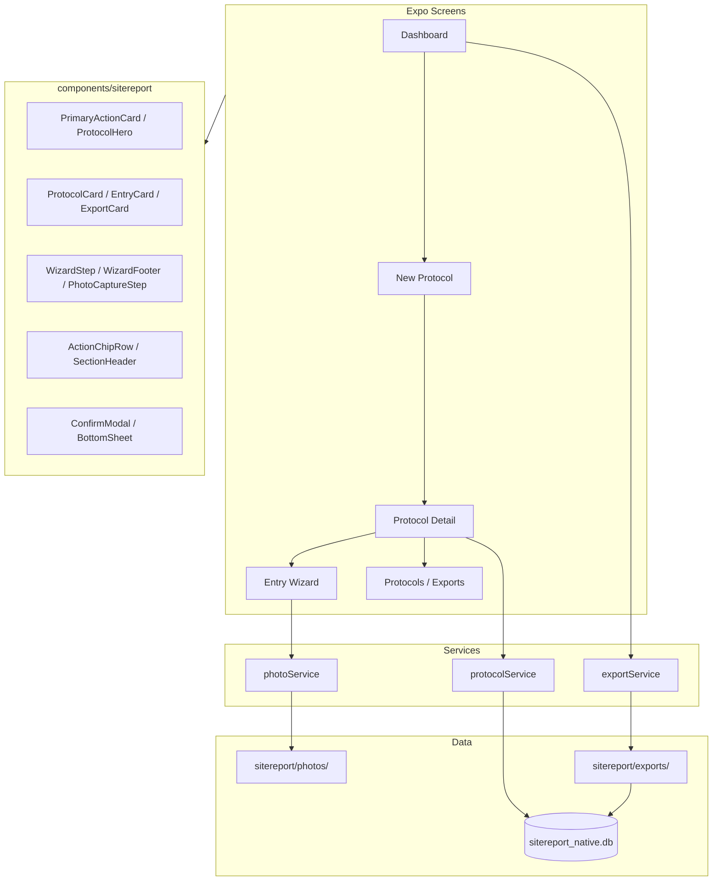

# SiteReport — Technische IST-Dokumentation (Expo APK)

> **Stand:** Juli 2026 (Premium-Native-UX + erweiterte technische Referenz, PR #27)  
> **Zweck:** Vollständige Beschreibung des SiteReport-Moduls in der **BÜW-Toolbox Expo-App** für Weiterentwicklung ohne Quellcode-Zugriff.  
> **Scope:** Ausschließlich die native Android-APK (`expo-toolbox/`). Keine PWA, kein WebView, keine SvelteKit-Referenz.

---

## Inhaltsverzeichnis

1. [Projektübersicht](#1-projektübersicht)
2. [UI/UX](#2-uiux)
3. [Navigation](#3-navigation)
4. [Funktionen](#4-funktionen)
5. [Datenmodell](#5-datenmodell)
6. [Datenhaltung](#6-datenhaltung)
7. [Einstellungen](#7-einstellungen)
8. [Komponenten](#8-komponenten)
9. [Custom Hooks & Context](#9-custom-hooks--context)
10. [State Management](#10-state-management)
11. [Services](#11-services)
12. [Sicherheit](#12-sicherheit)
13. [Bekannte Probleme](#13-bekannte-probleme)
14. [Architektur](#14-architektur)
15. [Verbesserungspotential](#15-verbesserungspotential)
16. [Zusammenfassung](#16-zusammenfassung)
17. [Build- und Laufzeitumgebung](#17-build--und-laufzeitumgebung)
18. [App-Konfiguration](#18-app-konfiguration)
19. [Vollständiges SQLite-Datenmodell](#19-vollständiges-sqlite-datenmodell)
20. [Datenfluss und Lifecycle](#20-datenfluss-und-lifecycle)
21. [Fehlerhandling](#21-fehlerhandling)
22. [Backup- und Restore-System](#22-backup--und-restore-system)
23. [Export-Spezifikation](#23-export-spezifikation)
24. [Datenschutz und Berechtigungen](#24-datenschutz-und-berechtigungen)
25. [Performance und Skalierung](#25-performance-und-skalierung)

---

## 1. Projektübersicht

### 1.1 Zweck der Anwendung

**SiteReport** ist ein **offline-fähiges Baustellen-Protokoll-Tool** innerhalb der **BÜW-Toolbox Expo-App**. Nutzer erstellen Foto-basierte Protokolleinträge auf der Baustelle, erfassen strukturierte Zusatzdaten über einen **geführten Wizard** und exportieren das Ergebnis als **Excel (XLSX)** und/oder **PDF** — optional mit **Firmenlogo** im Export.

Kernworkflow:

1. Dashboard öffnen → **„Neues Protokoll starten"** (Hero-CTA, 3-Schritt-Setup)
2. Tabellenformat wählen oder anlegen, Stammdaten + Logo erfassen
3. Protokoll-Detail → Einträge über **Guided Entry Wizard** (Foto → Felder → Status → Zusammenfassung)
4. Protokoll abschließen (Speichern / PDF / Excel / beides) oder Export aus Export-Center

Die App wird als **standalone Release-APK** verteilt (eingebettetes JS-Bundle, kein Metro-Server nötig).

### 1.2 Zielgruppe

- Bauleitung, Polier, Projektleitung auf Baustellen
- Mitarbeitende, die **Foto-Protokolle** mit tabellarischer Struktur führen
- Nutzer der **BÜW-Toolbox** (SiteReport ist eines von zwei Werkzeugen neben Bautagebuch)

### 1.3 Aktueller Entwicklungsstand

| Bereich | Status |
|---------|--------|
| Dashboard mit Statistiken + Hero-CTA | ✅ |
| Geführter Protokoll-Start (3 Schritte, WizardFooter) | ✅ |
| Guided Entry Wizard (Animation, Haptik) | ✅ |
| Format-Builder (Spaltenvorlagen, ↑/↓, Drag-Handle) | ✅ |
| Firmenlogo | ✅ |
| Stammdaten bearbeiten | ✅ |
| PDF-Export | ✅ |
| XLSX-Export | ✅ |
| Export-Cache (Dateipfade + Re-Share) | ✅ |
| Export-Center (eigener Screen, Bulk via „Auswahl") | ✅ |
| Protokoll-Liste mit Bulk-Auswahl | ✅ |
| Protokoll löschen (Einzel + Bulk) | ✅ |
| Entry löschen | ✅ |
| Protokoll abschließen (Modal) | ✅ |
| Foto-Kompression + permanente Speicherung | ✅ |
| Toast-Feedback (animiert) | ✅ |
| Bottom Sheets / Confirm Modals | ✅ |
| Haptisches Feedback (expo-haptics) | ✅ |
| Premium Native UX (Karten, Chips, Hero-Layout) | ✅ |
| Suche / Sortierung in Listen | ⚠️ UI-Platzhalter vorbereitet |
| Swipe-Aktionen | ⚠️ vorbereitet, nicht implementiert |
| Offline-Betrieb | ✅ |
| Multi-DB-Backup (Toolbox-Ebene) | ✅ |
| Dark Mode | ⚠️ Tokens vorbereitet, nicht aktiv |
| Cloud-Sync | ❌ |

**Fazit:** Die Expo-App hat **funktionale Parität zur PWA** und eine **professionelle native Mobile-UX** (Notion/Produktivitäts-App-Stil). Verbleibende Lücken: echte Suche/Sortierung, Swipe-Gesten, Dark Mode, Cloud-Sync, Schema-Migrationen.

### 1.4 Verwendete Technologien

| Technologie | Version (ca.) | Verwendung |
|-------------|---------------|------------|
| Expo SDK | ~57 | App-Framework |
| React Native | 0.86.x | UI |
| React | 19.2.x | UI |
| TypeScript | 5.9.x | Typsicherheit |
| Expo Router | ~57 | File-based Navigation |
| expo-sqlite | ~57 | SQLite-Datenbank |
| expo-image-picker | ~57 | Kamera / Galerie |
| expo-image-manipulator | ~57 | Foto-Kompression (1600px, 0.75) |
| expo-file-system | ~57 | Dateispeicher, Exporte, Fotos |
| expo-sharing | ~57 | System-Share-Sheet |
| expo-haptics | ~57 | Haptisches Feedback |
| ExcelJS | 4.4.x | XLSX-Generierung |
| pdf-lib | 1.17.x | PDF-Generierung |
| Space Grotesk | Google Fonts | Typografie |

**Nicht verwendet in SiteReport:** Redux, Zustand, React Query, MobX, WebViews, Drawer-Navigation, Cloud-Sync.

### 1.5 APK-Build & Verteilung

| Aspekt | Detail |
|--------|--------|
| Projekt | `expo-toolbox/` |
| CI-Workflow | `.github/workflows/android-apk.yml` |
| Trigger | Push auf `main` bei Änderungen in `expo-toolbox/**` oder `shared/**` |
| Build | `npx expo prebuild --platform android` → `./gradlew assembleRelease` |
| Release-Asset | `buew-toolbox-<version>-<sha>.apk` |
| GitHub-Tag | `apk-v<version>.<run_number>` |
| PR-Checks | Nur Typecheck, **keine APK** |

Details: [`ANDROID_APK.md`](ANDROID_APK.md)

### 1.6 Projektstruktur

```
/workspace/expo-toolbox/
├── app/
│   ├── _layout.tsx                          # Root Stack, ToastProvider, DB-Init
│   ├── (tabs)/
│   │   ├── index.tsx                          # Toolbox-Home
│   │   └── sitereport/index.tsx               # SiteReport-Dashboard (Tab)
│   └── sitereport/
│       ├── new-protocol.tsx                   # 3-Schritt Protokoll-Setup
│       ├── format-builder.tsx                 # Format-Editor
│       ├── protocols/index.tsx                # Protokoll-Liste (Bulk)
│       ├── exports/index.tsx                  # Export-Center
│       └── protocol/
│           ├── [id].tsx                       # Protokoll-Detail
│           ├── [id]/edit.tsx                  # Stammdaten bearbeiten
│           └── [id]/wizard.tsx                # Guided Entry Wizard
├── src/
│   ├── components/
│   │   ├── mobile/                            # Shared UI (Screen, Button, …)
│   │   └── sitereport/                        # SiteReport-spezifische Komponenten
│   ├── contexts/ToastContext.tsx              # App-weite Toast-Meldungen
│   ├── constants/theme.ts                     # Design Tokens
│   ├── constants/tools.ts                     # Tab-Definition
│   ├── lib/haptics.ts                         # Haptisches Feedback
│   ├── hooks/useOfflineBootstrap.ts           # Backup/Restore
│   ├── storage/backupService.ts               # Multi-DB-Backup
│   └── native/sitereport/
│       ├── db/database.ts                     # SQLite + Typen
│       ├── services/
│       │   ├── exportService.ts               # Export + Cache + Abschluss
│       │   ├── photoService.ts                # Kompression + Persistenz
│       │   └── protocolService.ts             # Entry/Protocol-Helfer, Bulk
│       └── lib/
│           ├── pdf.js
│           ├── xlsx-export.js
│           └── native-image.ts
├── app.config.js
├── eas.json
└── package.json
```

---

## 2. UI/UX

### 2.1 Design Tokens

**Datei:** `expo-toolbox/src/constants/theme.ts`

| Token | Wert | Verwendung |
|-------|------|------------|
| `colors.bg` | `#F2F0EB` | Hintergrund |
| `colors.ink` | `#1A1916` | Primärtext |
| `colors.muted` | `#6B6560` | Sekundärtext |
| `colors.accent` | `#C44B32` | Primär-Aktion, Tab aktiv |
| `colors.panel` | `#FFFCF7` | Karten, Header |
| `colors.border` | `#E4DDD2` | Rahmen |
| `colors.danger` | `#A12C24` | Fehler, Löschen |
| Font | Space Grotesk 400/600/700 | Gesamte App |

**Stil:** Professionelle Baustellen-App / moderne Produktivitäts-App (Notion Mobile, Apple Notes). Abgerundete Karten, Schatten, großzügige Abstände, große Touchflächen, klare visuelle Hierarchie, wenige Informationen pro Screen.

**UX-Prinzipien:**

- Eine klare Primäraktion pro Screen (fixierter Footer)
- Sekundäraktionen als kompakte Chips, nicht als Button-Wand
- Fortschritt immer sichtbar in Wizards (Schritt N von M, Dots, Balken, Animation)
- Haptisches Feedback bei wichtigen Aktionen
- Empty States mit Icon und Handlungsaufforderung

---

### 2.2 Dashboard

**Datei:** `app/(tabs)/sitereport/index.tsx`  
**Route:** `/(tabs)/sitereport`

#### Aufbau

1. **Header** — „SiteReport" / „Baustellen-Protokolle"
2. **StatCards (2×2)** — Protokolle, Einträge, Fotos, Exporte (Exporte tappbar → Export-Center)
3. **PrimaryActionCard** — große Hero-Karte: **„Neues Protokoll starten"** (Akzentfarbe, Chevron)
4. **Link** — „Alle Protokolle anzeigen"
5. **Zuletzt verwendet** — letzte 3 Protokolle als `ProtocolCard` (Datum, Einträge, Fotos als Chips)
6. **Letzte Exporte** — letzte 3 als `ProtocolCard`
7. **Empty State** — wenn keine Protokolle vorhanden

#### Interaktion

- Pull-to-Refresh
- **Kein FAB mehr** — Primäraktion nur über Hero-Karte
- Navigation zu `/sitereport/new-protocol`, `/sitereport/protocols`, `/sitereport/exports`

---

### 2.3 Neues Protokoll (3-Schritt-Setup)

**Datei:** `app/sitereport/new-protocol.tsx`  
**Route:** `/sitereport/new-protocol`

| Schritt | Inhalt |
|---------|--------|
| 1 — Allgemeine Daten | Protokollname*, Projekt, Beschreibung, Teilnehmer, Datum (readonly in Karte) |
| 2 — Firmenlogo | Auswählen, Vorschau, ändern, entfernen (gestrichelte Platzhalter-Fläche) |
| 3 — Tabellenformat | Template wählen, neu/bearbeiten, `TablePreview` |

**Footer:** `WizardFooter` — Zurück (ab Schritt 2) | Weiter / Protokoll erstellen (side-by-side, fixiert unten)

**UI:** `WizardStep` mit „Schritt N von M", Fortschritts-Dots, Balken, Fade/Slide-Animation beim Schrittwechsel

**Haptik:** Leichtes Feedback bei Weiter/Zurück, Success bei Erstellen

---

### 2.4 Protokoll-Detail

**Datei:** `app/sitereport/protocol/[id].tsx`  
**Route:** `/sitereport/protocol/:id`

#### Aufbau

1. **ProtocolHero** — Protokolltitel, Projektname, Datum, Status-Badge (z. B. „3 offen" / „Alle erledigt")
2. **StatCards (3er-Reihe)** — Einträge, Fotos, Offen
3. **ActionChipRow** — Export, Bearbeiten, Abschließen (kompakte Chips, nicht gestapelte Buttons)
4. **Einträge** — `SectionHeader` + `EntryCard`-Liste oder Empty State
5. **Footer (fixiert)** — **„+ Neuer Eintrag"** als einzige Primäraktion

#### EntryCard-Layout

- Foto groß oben (220px) oder Platzhalter
- Status-Badge
- Bis zu 3 Datenfelder
- Kompakte Aktions-Buttons: Bearbeiten / Löschen

#### Abschluss-Modal (`ConfirmModal`)

| Option | Aktion |
|--------|--------|
| Nur speichern | `updateProtocol()` → Protokoll-Liste |
| PDF erstellen | `closeProtocolWithExport('pdf')` |
| Excel erstellen | `closeProtocolWithExport('xlsx')` |
| PDF + Excel | `closeProtocolWithExport('both')` |

Export ohne Share-Sheet (`share: false`), Toast + Haptik.

#### Export Bottom Sheet

- PDF exportieren (mit Share-Sheet)
- Excel exportieren (mit Share-Sheet)

---

### 2.5 Stammdaten bearbeiten

**Datei:** `app/sitereport/protocol/[id]/edit.tsx`  
**Route:** `/sitereport/protocol/:id/edit`

Editierbar: Titel, Projekt, Beschreibung, Teilnehmer, Logo.  
Datum bleibt readonly (aus Protokoll-Record).

---

### 2.6 Guided Entry Wizard

**Datei:** `app/sitereport/protocol/[id]/wizard.tsx`  
**Route:** `/sitereport/protocol/:id/wizard?entryId=<id>` (optional für Bearbeiten)

#### Ablauf

1. Pro Spalte ein Screen (`WizardStep` mit „Schritt N von M", Dots, Animation)
2. **Foto-Spalte:** `PhotoCaptureStep` — große Kamera-Fläche (320px), Vorschau, entfernen
3. **Status-Spalte:** `StatusFieldStep` — große Touch-Buttons (Offen / Bearbeitung / Erledigt)
4. **Andere Spalten:** `FieldStep` — ein großes Eingabefeld pro Screen, Auto-Focus
5. **Zusammenfassung:** `ProtocolSummary` → Speichern

**Footer:** `WizardFooter` — Zurück | Weiter / Speichern (fixiert unten)

**Foto:** `captureProtocolPhoto()` → Kompression → `sitereport/photos/{protocolId}/{entryId}.jpg`

**Haptik:** Light bei Navigation, Success bei Speichern

**Query:** `entryId` gesetzt = Bearbeiten, sonst neuer Eintrag

---

### 2.7 Protokoll-Liste

**Datei:** `app/sitereport/protocols/index.tsx`  
**Route:** `/sitereport/protocols`

- **SearchFieldPlaceholder** — „Protokolle durchsuchen… (bald verfügbar)"
- **Sortier-Platzhalter** — „Sortierung: Neueste zuerst" (Toast-Hinweis)
- **ProtocolCards** mit Titel, Projekt, Datum/Einträge/Fotos als Chips
- Einzel-Löschen (✕ + Alert)
- **Bulk-Modus** über Button **„Auswahl"** (nicht dauerhaft sichtig): Checkboxen, Alle, Bulk-Export (Bottom Sheet), Bulk-Löschen

---

### 2.8 Export-Center

**Datei:** `app/sitereport/exports/index.tsx`  
**Route:** `/sitereport/exports`

- **SectionHeader** mit Anzahl + **„Auswahl"**-Toggle (Bulk nur bei Aktivierung)
- **ExportCards** mit PDF/Excel-Icon-Kreisen, Protokollname, Datum
- PDF/Excel teilen, Löschen (nur außerhalb Auswahl-Modus)
- Bulk-Löschen im Auswahl-Modus

---

### 2.9 Format-Builder

**Datei:** `app/sitereport/format-builder.tsx`  
**Route:** `/sitereport/format-builder?mode=new|edit&templateId=...`

- `FormatColumnCard` pro Spalte mit Drag-Handle (≡), Positionsnummer (#N)
- Spalte hinzufügen/bearbeiten/entfernen, ↑/↓ Reorder (mobile-optimiert)
- Foto-Spalte fest (📷-Icon), nicht löschbar
- Toast bei Speichern

---

### 2.10 Globale UI-Elemente

| Element | Verwendung |
|---------|------------|
| `ToastProvider` | „Gespeichert", „Exportiert", „Gelöscht" (animiert, ~2,2s) |
| `ConfirmModal` | Abschluss-Flow, kritische Bestätigungen (fade) |
| `BottomSheet` | Export-Auswahl, Bulk-Export (slide-up) |
| `WizardFooter` | Fixierter Zurück/Weiter-Footer in allen Wizards |
| `haptics.ts` | Light/Medium/Success/Selection Feedback |
| `Alert.alert` | Löschen-Bestätigung, Kamera-Berechtigung, Fehler |

---

## 3. Navigation

### 3.1 Expo Router Struktur

```
Root Stack (_layout.tsx) + ToastProvider
├── (tabs)
│   ├── index                    # Toolbox-Home
│   ├── sitereport/index         # Dashboard (Tab)
│   └── bautagebuch/
├── sitereport/new-protocol
├── sitereport/protocol/[id]
├── sitereport/protocol/[id]/edit
├── sitereport/protocol/[id]/wizard
├── sitereport/protocols/index
├── sitereport/exports/index
└── sitereport/format-builder
```

### 3.2 Screen-Hierarchie

```
Dashboard (Tab)
├── Neues Protokoll (3 Schritte, WizardFooter)
│   └── → Protokoll-Detail
│       ├── Stammdaten bearbeiten
│       ├── Entry Wizard (neu/bearbeiten, WizardFooter)
│       ├── Export (Bottom Sheet via Chip)
│       └── Abschließen (Modal via Chip) → Protokoll-Liste
├── Protokolle (Bulk via „Auswahl")
├── Export-Center (Bulk via „Auswahl")
└── Format-Builder
```

### 3.3 Deep Links

- `sitereport/new-protocol`
- `sitereport/protocol/<id>`
- `sitereport/protocol/<id>/edit`
- `sitereport/protocol/<id>/wizard?entryId=<id>`
- `sitereport/protocols`
- `sitereport/exports`
- `sitereport/format-builder?mode=new|edit&templateId=<id>`

---

## 4. Funktionen

### 4.1 Firmenlogo

| Aspekt | Detail |
|--------|--------|
| Speicher | Data-URL in SQLite `settings.id='logo'` |
| Eingabe | Galerie-Picker in Setup (Schritt 2) oder Stammdaten-Edit |
| Ausgabe | In PDF/XLSX Header eingebettet |

### 4.2 Tabellenformat

Templates in SQLite, Seed „Standard Baustelle", ↑/↓ Reorder, `FormatColumnCard` mit Drag-Handle-Optik.

### 4.3 Protokoll erstellen

**Screen:** `new-protocol.tsx` (3 Schritte)  
**Pflicht:** Protokollname + Template  
**Ablauf:** `createProtocol()` mit vollständigen Stammdaten → Detail-Screen

### 4.4 Stammdaten bearbeiten

**Screen:** `protocol/[id]/edit.tsx`  
Editierbar: Titel, Projekt, Beschreibung, Teilnehmer, Logo. Datum readonly.

### 4.5 Eintrag hinzufügen (Guided Wizard)

| Aspekt | Detail |
|--------|--------|
| Ablauf | Wizard: Foto → je Spalte ein Screen → Zusammenfassung |
| Foto | `expo-image-manipulator` (1600px, JPEG 0.75) |
| Speicherort | `{documentDirectory}sitereport/photos/{protocolId}/{entryId}.jpg` |
| Status | `offen` / `bearbeitung` / `erledigt` |
| Reihenfolge | Neueste oben (prepend) |

### 4.6 Eintrag bearbeiten / löschen

| Aktion | Implementierung |
|--------|-----------------|
| Bearbeiten | Wizard mit `?entryId=` |
| Löschen | `removeProtocolEntry()` + Foto-Datei löschen, Alert-Bestätigung |

### 4.7 Protokoll abschließen

`closeProtocolWithExport(protocol, mode)` — Speichern, PDF, XLSX oder beides ohne Share-Sheet, dann Navigation zur Protokoll-Liste.

### 4.8 PDF / XLSX Export

Technisch (`pdf.js`, `xlsx-export.js`).  
`exportProtocolPdf/Xlsx(protocol, { share: true|false })`.

### 4.9 Export-Cache

Eigener Screen `/sitereport/exports`. `shareCachedExport`, `deleteCachedExport`, Bulk-Löschen.

### 4.10 Protokoll-Verwaltung

| Aktion | API |
|--------|-----|
| Einzel löschen | `deleteProtocolWithCleanup()` |
| Bulk löschen | `bulkDeleteProtocols()` |
| Bulk exportieren | `exportProtocolPdf/Xlsx` mit `share: false` |

### 4.11 Bulk-Auswahl

Protokolle und Exporte: Selection-Mode über **„Auswahl"**-Button, Checkboxen (`SelectionCheckbox`), Alle auswählen, Bulk-Aktionen.

---

## 5. Datenmodell

SQLite-Schema für SiteReport ist **stabil und ohne Migrations-Framework** (Tabellen werden per `CREATE TABLE IF NOT EXISTS` angelegt). Vollständige Schema-Beschreibung mit Spalten, JSON-Strukturen und Beispielwerten: **Kapitel 19**.

### 5.1 Kern-Typen (TypeScript)

| Typ | Datei | Beschreibung |
|-----|-------|--------------|
| `SiteReportColumn` | `database.ts` | Spaltendefinition (id, name, type, isPhoto) |
| `SiteReportEntry` | `database.ts` | Protokolleintrag (id, createdAt, fields, photoPath) |
| `SiteReportProtocol` | `database.ts` | Protokoll inkl. columns + entries (deserialisiert) |
| `SiteReportTemplate` | `database.ts` | Tabellenformat-Vorlage |
| `SiteReportSettings` | `database.ts` | Aktives Template + Spalten (`settings.id = 'current'`) |
| `SiteReportExport` | `database.ts` | Export-Cache-Metadaten |

### 5.2 `photoPath`

Permanenter absoluter Pfad unter `{documentDirectory}sitereport/photos/{protocolId}/{entryId}.jpg` — **nicht** der temporäre Kamera-Cache-URI.

### 5.3 Soft Delete

Protokolle werden per `deleted_at` (ISO-Zeitstempel) markiert, nicht physisch aus der Tabelle entfernt. `listProtocols()` filtert gelöschte Einträge heraus.

---

## 6. Datenhaltung

### 6.1 SQLite

`sitereport_native.db` — unverändert (protocols, settings, templates, exports).

### 6.2 Dateispeicherung

| Pfad | Inhalt |
|------|--------|
| `sitereport/exports/*.pdf` | PDF-Exporte |
| `sitereport/exports/*.xlsx` | XLSX-Exporte |
| `sitereport/photos/{protocolId}/*.jpg` | **Permanente Eintrags-Fotos** |

### 6.3 Foto-Pipeline

```
launchCameraAsync
  → ImageManipulator (resize 1600px, compress 0.75, JPEG)
  → copyAsync → sitereport/photos/{protocolId}/{entryId}.jpg
  → photoPath in entry
```

Beim Löschen: `deleteEntryPhoto()`. Beim Protokoll-Löschen: `deleteProtocolPhotos(protocolId)`.

### 6.4 Backup

`backupService.ts` sichert `sitereport_native.db` mit Toolbox-DBs.

---

## 7. Einstellungen

Template (`settings.current`), Logo (`settings.logo`). Kein Dark Mode aktiv.

---

## 8. Komponenten

### 8.1 SiteReport (`src/components/sitereport/`)

| Komponente | Zweck |
|------------|-------|
| `PrimaryActionCard` | Hero-CTA auf dem Dashboard |
| `ProtocolCard` | Protokoll-Karte mit Chips (Datum, Einträge, Fotos), Bulk-Checkbox |
| `ProtocolHero` | Hero-Header im Protokoll-Detail |
| `EntryCard` | Eintrag mit Foto oben, Status-Badge, kompakte Aktionen |
| `ExportCard` | Export-Karte mit PDF/Excel-Icons, Teilen/Löschen |
| `FormatColumnCard` | Spalten-Editor mit Drag-Handle und ↑/↓ |
| `WizardStep` | Schritt-Anzeige mit Dots, Balken, Animation |
| `WizardFooter` | Fixierter Zurück/Weiter-Footer |
| `PhotoCaptureStep` | Große Kamera-UI im Wizard |
| `FieldStep` | Einzelfeld im Wizard (Auto-Focus) |
| `StatusFieldStep` | Status-Auswahl (große Touch-Buttons) |
| `ProtocolSummary` | Zusammenfassung vor Speichern |
| `TablePreview` | Tabellenvorschau im Setup |
| `SectionHeader` | Abschnitts-Überschrift mit optionalem Link |
| `ActionChipRow` | Sekundäraktionen als Chips |
| `SelectionCheckbox` | Bulk-Auswahl-Checkbox |
| `SearchFieldPlaceholder` | Suchfeld-Platzhalter (vorbereitet) |
| `DashboardActionCard` | Legacy-Schnellaktion (nicht mehr auf Dashboard) |
| `ConfirmModal` | Native Modal für Bestätigungen |
| `BottomSheet` | Slide-up Sheet für Export-Auswahl |

### 8.2 Shared Mobile (`src/components/mobile/`)

`Screen`, `PrimaryButton`, `TextField`, `ListItem`, `Card`, `StatCard`, `StatusBadge`, `EmptyState` (mit Icon), `Fab` (nicht mehr auf SiteReport-Dashboard)

### 8.3 Utilities (`src/lib/`)

| Datei | Zweck |
|-------|-------|
| `haptics.ts` | `hapticLight`, `hapticMedium`, `hapticSuccess`, `hapticSelection` |

---

## 9. Custom Hooks & Context

### `useToast()` — `src/contexts/ToastContext.tsx`

| API | Beschreibung |
|-----|--------------|
| `showToast(message)` | Kurze Meldung unten, animiert, auto-hide |

Eingebunden in `app/_layout.tsx` via `ToastProvider`.

### `useOfflineBootstrap()` — App-weit

Backup/Restore-Banner (unverändert).

**Keine SiteReport-spezifischen Hooks** — State in Screen-Komponenten, UI in `components/sitereport/`.

---

## 10. State Management

| Ansatz | Verwendung |
|--------|------------|
| React `useState` | Alle Screens |
| `useCallback` / `useEffect` | Laden, Refresh |
| `ToastContext` | Globales Feedback |
| Kein Redux/Zustand/React Query | — |

---

## 11. Services

### 11.1 `database.ts`

CRUD für protocols, templates, settings, exports, `softDeleteProtocol`, `todayDe()`.

### 11.2 `photoService.ts`

| Funktion | Beschreibung |
|----------|--------------|
| `compressAndPersistPhoto` | Resize + JPEG + copy nach photos/ |
| `captureProtocolPhoto` | Kamera → persistieren |
| `deleteEntryPhoto` | Einzelnes Foto löschen |
| `deleteProtocolPhotos` | Gesamten Protokoll-Ordner löschen |

### 11.3 `protocolService.ts`

| Funktion | Beschreibung |
|----------|--------------|
| `createEntryId` | ID-Generierung |
| `emptyFieldsFromColumns` | Default-Felder inkl. Status `offen` |
| `protocolStats` | entryCount, photoCount, openCount |
| `removeProtocolEntry` | Entry + Foto löschen |
| `deleteProtocolWithCleanup` | Protokoll + Exporte + Fotos |
| `bulkDeleteProtocols` | Mehrere Protokolle |
| `upsertProtocolEntry` | Entry erstellen/aktualisieren |
| `getProtocolOrThrow` | Laden mit Fehler |

### 11.4 `exportService.ts`

| Funktion | Beschreibung |
|----------|--------------|
| `exportProtocolPdf(protocol, { share? })` | PDF generieren, optional teilen |
| `exportProtocolXlsx(protocol, { share? })` | XLSX generieren, optional teilen |
| `closeProtocolWithExport(protocol, mode)` | Abschluss: save/pdf/xlsx/both |
| `shareCachedExport` | Aus Cache teilen oder regenerieren |
| `deleteCachedExport` | Dateien + DB-Eintrag löschen |
| `listExports` | Re-export aus database |

---

## 12. Sicherheit

Kamera- und Galerie-Berechtigungen, keine DB-Verschlüsselung, lokale Datenhaltung.

---

## 13. Bekannte Probleme

| ID | Beschreibung | Schwere |
|----|--------------|---------|
| B1 | Kein Schema-Migrations-Framework | Mittel |
| B2 | Logo als große Data-URL in SQLite | Niedrig |
| B3 | Spalten umbenennen bricht `fields`-Keys in alten Einträgen | Mittel |
| B4 | `entriesJson` bei jedem Feld-Update voll serialisiert | Niedrig |
| B5 | Dark Mode Tokens vorhanden, nicht aktiv | Niedrig |
| B6 | Keine Cloud-Sync | Info |
| B7 | Suche/Sortierung nur als UI-Platzhalter | Niedrig |

**Behoben seit vorheriger Doku:** Foto-Persistenz, Wizard, Bulk, Protokoll-Löschen, Stammdaten-Edit, Abschluss-Flow, Premium Native UX, Haptik.

---

## 14. Architektur

### 14.1 Schichten

| Schicht | Verantwortung |
|---------|---------------|
| Screens (`app/sitereport/`) | Navigation, lokaler State, Orchestrierung |
| `components/sitereport/` | Präsentations-Komponenten (UI only) |
| `protocolService.ts` | Business-Logik Entry/Protocol |
| `photoService.ts` | Foto-Pipeline |
| `exportService.ts` | Export-Pipeline |
| `database.ts` | Persistenz |

### 14.2 Diagramm



---

## 15. Verbesserungspotential

- **Echte Suche** in Protokoll-Liste (Platzhalter vorhanden)
- **Sortierung** (neueste/älteste, Projektname)
- **Swipe-to-Delete** auf Protokoll- und Export-Karten
- **Schema-Migrationen** (`PRAGMA user_version`)
- **Dark Mode** aktivieren
- **Repository-Pattern** zwischen Screens und DB
- **Spalten-ID statt Name** als Field-Key (Umbenennung-sicher)
- **On-Device-Tests** der Export-Pipeline auf Release-APK

---

## 16. Zusammenfassung

### Was funktioniert

| Feature | Status |
|---------|:------:|
| Dashboard mit Hero-CTA + Statistiken | ✅ |
| Geführter Protokoll-Start (WizardFooter) | ✅ |
| Guided Entry Wizard (Animation + Haptik) | ✅ |
| Stammdaten bearbeiten | ✅ |
| Protokoll abschließen | ✅ |
| Entry löschen | ✅ |
| Protokoll löschen (Einzel + Bulk) | ✅ |
| Bulk-Export | ✅ |
| Export-Center | ✅ |
| Foto-Kompression + Persistenz | ✅ |
| Toast / Modals / Bottom Sheets | ✅ |
| Haptisches Feedback | ✅ |
| Premium Native UX | ✅ |
| PDF/XLSX Export + Cache | ✅ |
| Offline + Backup | ✅ |

### Was fehlt noch

- Echte Suche und Sortierung
- Swipe-Gesten
- Dark Mode
- Cloud-Sync
- SQLite-Migrations-Framework
- Template löschen (API fehlt)

### Nächste Schritte

1. PR #27 mergen → Premium UX auf `main`
2. On-Device-Test: Wizard → Export → Abschluss
3. Suche/Sortierung implementieren
4. Schema-Versionierung für zukünftige Updates

---

## 17. Build- und Laufzeitumgebung

> Werte stammen aus `package.json`, CI-Workflow (`.github/workflows/android-apk.yml`) und dem per `expo prebuild` erzeugten Android-Projekt (nicht im Git committed). Nach SDK-Upgrade **zu prüfen**.

### 17.1 Entwicklungsumgebung

| Komponente | Version / Wert | Quelle |
|------------|----------------|--------|
| **Node.js** | **22** | GitHub Actions `setup-node` |
| **Paketmanager** | **npm** (`npm ci`) | CI + `package-lock.json` |
| yarn / pnpm | nicht im CI verwendet | — |
| **TypeScript** | ~5.9.2 | `package.json` |
| **Expo SDK** | ~57.0.7 | `package.json` |
| **React Native** | 0.86.0 | `package.json` |
| **React** | 19.2.3 | `package.json` |

### 17.2 Android-Build (nach `expo prebuild`)

| Komponente | Version / Wert | Quelle |
|------------|----------------|--------|
| **Java (JDK)** | **17** (Temurin) | GitHub Actions `setup-java` |
| **Gradle** | **9.3.1** | `android/gradle/wrapper/gradle-wrapper.properties` |
| **Android Gradle Plugin (AGP)** | **8.12.0** | `@react-native/gradle-plugin/gradle/libs.versions.toml` |
| **compileSdk** | **35** | Expo-Defaults (`expo-modules-autolinking`) |
| **targetSdk** | **35** | Expo-Defaults |
| **minSdk** | **24** | Expo-Defaults |
| **buildToolsVersion** | **35.0.0** | Expo-Defaults |
| **NDK** | über `rootProject.ext.ndkVersion` | *zu prüfen* nach prebuild |
| **Hermes** | aktiviert (`hermesEnabled=true`) | `android/gradle.properties` |
| **New Architecture** | aktiviert (`newArchEnabled=true`) | `android/gradle.properties` |

### 17.3 Build-Befehle

| Zweck | Befehl | Arbeitsverzeichnis |
|-------|--------|-------------------|
| Abhängigkeiten | `npm ci` | `expo-toolbox/` |
| Typecheck | `npm run typecheck` | `expo-toolbox/` |
| Dev-Server | `npm start` / `npx expo start` | `expo-toolbox/` |
| Native Android erzeugen | `npx expo prebuild --platform android` | `expo-toolbox/` |
| Release-APK | `./gradlew assembleRelease` | `expo-toolbox/android/` |

### 17.4 CI / Release-APK

| Aspekt | Detail |
|--------|--------|
| Workflow | `.github/workflows/android-apk.yml` |
| PR | nur `npm run typecheck` |
| Push `main` | prebuild + `assembleRelease` + GitHub Release |
| JS-Bundle | eingebettet via `export:embed` (kein Metro auf Gerät) |
| Ausgabe | `buew-toolbox-<version>-<sha>.apk` |
| Native `android/` | **nicht committed** (CNG); bei Build frisch generiert |

### 17.5 EAS (optional)

`eas.json` definiert Profile `development`, `preview` (APK), `production` (AAB). Der dokumentierte Standard-Release-Weg ist **GitHub Actions**, nicht EAS Cloud Build — *EAS-Nutzung im Team zu prüfen*.

### 17.6 Laufzeit auf dem Gerät

| Aspekt | Detail |
|--------|--------|
| Betriebssystem | Android ≥ API 24 (Android 7.0) |
| Orientierung | Portrait (`app.config.js`) |
| Datenbank | `expo-sqlite`, Datei `sitereport_native.db` |
| Dateisystem | `expo-file-system` → `documentDirectory` |
| JS-Engine | Hermes (Release-APK) |

---

## 18. App-Konfiguration

**Datei:** `expo-toolbox/app.config.js`  
SiteReport ist ein **Modul innerhalb der BÜW-Toolbox** — App-weite Einstellungen gelten für die gesamte APK.

### 18.1 Identität

| Eigenschaft | Wert |
|-------------|------|
| **App-Name** | `BÜW-Toolbox` |
| **Slug** | `buew-toolbox` |
| **Android Package** | `de.buew.toolbox` |
| **iOS Bundle ID** | `de.buew.toolbox` (vorhanden, SiteReport-Fokus: Android) |
| **Scheme (Deep Link)** | `buew-toolbox` |
| **version** (Expo) | `1.0.0` |
| **versionName** (Android, prebuild) | `1.0.0` |
| **versionCode** (Android, prebuild) | `1` |
| **userInterfaceStyle** | `light` (Dark Mode nicht aktiv) |
| **backgroundColor** | `#F2F0EB` |

> **Hinweis:** `versionCode` wird beim prebuild aus Expo-Version abgeleitet; für Play-Store-Releases muss die Inkrementierung *manuell bzw. über Build-Pipeline zu prüfen* sein.

### 18.2 Icons & Splash

| Asset | Pfad | Verwendung |
|-------|------|------------|
| App-Icon | `./assets/icon.png` | Launcher |
| Adaptive Icon (Vordergrund) | `./assets/android-icon-foreground.png` | Android adaptive |
| Adaptive Icon (Hintergrund) | `./assets/android-icon-background.png` | Android adaptive |
| Monochrome | `./assets/android-icon-monochrome.png` | Android 13+ |
| Splash | `./assets/splash-icon.png` | Startbildschirm |
| Splash-Hintergrund | `#F2F0EB` | `contain` |
| Web-Favicon | `./assets/favicon.png` | nur Web |

### 18.3 Expo-Plugins (relevant für SiteReport)

| Plugin | Wirkung |
|--------|---------|
| `expo-router` | File-based Navigation |
| `expo-sqlite` | SQLite-Zugriff |
| `expo-image-picker` | Kamera + Galerie; `cameraPermission`-Text konfiguriert |
| `expo-font` | Space Grotesk |
| `expo-system-ui` | System-UI-Hintergrund `#F2F0EB` |

### 18.4 Android-Berechtigungen (`app.config.js` + generiertes Manifest)

**Explizit in `app.config.js`:**

| Permission | Zweck (App-Ebene) |
|------------|-------------------|
| `CAMERA` | Foto-Aufnahme im Entry-Wizard |
| `ACCESS_FINE_LOCATION` | Bautagebuch (nicht SiteReport) |
| `ACCESS_COARSE_LOCATION` | Bautagebuch (nicht SiteReport) |

**Zusätzlich im generierten `AndroidManifest.xml` (Expo/React Native):**

| Permission | SiteReport-relevant? |
|------------|---------------------|
| `INTERNET` | Ja (technisch; SiteReport arbeitet offline, kein API-Traffic) |
| `READ_EXTERNAL_STORAGE` (maxSdk 32) | Galerie / Logo-Auswahl |
| `WRITE_EXTERNAL_STORAGE` (maxSdk 32) | Legacy-Speicher |
| `VIBRATE` | Haptik (`expo-haptics`) |
| `RECORD_AUDIO` | Nein (App-weit; nicht von SiteReport genutzt) |
| `SYSTEM_ALERT_WINDOW` | Dev/Overlay (Expo-Standard) |

**Galerie (Logo):** Laufzeit-Abfrage via `ImagePicker.requestMediaLibraryPermissionsAsync()` — kein separater Permission-String in `app.config.js`.

**Kamera (Eintrags-Foto):** Laufzeit-Abfrage via `ImagePicker.requestCameraPermissionsAsync()` in `photoService.ts`.

### 18.5 Backup-Verhalten Android

| Einstellung | Wert | Bedeutung |
|-------------|------|-----------|
| `android:allowBackup` | `true` | Android Auto-Backup *kann* App-Daten sichern |
| App-internes Backup | `backupService.ts` | Eigene SQLite-Kopien in `backups/` (Toolbox-Ebene) |

> Android-System-Backup und App-internes DB-Backup sind **getrennte Mechanismen**. SiteReport-Fotos/Exporte liegen unter `documentDirectory` und werden vom **internen Backup nur indirekt** über DB-Metadaten referenziert — die Dateien selbst werden **nicht** kopiert (siehe Kapitel 22).

### 18.6 Release-Konfiguration

| Aspekt | Wert |
|--------|------|
| Build-Typ (CI) | `assembleRelease` |
| Signing (CI/prebuild) | Debug-Keystore in generiertem Projekt | *Produktions-Keystore: zu prüfen* |
| Minify (R8) | standardmäßig aus (`enableMinifyInReleaseBuilds=false`) |
| JS-Bundle | Hermes, `export:embed` |
| OTA Updates | `expo.modules.updates.ENABLED=false` |

### 18.7 Umgebungsvariablen (`extra`)

| Variable | Default | Verwendung |
|----------|---------|------------|
| `EXPO_PUBLIC_TOOLBOX_WEB_BASE_URL` | `https://kclk08.github.io/buew-toolbox` | Toolbox-Web (nicht SiteReport-Kern) |
| `EAS_PROJECT_ID` | optional | EAS Build |

---

## 19. Vollständiges SQLite-Datenmodell

**Datenbankdatei:** `sitereport_native.db`  
**Pfad:** `{documentDirectory}SQLite/sitereport_native.db`  
**Initialisierung:** `initSiteReportDatabase()` → `getDb()` mit `CREATE TABLE IF NOT EXISTS`  
**Migrations-Framework:** **keines** (kein `PRAGMA user_version` für SiteReport-DB)

### 19.1 Tabelle `protocols`

| Spalte | SQLite-Typ | Pflicht | Beschreibung |
|--------|------------|---------|--------------|
| `id` | TEXT PK | ja | Protokoll-ID (`protocol_{ts}_{rand}`) |
| `createdAt` | TEXT | ja | ISO-8601 Erstellzeit |
| `updatedAt` | TEXT | ja | ISO-8601 letzte Änderung |
| `protocolTitle` | TEXT | ja | Anzeigename / Protokolltitel |
| `projectName` | TEXT | ja | Projektname |
| `protocolDate` | TEXT | ja | Datum `TT-MM-JJJJ` (`todayDe()`) |
| `protocolDescription` | TEXT | ja (Default `''`) | Beschreibung |
| `attendees` | TEXT | ja (Default `''`) | Teilnehmer |
| `columnsJson` | TEXT | ja | JSON-Array `SiteReportColumn[]` |
| `entriesJson` | TEXT | ja | JSON-Array `SiteReportEntry[]` |
| `deleted_at` | TEXT | nein | Soft-Delete-Zeitstempel oder `NULL` |

**Beziehungen:**

- 1 Protokoll → n Einträge (in `entriesJson` eingebettet, nicht normalisiert)
- 1 Protokoll → 0..1 Export-Cache-Eintrag (`exports.protocolId`)
- Spaltenlayout kommt aus `columnsJson` (Kopie zum Erstellzeitpunkt)

**Beispiel `columnsJson`:**

```json
[
  {"id":"col_photo","name":"Bilder","type":"text","isPhoto":true},
  {"id":"col_km","name":"Kilometer","type":"number","isPhoto":false},
  {"id":"col_desc","name":"Beschreibung","type":"text","isPhoto":false},
  {"id":"col_status","name":"Status","type":"text","isPhoto":false}
]
```

**Beispiel `entriesJson` (ein Eintrag):**

```json
[
  {
    "id": "entry_1721234567890_a1b2c3",
    "createdAt": "2026-07-21T10:00:00.000Z",
    "fields": {
      "Kilometer": 12.5,
      "Beschreibung": "Fundament gegossen",
      "Status": "offen"
    },
    "photoPath": "file:///data/user/0/de.buew.toolbox/files/sitereport/photos/protocol_.../entry_....jpg"
  }
]
```

> **Wichtig:** `fields` verwendet **Spaltennamen** als Keys, nicht Spalten-IDs. Umbenennung einer Spalte bricht bestehende Einträge (bekanntes Problem B3).

### 19.2 Tabelle `templates`

| Spalte | SQLite-Typ | Pflicht | Beschreibung |
|--------|------------|---------|--------------|
| `id` | TEXT PK | ja | `tpl_{ts}_{rand}` |
| `createdAt` | TEXT | ja | ISO-8601 |
| `name` | TEXT | ja | Vorlagenname (z. B. „Standard Baustelle") |
| `columnsJson` | TEXT | ja | JSON-Array `SiteReportColumn[]` |

**Seed:** Bei leerer Tabelle wird automatisch „Standard Baustelle" mit `defaultColumns` angelegt.

**Beziehungen:** Templates werden über `settings.id='current'` referenziert; Protokolle speichern eine **Kopie** der Spalten in `columnsJson`.

### 19.3 Tabelle `settings`

Key-Value-Tabelle (kein JSON-Wrapper auf Tabellenebene).

| `id` (PK) | `value` (TEXT) | Inhalt |
|-----------|----------------|--------|
| `current` | JSON-String | `SiteReportSettings`: `{ selectedTemplateId, columns }` |
| `logo` | Data-URL-String | `data:image/png;base64,...` oder JPEG |

**Beispiel `current`:**

```json
{
  "selectedTemplateId": "tpl_1721234567890_x9y8z7",
  "columns": [ /* SiteReportColumn[] */ ]
}
```

### 19.4 Tabelle `exports`

| Spalte | SQLite-Typ | Pflicht | Beschreibung |
|--------|------------|---------|--------------|
| `id` | TEXT PK | ja | Standard: `export_{protocolId}` |
| `protocolId` | TEXT | ja | Referenz auf Protokoll |
| `protocolTitle` | TEXT | ja | Denormalisiert für Anzeige |
| `projectName` | TEXT | ja | Denormalisiert |
| `protocolDate` | TEXT | ja | Denormalisiert |
| `createdAt` | TEXT | ja | ISO-8601 |
| `updatedAt` | TEXT | ja | ISO-8601 |
| `pdfPath` | TEXT | nein | Absoluter Pfad zur PDF-Datei |
| `pdfFilename` | TEXT | nein | Dateiname ohne Pfad |
| `xlsxPath` | TEXT | nein | Absoluter Pfad zur XLSX-Datei |
| `xlsxFilename` | TEXT | nein | Dateiname ohne Pfad |

**Indizes:**

- `idx_exports_protocol` auf `protocolId`
- `idx_exports_updated` auf `updatedAt`

**Beziehungen:** Pro `protocolId` typischerweise ein Cache-Eintrag (`upsertExportByProtocol`); PDF und XLSX können im selben Record koexistieren.

### 19.5 JSON-Typen (TypeScript ↔ SQLite)

#### `SiteReportColumn`

```typescript
{ id: string; name: string; type: 'text' | 'number'; isPhoto: boolean }
```

#### `SiteReportEntry`

```typescript
{ id: string; createdAt: string; fields: Record<string, string | number>; photoPath: string | null }
```

#### `SiteReportProtocol` (deserialisiert)

Alle `protocols`-Spalten + geparste `columns` / `entries` Arrays.

### 19.6 IDs und Zeitstempel

| Entität | Format | Generator |
|---------|--------|-----------|
| Protocol | `protocol_{Date.now()}_{random6}` | `createId()` in `database.ts` |
| Template | `tpl_{Date.now()}_{random6}` | `createId()` / Format-Builder |
| Entry | `entry_{Date.now()}_{random6}` | `createEntryId()` in `protocolService.ts` |
| Column | `col_{Date.now()}_{random6}` | Format-Builder |
| Export | `export_{protocolId}` | `upsertExportByProtocol()` |
| Zeitstempel | ISO-8601 UTC | `nowIso()` → `new Date().toISOString()` |
| Protokolldatum (UI) | `TT-MM-JJJJ` | `todayDe()` |
| Soft-Delete | ISO-8601 | `softDeleteProtocol()` |

---

## 20. Datenfluss und Lifecycle

### 20.1 Neuer Protokolleintrag

```
Entry Wizard UI (wizard.tsx)
  │  WizardStep / PhotoCaptureStep / FieldStep / StatusFieldStep
  │  Lokaler State: fields, photoPath, stepIndex
  ▼
Nutzer tippt „Speichern" (Zusammenfassung)
  ▼
protocolService.upsertProtocolEntry(protocol, entry, editingEntryId?)
  │  Neuer Eintrag: prepend in entries[]
  │  Bearbeiten: replace by entry.id
  ▼
database.updateProtocol(protocol)
  │  Serialisiert columnsJson + entriesJson
  │  Setzt updatedAt = nowIso()
  ▼
SQLite protocols-Tabelle
  │
  ▼
router.back() → Protokoll-Detail lädt via getProtocolOrThrow()
  ▼
EntryCard-Liste + protocolStats()
```

**Foto-Zweig (parallel im Wizard):**

```
PhotoCaptureStep → captureProtocolPhoto()
  → ImagePicker.launchCameraAsync()
  → photoService.compressAndPersistPhoto()  (1600px, JPEG 0.75)
  → FileSystem: sitereport/photos/{protocolId}/{entryId}.jpg
  → photoPath im lokalen Wizard-State
  → beim Speichern in entry.photoPath → entriesJson
```

### 20.2 Foto-Pipeline (End-to-End)

```
┌─────────────┐    ┌──────────────────┐    ┌─────────────────────────────┐
│   Kamera    │───▶│ ImageManipulator │───▶│ JPEG auf FileSystem         │
│ (ImagePicker)│    │ resize 1600px    │    │ .../photos/{protocolId}/    │
│ quality 0.8 │    │ compress 0.75    │    │     {entryId}.jpg           │
└─────────────┘    └──────────────────┘    └──────────────┬──────────────┘
                                                          │
                        ┌─────────────────────────────────┘
                        ▼
              entriesJson.photoPath (SQLite)
                        │
          ┌─────────────┴─────────────┐
          ▼                           ▼
   EntryCard (Image uri)        Export prepareEntries()
                               → Base64 einlesen
                               → PDF/XLSX Embed
```

**Löschen:** `deleteEntryPhoto(path)` → `FileSystem.deleteAsync`  
**Protokoll-Löschen:** `deleteProtocolPhotos(protocolId)` → gesamter Ordner

### 20.3 Export-Pipeline

```
Protokoll-Detail / Abschluss / Bulk-Liste
  ▼
exportService.exportProtocolPdf() | exportProtocolXlsx()
  │
  ├─ prepareEntries(): photoPath → Base64
  ├─ loadLogo(): Data-URL aus settings.logo
  ├─ exportPayload(): Metadaten + columns + entries
  │
  ├─ PDF: exportToPdfData() [pdf.js / pdf-lib]
  │     → Uint8Array + filename
  │
  └─ XLSX: exportToXlsxData() [xlsx-export.js / ExcelJS]
        → ArrayBuffer + filename
  ▼
FileSystem.write → sitereport/exports/{projekt}_{datum}.pdf|.xlsx
  ▼
database.upsertExportByProtocol()  (Pfade + Dateinamen)
  ▼
Optional: Sharing.shareAsync()  (share: true, Default)
  ▼
Export-Center: listExports() → ExportCard
```

**Cache-Re-Share:** `shareCachedExport()` prüft Datei-Existenz; bei Fehlen Regenerierung aus Protokoll.

### 20.4 Löschen

#### Eintrag löschen

```
EntryCard „Löschen" → Alert Bestätigung
  ▼
protocolService.removeProtocolEntry(protocol, entryId)
  ├─ deleteEntryPhoto(entry.photoPath)
  ├─ entries.filter(id !== entryId)
  └─ updateProtocol()
  ▼
Toast „Eintrag gelöscht"
```

#### Protokoll löschen (Einzel)

```
protocolService.deleteProtocolWithCleanup(protocolId)
  ├─ listExports → deleteCachedExport() je Export (Dateien + DB)
  ├─ deleteExportsByProtocol()
  ├─ deleteProtocolPhotos(protocolId)
  └─ softDeleteProtocol()  (deleted_at setzen)
```

#### Bulk-Löschen

`bulkDeleteProtocols(ids)` → Schleife über `deleteProtocolWithCleanup()`

#### Export löschen

`deleteCachedExport(exportId)` → PDF/XLSX-Dateien löschen + `DELETE FROM exports`

---

## 21. Fehlerhandling

SiteReport nutzt **drei Feedback-Kanäle:** `Alert.alert`, `showToast()`, und stille `throw`/`catch` in Services.

### 21.1 Übersicht

| Fehlerfall | Ursache | Verhalten | Nutzer-Feedback | Recovery |
|------------|---------|-----------|-----------------|----------|
| **Kamera verweigert** | `requestCameraPermissionsAsync().granted === false` | `captureProtocolPhoto` wirft Error | `Alert` „Kamerazugriff ist erforderlich." (Wizard) | Einstellungen → Berechtigung erteilen, erneut versuchen |
| **Kamera abgebrochen** | `result.canceled` | `null` zurück, kein Foto | Kein Toast; „Weiter" blockiert mit Alert „Bitte zuerst ein Foto aufnehmen." | Foto aufnehmen |
| **Galerie verweigert** | Logo-Picker ohne Permission | Abbruch vor Picker | `Alert` „Zugriff auf die Fotobibliothek ist erforderlich." | Berechtigung erteilen |
| **SQLite Schreibfehler** | DB gesperrt / Speicher voll | `throw` aus `database.ts` | `Alert` mit `err.message` (Screen-catch) | App neu starten; ggf. Backup-Restore (Toolbox) |
| **Protokoll nicht gefunden** | Ungültige ID / soft-deleted | `getProtocolOrThrow` → Error | `Alert` + `router.back()` | Zur Liste navigieren |
| **Export Fehler** | PDF/XLSX-Generierung, IO | `catch` in Screen | `Alert` „Export fehlgeschlagen" + Meldung | Erneut exportieren; Speicher prüfen |
| **Share nicht verfügbar** | `Sharing.isAvailableAsync() === false` | Datei wird geschrieben, kein Share-Sheet | Kein expliziter Hinweis | Datei unter `sitereport/exports/` *manuell zu prüfen* |
| **Fehlende Export-Datei** | Cache-Pfad ungültig | `shareCachedExport` regeneriert | Toast bei Erfolg | Automatische Regenerierung |
| **Fehlende Foto-Datei** | `photoPath` ohne Datei | Export: leerer Platzhalter / Issue-Log | Export läuft weiter (PDF: „Kein Bild vorhanden") | Eintrag bearbeiten, Foto neu aufnehmen |
| **Beschiädigtes Backup** | Restore schlägt fehl | `restoreDatabaseFromBackup` → `false` | `OfflineStatusBanner` / Integrity-Fehler | Anderes Backup wählen oder ohne Restore weiter |
| **Ungültige Formulardaten** | Leerer Protokollname etc. | Validierung vor API-Call | `Alert` mit konkretem Hinweis | Pflichtfelder ausfüllen |
| **Template nicht gefunden** | Format-Builder Edit | `router.back()` | `Alert` „Vorlage nicht gefunden." | — |

### 21.2 Export-interne Fehlertoleranz

`pdf.js` und `xlsx-export.js` sammeln bis zu **20 Issues** pro Export (z. B. fehlerhaftes Bild). Betroffene Einträge werden übersprungen oder mit Platzhalter dargestellt; der Export wird **nicht** komplett abgebrochen.

### 21.3 Keine globalen Error Boundaries

React Error Boundaries für SiteReport-Screens: **nicht implementiert**. Unerwartete Render-Fehler führen zum Standard-React-Native-Fehlerbildschirm.

---

## 22. Backup- und Restore-System

SiteReport nutzt das **Toolbox-weite Backup** in `backupService.ts`. SiteReport-spezifische Aufrufe von `requestDatabaseBackup()` existieren **nicht** — Backups werden auf App-Ebene ausgelöst.

### 22.1 Wann Backups erstellt werden

| Trigger | `BackupReason` | Quelle |
|---------|----------------|--------|
| App in Hintergrund | `app_background` | `useOfflineBootstrap` → `AppState` |
| Bautagebuch-Schreibvorgänge | `photo_added`, `record_deleted`, `status_change` | `repositories/index.ts` (nicht SiteReport) |
| Manuell | `manual` | `createDatabaseBackup()` (deprecated API) |

**Throttling:** Max. 1 Backup / 60 Sekunden (außer `manual`).  
**Schreibschutz:** Kein Backup während `isDatabaseWriteInProgress()`.

### 22.2 Was gesichert wird

Pro Backup-Stamp werden **drei SQLite-Dateien** kopiert:

| Datei | Prefix | SiteReport-relevant |
|-------|--------|---------------------|
| `buew_toolbox.db` | `buew_toolbox_backup_` | Nein (Toolbox) |
| `sitereport_native.db` | `sitereport_native_backup_` | **Ja** |
| `bautagebuch_v2_native.db` | `bautagebuch_v2_native_backup_` | Nein |

**Nicht gesichert durch internes Backup:**

| Daten | Pfad | Hinweis |
|-------|------|---------|
| Eintrags-Fotos | `sitereport/photos/` | Nur Pfade in DB gesichert |
| Export-Dateien | `sitereport/exports/` | Pfade in `exports`-Tabelle |
| Logo (Data-URL) | `settings.logo` | **In DB enthalten** → mit `sitereport_native.db` gesichert |

### 22.3 Speicherort & Rotation

| Eigenschaft | Wert |
|-------------|------|
| Verzeichnis | `{documentDirectory}backups/` |
| Dateiname | `{prefix}{stamp}.db` (Stamp = ISO ohne `:`/`.`) |
| **MAX_BACKUPS** | **3** (älteste Stamps werden gelöscht) |
| Rotation | `rotateBackups()` löscht alle drei DB-Dateien eines Stamps gemeinsam |

### 22.4 Restore-Ablauf

```
App-Start → integrityService.runStartupIntegrityCheck()
  │  Fatal DB-Fehler?
  ▼
getLatestBackupInfo() → PendingRestoreOffer im UI (OfflineStatusBanner)
  │
  ├─ Nutzer akzeptiert → restoreDatabaseFromBackup(backupUri)
  │     ├─ DB-Verbindungen schließen (alle 3 Module)
  │     ├─ Kopie stamp-gebundener .db-Dateien → SQLite/
  │     └─ restoredAny = true/false
  │
  └─ Nutzer lehnt ab → declinePendingRestore()
```

**Nach Restore:** App-State neu laden; SiteReport-Screens rufen `initSiteReportDatabase()` erneut auf.

### 22.5 Fehler bei Restore

| Situation | Verhalten |
|-----------|-----------|
| Schreibvorgang aktiv | `throw` „Wiederherstellung während laufendem Schreibvorgang nicht möglich." |
| Stamp nicht parsebar | `return false` |
| Backup-Datei fehlt | `return false` (partiell) |
| Erfolg | `return true` wenn mindestens eine DB wiederhergestellt |

---

## 23. Export-Spezifikation

Implementierung: `src/native/sitereport/lib/pdf.js` (pdf-lib) und `xlsx-export.js` (ExcelJS).  
**Dateiname (beide):** `{sanitize(projectName)}_{sanitize(protocolDate)}.pdf|.xlsx`  
**Speicherort:** `{documentDirectory}sitereport/exports/`

### 23.1 PDF

| Eigenschaft | Wert |
|-------------|------|
| **Seitenformat** | A4 Portrait — 595.28 × 841.89 pt |
| **Orientierung** | Hochformat (Portrait) |
| **Ränder** | 36 pt |
| **Schrift** | Helvetica / Helvetica-Bold (StandardFonts) |
| **Kopfbereich (Seite 1)** | Box mit Protokolltitel, Projekt, Datum, Beschreibung, Anwesende |
| **Logo** | Oben rechts im Header; max. 120×60 pt; PNG oder JPEG aus Data-URL |
| **Akzent-Streifen** | 4 pt Balken oben in Header-Box |
| **Eintrags-Layout** | Pro Eintrag eine Karte: Bild (max. Höhe 260 pt) + Tabelle (Label/Wert-Spalten) |
| **Bild-Badge** | „Bild N" auf jedem Eintrag |
| **Fehlendes Bild** | Platzhalter „Kein Bild vorhanden" (170 pt) |
| **Tabellenspalten** | Alle `columns` mit `isPhoto=false` |
| **Seitenumbruch** | Automatisch wenn Block nicht auf Seite passt |
| **Footer / Seitenzahlen** | **Nicht implementiert** |
| **Fehlertoleranz** | `issues[]` max. 20 Einträge; fehlerhafte Bilder → Platzhalter |

### 23.2 XLSX

| Eigenschaft | Wert |
|-------------|------|
| **Arbeitsblatt** | Ein Sheet: `Protokoll` |
| **Metadaten-Block** | Zeilen 1–5: Protokoll-Name, Projekt, Datum, Beschreibung, Anwesende (merged über Tabellenbreite) |
| **Logo** | Oben rechts in Zeile 1, max. 140×70 px, wenn `logoDataUrl` gesetzt |
| **Tabellenkopf** | Zeile 7: `Nr.` + alle Spaltennamen |
| **Kopfzeilen-Stil** | Dunkler Hintergrund `#1F2937`, weiße Schrift |
| **Datenzeilen** | Ab Zeile 8; fortlaufende Nr. |
| **Foto-Spalte** | Bild embedded in Zelle (`addImage`), zentriert, skaliert auf Zellgröße |
| **Zellgröße Foto** | min. 160×110 px, max. 360×260 px (skaliert) |
| **Zahlen-Spalten** | `type: 'number'` → zentrierte Ausrichtung |
| **Rahmen** | Dünne Rahmen `#E5E7EB` um Tabellenbereich |
| **Creator** | `SiteReport` (Workbook-Metadaten) |
| **Dateiname** | `{projekt}_{datum}.xlsx` |
| **Fehlertoleranz** | `issues[]` max. 20; fehlerhafte Bilder übersprungen |

### 23.3 Share-Verhalten

| Kontext | `share` | Share-Sheet |
|---------|---------|-------------|
| Protokoll-Detail Export | `true` (Default) | Ja |
| Protokoll abschließen | `false` | Nein |
| Bulk-Export Liste | `false` | Nein |
| Export-Center Teilen | explizit | Ja (`shareCachedExport`) |

MIME-Typen: `application/pdf`, `application/vnd.openxmlformats-officedocument.spreadsheetml.sheet`

---

## 24. Datenschutz und Berechtigungen

### 24.1 Grundprinzipien

| Prinzip | Umsetzung |
|---------|-----------|
| **Offline-first** | Alle SiteReport-Daten lokal auf dem Gerät |
| **Keine Cloud** | Kein Sync, kein Remote-Backend für SiteReport |
| **Keine Accounts** | Kein Login, keine Benutzer-IDs |
| **Keine Analytics** | Kein Tracking-/Analytics-SDK in SiteReport |
| **Keine externen APIs** | SiteReport-Kernfunktionen ohne Netzwerk (INTERNET permission vorhanden für App-Gesamtfunktionen) |

### 24.2 Gespeicherte personenbezogene / projektbezogene Daten

- Protokolltexte, Teilnehmernamen, Fotos von Baustellen
- Firmenlogo (optional, lokal als Data-URL)
- Alles unter `documentDirectory` des App-Sandbox

### 24.3 Berechtigungstabelle (SiteReport-relevant)

| Permission (Android) | Zweck | Zeitpunkt der Abfrage |
|----------------------|-------|----------------------|
| `CAMERA` | Foto für Protokolleintrag | Beim ersten `captureProtocolPhoto()` im Entry-Wizard |
| Galerie / Mediathek | Firmenlogo aus Bibliothek | `requestMediaLibraryPermissionsAsync()` in Setup (Schritt 2) und Stammdaten-Edit |
| `VIBRATE` | Haptisches Feedback | Keine Laufzeit-Abfrage (System) |
| `INTERNET` | App-weit deklariert | Installationszeit; SiteReport nutzt es nicht aktiv |

> Auf Android 13+ können zusätzliche Medien-Berechtigungen durch `expo-image-picker` zur Laufzeit angefragt werden — *exaktes Verhalten je Android-Version zu prüfen*.

### 24.4 Datenweitergabe

Export via **Android Share Sheet** (PDF/XLSX): Nutzer wählt Ziel-App explizit. Kein automatischer Upload.

---

## 25. Performance und Skalierung

> **Hinweis:** Im Repository sind **keine dokumentierten Lasttests** oder Benchmarks hinterlegt. Angaben zu Grenzen basieren auf Architektur-Analyse.

### 25.1 Architekturbedingte Engpässe

| Bereich | Risiko | Ursache |
|---------|--------|---------|
| **`entriesJson`** | Hoch bei vielen Einträgen | Gesamtes Entries-Array wird bei **jedem** `updateProtocol()` voll serialisiert |
| **Protokoll laden** | Mittel | `JSON.parse(entriesJson)` für große Protokolle im UI-Thread |
| **Export PDF/XLSX** | Hoch bei vielen/großen Fotos | Alle Fotos werden als Base64 in den Speicher geladen (`prepareEntries`) |
| **Logo in SQLite** | Mittel | Große Data-URL in `settings.logo` vergrößert DB und Export-Payload |
| **SQLite-Dateigröße** | Wächst mit Einträgen + JSON | Kein VACUUM / keine Archivierung implementiert |
| **Foto-Speicher** | Linear mit Eintragsanzahl | Je Eintrag bis ~1600 px JPEG; kein Limit |

### 25.2 Erwartete praktische Grenzen (Schätzung, zu verifizieren)

| Szenario | Erwartung | Status |
|----------|-----------|--------|
| Einträge pro Protokoll | ~50–200 flüssig; darüber Export-Latenz spürbar | *On-Device zu prüfen* |
| Fotos gesamt | Hunderte MB auf Gerät möglich | Speicherplatz-abhängig |
| Export-Dauer | Sekunden bis Minuten bei vielen HD-Fotos | CPU + I/O bound |
| Protokolle gesamt | Kein hartes Limit in Code | Listen laden alle Protokolle in Speicher |

### 25.3 Getestete Datenmengen

**Nicht dokumentiert** — keine Testdaten-Suite oder Performance-Tests im Repository.

### 25.4 Empfohlene Monitoring-Punkte (für Wartung)

1. Größe von `sitereport_native.db` auf Referenzgeräten
2. Export-Zeit bei 10 / 50 / 100 Einträgen mit Fotos
3. Speicherverbrauch während Bulk-Export
4. Scroll-Performance in Protokoll-Detail bei langen Entry-Listen

---

## Anhang A: Standard-Spalten

```typescript
[
  { id: 'col_photo', name: 'Bilder', type: 'text', isPhoto: true },
  { id: 'col_km', name: 'Kilometer', type: 'number', isPhoto: false },
  { id: 'col_desc', name: 'Beschreibung', type: 'text', isPhoto: false },
  { id: 'col_status', name: 'Status', type: 'text', isPhoto: false }
]
```

## Anhang B: ID-Generierung

| Entität | Format |
|---------|--------|
| Protocol | `protocol_{timestamp}_{random6}` |
| Template | `tpl_{timestamp}_{random6}` |
| Entry | `entry_{timestamp}_{random6}` |
| Column | `col_{timestamp}_{random6}` |
| Export | `export_{protocolId}` |

## Anhang C: Dateipfade

| Pfad (relativ zu documentDirectory) | Inhalt |
|-------------------------------------|--------|
| `SQLite/sitereport_native.db` | Hauptdatenbank |
| `sitereport/exports/` | PDF/XLSX |
| `sitereport/photos/{protocolId}/` | Eintrags-Fotos |
| `backups/sitereport_native_backup_{stamp}.db` | DB-Backup |

## Anhang D: Screen-Route-Übersicht

| Screen | Datei | Route |
|--------|-------|-------|
| Dashboard | `(tabs)/sitereport/index.tsx` | `/(tabs)/sitereport` |
| Neues Protokoll | `sitereport/new-protocol.tsx` | `/sitereport/new-protocol` |
| Protokoll-Detail | `sitereport/protocol/[id].tsx` | `/sitereport/protocol/:id` |
| Stammdaten | `sitereport/protocol/[id]/edit.tsx` | `/sitereport/protocol/:id/edit` |
| Entry Wizard | `sitereport/protocol/[id]/wizard.tsx` | `/sitereport/protocol/:id/wizard` |
| Protokolle | `sitereport/protocols/index.tsx` | `/sitereport/protocols` |
| Exporte | `sitereport/exports/index.tsx` | `/sitereport/exports` |
| Format-Builder | `sitereport/format-builder.tsx` | `/sitereport/format-builder` |

## Anhang E: Komponenten-Übersicht (Premium UX)

| Komponente | Datei | Verwendet in |
|------------|-------|--------------|
| `PrimaryActionCard` | `PrimaryActionCard.tsx` | Dashboard |
| `ProtocolHero` | `ProtocolHero.tsx` | Protokoll-Detail |
| `ActionChipRow` | `ActionChipRow.tsx` | Protokoll-Detail |
| `WizardFooter` | `WizardFooter.tsx` | new-protocol, Entry Wizard |
| `WizardStep` | `WizardStep.tsx` | new-protocol, Entry Wizard |
| `SectionHeader` | `SectionHeader.tsx` | Dashboard, Detail, Exporte |
| `SelectionCheckbox` | `SelectionCheckbox.tsx` | ProtocolCard, ExportCard |
| `SearchFieldPlaceholder` | `SearchFieldPlaceholder.tsx` | Protokoll-Liste |

---

*Ende der IST-Dokumentation (Expo APK)*
