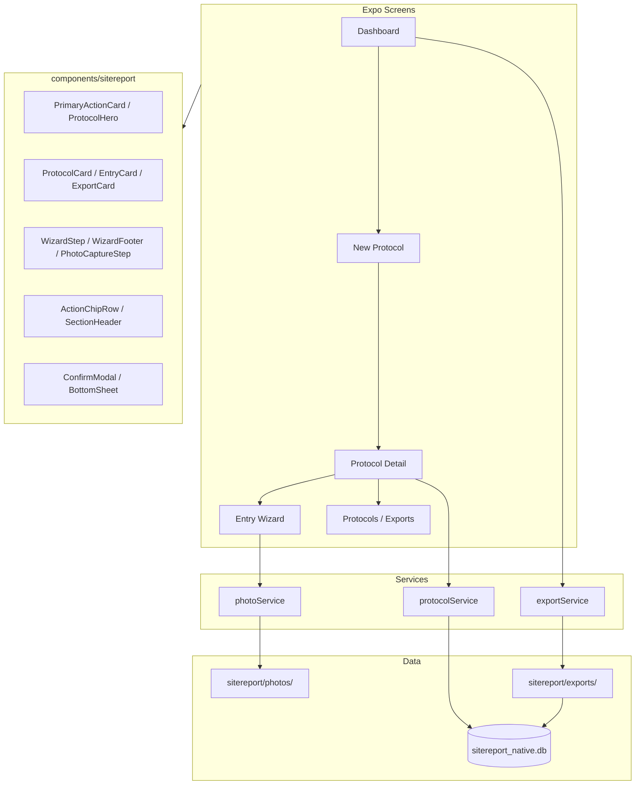

# SiteReport — Technische IST-Dokumentation (Expo APK)

> **Stand:** Juli 2026 (nach Premium-Native-UX-Polish, PR #27)  
> **Zweck:** Vollständige Beschreibung des SiteReport-Moduls in der **BÜW-Toolbox Expo-App** für Weiterentwicklung ohne Quellcode-Zugriff.  
> **Scope:** Ausschließlich die native Android-APK (`expo-toolbox/`). Keine PWA, kein WebView, keine SvelteKit-Referenz.

---

## Inhaltsverzeichnis

1. [Projektübersicht](#1-projektübersicht)
2. [UI/UX](#2-uiux)
3. [Navigation](#3-navigation)
4. [Funktionen](#4-funktionen)
5. [Datenmodell](#5-datenmodell)
6. [Datenhaltung](#6-datenhaltung)
7. [Einstellungen](#7-einstellungen)
8. [Komponenten](#8-komponenten)
9. [Custom Hooks & Context](#9-custom-hooks--context)
10. [State Management](#10-state-management)
11. [Services](#11-services)
12. [Sicherheit](#12-sicherheit)
13. [Bekannte Probleme](#13-bekannte-probleme)
14. [Architektur](#14-architektur)
15. [Verbesserungspotential](#15-verbesserungspotential)
16. [Zusammenfassung](#16-zusammenfassung)

---

## 1. Projektübersicht

### 1.1 Zweck der Anwendung

**SiteReport** ist ein **offline-fähiges Baustellen-Protokoll-Tool** innerhalb der **BÜW-Toolbox Expo-App**. Nutzer erstellen Foto-basierte Protokolleinträge auf der Baustelle, erfassen strukturierte Zusatzdaten über einen **geführten Wizard** und exportieren das Ergebnis als **Excel (XLSX)** und/oder **PDF** — optional mit **Firmenlogo** im Export.

Kernworkflow:

1. Dashboard öffnen → **„Neues Protokoll starten"** (Hero-CTA, 3-Schritt-Setup)
2. Tabellenformat wählen oder anlegen, Stammdaten + Logo erfassen
3. Protokoll-Detail → Einträge über **Guided Entry Wizard** (Foto → Felder → Status → Zusammenfassung)
4. Protokoll abschließen (Speichern / PDF / Excel / beides) oder Export aus Export-Center

Die App wird als **standalone Release-APK** verteilt (eingebettetes JS-Bundle, kein Metro-Server nötig).

### 1.2 Zielgruppe

- Bauleitung, Polier, Projektleitung auf Baustellen
- Mitarbeitende, die **Foto-Protokolle** mit tabellarischer Struktur führen
- Nutzer der **BÜW-Toolbox** (SiteReport ist eines von zwei Werkzeugen neben Bautagebuch)

### 1.3 Aktueller Entwicklungsstand

| Bereich | Status |
|---------|--------|
| Dashboard mit Statistiken + Hero-CTA | ✅ |
| Geführter Protokoll-Start (3 Schritte, WizardFooter) | ✅ |
| Guided Entry Wizard (Animation, Haptik) | ✅ |
| Format-Builder (Spaltenvorlagen, ↑/↓, Drag-Handle) | ✅ |
| Firmenlogo | ✅ |
| Stammdaten bearbeiten | ✅ |
| PDF-Export | ✅ |
| XLSX-Export | ✅ |
| Export-Cache (Dateipfade + Re-Share) | ✅ |
| Export-Center (eigener Screen, Bulk via „Auswahl") | ✅ |
| Protokoll-Liste mit Bulk-Auswahl | ✅ |
| Protokoll löschen (Einzel + Bulk) | ✅ |
| Entry löschen | ✅ |
| Protokoll abschließen (Modal) | ✅ |
| Foto-Kompression + permanente Speicherung | ✅ |
| Toast-Feedback (animiert) | ✅ |
| Bottom Sheets / Confirm Modals | ✅ |
| Haptisches Feedback (expo-haptics) | ✅ |
| Premium Native UX (Karten, Chips, Hero-Layout) | ✅ |
| Suche / Sortierung in Listen | ⚠️ UI-Platzhalter vorbereitet |
| Swipe-Aktionen | ⚠️ vorbereitet, nicht implementiert |
| Offline-Betrieb | ✅ |
| Multi-DB-Backup (Toolbox-Ebene) | ✅ |
| Dark Mode | ⚠️ Tokens vorbereitet, nicht aktiv |
| Cloud-Sync | ❌ |

**Fazit:** Die Expo-App hat **funktionale Parität zur PWA** und eine **professionelle native Mobile-UX** (Notion/Produktivitäts-App-Stil). Verbleibende Lücken: echte Suche/Sortierung, Swipe-Gesten, Dark Mode, Cloud-Sync, Schema-Migrationen.

### 1.4 Verwendete Technologien

| Technologie | Version (ca.) | Verwendung |
|-------------|---------------|------------|
| Expo SDK | ~57 | App-Framework |
| React Native | 0.86.x | UI |
| React | 19.2.x | UI |
| TypeScript | 5.9.x | Typsicherheit |
| Expo Router | ~57 | File-based Navigation |
| expo-sqlite | ~57 | SQLite-Datenbank |
| expo-image-picker | ~57 | Kamera / Galerie |
| expo-image-manipulator | ~57 | Foto-Kompression (1600px, 0.75) |
| expo-file-system | ~57 | Dateispeicher, Exporte, Fotos |
| expo-sharing | ~57 | System-Share-Sheet |
| expo-haptics | ~57 | Haptisches Feedback |
| ExcelJS | 4.4.x | XLSX-Generierung |
| pdf-lib | 1.17.x | PDF-Generierung |
| Space Grotesk | Google Fonts | Typografie |

**Nicht verwendet in SiteReport:** Redux, Zustand, React Query, MobX, WebViews, Drawer-Navigation, Cloud-Sync.

### 1.5 APK-Build & Verteilung

| Aspekt | Detail |
|--------|--------|
| Projekt | `expo-toolbox/` |
| CI-Workflow | `.github/workflows/android-apk.yml` |
| Trigger | Push auf `main` bei Änderungen in `expo-toolbox/**` oder `shared/**` |
| Build | `npx expo prebuild --platform android` → `./gradlew assembleRelease` |
| Release-Asset | `buew-toolbox-<version>-<sha>.apk` |
| GitHub-Tag | `apk-v<version>.<run_number>` |
| PR-Checks | Nur Typecheck, **keine APK** |

Details: [`ANDROID_APK.md`](ANDROID_APK.md)

### 1.6 Projektstruktur

```
/workspace/expo-toolbox/
├── app/
│   ├── _layout.tsx                          # Root Stack, ToastProvider, DB-Init
│   ├── (tabs)/
│   │   ├── index.tsx                          # Toolbox-Home
│   │   └── sitereport/index.tsx               # SiteReport-Dashboard (Tab)
│   └── sitereport/
│       ├── new-protocol.tsx                   # 3-Schritt Protokoll-Setup
│       ├── format-builder.tsx                 # Format-Editor
│       ├── protocols/index.tsx                # Protokoll-Liste (Bulk)
│       ├── exports/index.tsx                  # Export-Center
│       └── protocol/
│           ├── [id].tsx                       # Protokoll-Detail
│           ├── [id]/edit.tsx                  # Stammdaten bearbeiten
│           └── [id]/wizard.tsx                # Guided Entry Wizard
├── src/
│   ├── components/
│   │   ├── mobile/                            # Shared UI (Screen, Button, …)
│   │   └── sitereport/                        # SiteReport-spezifische Komponenten
│   ├── contexts/ToastContext.tsx              # App-weite Toast-Meldungen
│   ├── constants/theme.ts                     # Design Tokens
│   ├── constants/tools.ts                     # Tab-Definition
│   ├── lib/haptics.ts                         # Haptisches Feedback
│   ├── hooks/useOfflineBootstrap.ts           # Backup/Restore
│   ├── storage/backupService.ts               # Multi-DB-Backup
│   └── native/sitereport/
│       ├── db/database.ts                     # SQLite + Typen
│       ├── services/
│       │   ├── exportService.ts               # Export + Cache + Abschluss
│       │   ├── photoService.ts                # Kompression + Persistenz
│       │   └── protocolService.ts             # Entry/Protocol-Helfer, Bulk
│       └── lib/
│           ├── pdf.js
│           ├── xlsx-export.js
│           └── native-image.ts
├── app.config.js
├── eas.json
└── package.json
```

---

## 2. UI/UX

### 2.1 Design Tokens

**Datei:** `expo-toolbox/src/constants/theme.ts`

| Token | Wert | Verwendung |
|-------|------|------------|
| `colors.bg` | `#F2F0EB` | Hintergrund |
| `colors.ink` | `#1A1916` | Primärtext |
| `colors.muted` | `#6B6560` | Sekundärtext |
| `colors.accent` | `#C44B32` | Primär-Aktion, Tab aktiv |
| `colors.panel` | `#FFFCF7` | Karten, Header |
| `colors.border` | `#E4DDD2` | Rahmen |
| `colors.danger` | `#A12C24` | Fehler, Löschen |
| Font | Space Grotesk 400/600/700 | Gesamte App |

**Stil:** Professionelle Baustellen-App / moderne Produktivitäts-App (Notion Mobile, Apple Notes). Abgerundete Karten, Schatten, großzügige Abstände, große Touchflächen, klare visuelle Hierarchie, wenige Informationen pro Screen.

**UX-Prinzipien:**

- Eine klare Primäraktion pro Screen (fixierter Footer)
- Sekundäraktionen als kompakte Chips, nicht als Button-Wand
- Fortschritt immer sichtbar in Wizards (Schritt N von M, Dots, Balken, Animation)
- Haptisches Feedback bei wichtigen Aktionen
- Empty States mit Icon und Handlungsaufforderung

---

### 2.2 Dashboard

**Datei:** `app/(tabs)/sitereport/index.tsx`  
**Route:** `/(tabs)/sitereport`

#### Aufbau

1. **Header** — „SiteReport" / „Baustellen-Protokolle"
2. **StatCards (2×2)** — Protokolle, Einträge, Fotos, Exporte (Exporte tappbar → Export-Center)
3. **PrimaryActionCard** — große Hero-Karte: **„Neues Protokoll starten"** (Akzentfarbe, Chevron)
4. **Link** — „Alle Protokolle anzeigen"
5. **Zuletzt verwendet** — letzte 3 Protokolle als `ProtocolCard` (Datum, Einträge, Fotos als Chips)
6. **Letzte Exporte** — letzte 3 als `ProtocolCard`
7. **Empty State** — wenn keine Protokolle vorhanden

#### Interaktion

- Pull-to-Refresh
- **Kein FAB mehr** — Primäraktion nur über Hero-Karte
- Navigation zu `/sitereport/new-protocol`, `/sitereport/protocols`, `/sitereport/exports`

---

### 2.3 Neues Protokoll (3-Schritt-Setup)

**Datei:** `app/sitereport/new-protocol.tsx`  
**Route:** `/sitereport/new-protocol`

| Schritt | Inhalt |
|---------|--------|
| 1 — Allgemeine Daten | Protokollname*, Projekt, Beschreibung, Teilnehmer, Datum (readonly in Karte) |
| 2 — Firmenlogo | Auswählen, Vorschau, ändern, entfernen (gestrichelte Platzhalter-Fläche) |
| 3 — Tabellenformat | Template wählen, neu/bearbeiten, `TablePreview` |

**Footer:** `WizardFooter` — Zurück (ab Schritt 2) | Weiter / Protokoll erstellen (side-by-side, fixiert unten)

**UI:** `WizardStep` mit „Schritt N von M", Fortschritts-Dots, Balken, Fade/Slide-Animation beim Schrittwechsel

**Haptik:** Leichtes Feedback bei Weiter/Zurück, Success bei Erstellen

---

### 2.4 Protokoll-Detail

**Datei:** `app/sitereport/protocol/[id].tsx`  
**Route:** `/sitereport/protocol/:id`

#### Aufbau

1. **ProtocolHero** — Protokolltitel, Projektname, Datum, Status-Badge (z. B. „3 offen" / „Alle erledigt")
2. **StatCards (3er-Reihe)** — Einträge, Fotos, Offen
3. **ActionChipRow** — Export, Bearbeiten, Abschließen (kompakte Chips, nicht gestapelte Buttons)
4. **Einträge** — `SectionHeader` + `EntryCard`-Liste oder Empty State
5. **Footer (fixiert)** — **„+ Neuer Eintrag"** als einzige Primäraktion

#### EntryCard-Layout

- Foto groß oben (220px) oder Platzhalter
- Status-Badge
- Bis zu 3 Datenfelder
- Kompakte Aktions-Buttons: Bearbeiten / Löschen

#### Abschluss-Modal (`ConfirmModal`)

| Option | Aktion |
|--------|--------|
| Nur speichern | `updateProtocol()` → Protokoll-Liste |
| PDF erstellen | `closeProtocolWithExport('pdf')` |
| Excel erstellen | `closeProtocolWithExport('xlsx')` |
| PDF + Excel | `closeProtocolWithExport('both')` |

Export ohne Share-Sheet (`share: false`), Toast + Haptik.

#### Export Bottom Sheet

- PDF exportieren (mit Share-Sheet)
- Excel exportieren (mit Share-Sheet)

---

### 2.5 Stammdaten bearbeiten

**Datei:** `app/sitereport/protocol/[id]/edit.tsx`  
**Route:** `/sitereport/protocol/:id/edit`

Editierbar: Titel, Projekt, Beschreibung, Teilnehmer, Logo.  
Datum bleibt readonly (aus Protokoll-Record).

---

### 2.6 Guided Entry Wizard

**Datei:** `app/sitereport/protocol/[id]/wizard.tsx`  
**Route:** `/sitereport/protocol/:id/wizard?entryId=<id>` (optional für Bearbeiten)

#### Ablauf

1. Pro Spalte ein Screen (`WizardStep` mit „Schritt N von M", Dots, Animation)
2. **Foto-Spalte:** `PhotoCaptureStep` — große Kamera-Fläche (320px), Vorschau, entfernen
3. **Status-Spalte:** `StatusFieldStep` — große Touch-Buttons (Offen / Bearbeitung / Erledigt)
4. **Andere Spalten:** `FieldStep` — ein großes Eingabefeld pro Screen, Auto-Focus
5. **Zusammenfassung:** `ProtocolSummary` → Speichern

**Footer:** `WizardFooter` — Zurück | Weiter / Speichern (fixiert unten)

**Foto:** `captureProtocolPhoto()` → Kompression → `sitereport/photos/{protocolId}/{entryId}.jpg`

**Haptik:** Light bei Navigation, Success bei Speichern

**Query:** `entryId` gesetzt = Bearbeiten, sonst neuer Eintrag

---

### 2.7 Protokoll-Liste

**Datei:** `app/sitereport/protocols/index.tsx`  
**Route:** `/sitereport/protocols`

- **SearchFieldPlaceholder** — „Protokolle durchsuchen… (bald verfügbar)"
- **Sortier-Platzhalter** — „Sortierung: Neueste zuerst" (Toast-Hinweis)
- **ProtocolCards** mit Titel, Projekt, Datum/Einträge/Fotos als Chips
- Einzel-Löschen (✕ + Alert)
- **Bulk-Modus** über Button **„Auswahl"** (nicht dauerhaft sichtig): Checkboxen, Alle, Bulk-Export (Bottom Sheet), Bulk-Löschen

---

### 2.8 Export-Center

**Datei:** `app/sitereport/exports/index.tsx`  
**Route:** `/sitereport/exports`

- **SectionHeader** mit Anzahl + **„Auswahl"**-Toggle (Bulk nur bei Aktivierung)
- **ExportCards** mit PDF/Excel-Icon-Kreisen, Protokollname, Datum
- PDF/Excel teilen, Löschen (nur außerhalb Auswahl-Modus)
- Bulk-Löschen im Auswahl-Modus

---

### 2.9 Format-Builder

**Datei:** `app/sitereport/format-builder.tsx`  
**Route:** `/sitereport/format-builder?mode=new|edit&templateId=...`

- `FormatColumnCard` pro Spalte mit Drag-Handle (≡), Positionsnummer (#N)
- Spalte hinzufügen/bearbeiten/entfernen, ↑/↓ Reorder (mobile-optimiert)
- Foto-Spalte fest (📷-Icon), nicht löschbar
- Toast bei Speichern

---

### 2.10 Globale UI-Elemente

| Element | Verwendung |
|---------|------------|
| `ToastProvider` | „Gespeichert", „Exportiert", „Gelöscht" (animiert, ~2,2s) |
| `ConfirmModal` | Abschluss-Flow, kritische Bestätigungen (fade) |
| `BottomSheet` | Export-Auswahl, Bulk-Export (slide-up) |
| `WizardFooter` | Fixierter Zurück/Weiter-Footer in allen Wizards |
| `haptics.ts` | Light/Medium/Success/Selection Feedback |
| `Alert.alert` | Löschen-Bestätigung, Kamera-Berechtigung, Fehler |

---

## 3. Navigation

### 3.1 Expo Router Struktur

```
Root Stack (_layout.tsx) + ToastProvider
├── (tabs)
│   ├── index                    # Toolbox-Home
│   ├── sitereport/index         # Dashboard (Tab)
│   └── bautagebuch/
├── sitereport/new-protocol
├── sitereport/protocol/[id]
├── sitereport/protocol/[id]/edit
├── sitereport/protocol/[id]/wizard
├── sitereport/protocols/index
├── sitereport/exports/index
└── sitereport/format-builder
```

### 3.2 Screen-Hierarchie

```
Dashboard (Tab)
├── Neues Protokoll (3 Schritte, WizardFooter)
│   └── → Protokoll-Detail
│       ├── Stammdaten bearbeiten
│       ├── Entry Wizard (neu/bearbeiten, WizardFooter)
│       ├── Export (Bottom Sheet via Chip)
│       └── Abschließen (Modal via Chip) → Protokoll-Liste
├── Protokolle (Bulk via „Auswahl")
├── Export-Center (Bulk via „Auswahl")
└── Format-Builder
```

### 3.3 Deep Links

- `sitereport/new-protocol`
- `sitereport/protocol/<id>`
- `sitereport/protocol/<id>/edit`
- `sitereport/protocol/<id>/wizard?entryId=<id>`
- `sitereport/protocols`
- `sitereport/exports`
- `sitereport/format-builder?mode=new|edit&templateId=<id>`

---

## 4. Funktionen

### 4.1 Firmenlogo

| Aspekt | Detail |
|--------|--------|
| Speicher | Data-URL in SQLite `settings.id='logo'` |
| Eingabe | Galerie-Picker in Setup (Schritt 2) oder Stammdaten-Edit |
| Ausgabe | In PDF/XLSX Header eingebettet |

### 4.2 Tabellenformat

Templates in SQLite, Seed „Standard Baustelle", ↑/↓ Reorder, `FormatColumnCard` mit Drag-Handle-Optik.

### 4.3 Protokoll erstellen

**Screen:** `new-protocol.tsx` (3 Schritte)  
**Pflicht:** Protokollname + Template  
**Ablauf:** `createProtocol()` mit vollständigen Stammdaten → Detail-Screen

### 4.4 Stammdaten bearbeiten

**Screen:** `protocol/[id]/edit.tsx`  
Editierbar: Titel, Projekt, Beschreibung, Teilnehmer, Logo. Datum readonly.

### 4.5 Eintrag hinzufügen (Guided Wizard)

| Aspekt | Detail |
|--------|--------|
| Ablauf | Wizard: Foto → je Spalte ein Screen → Zusammenfassung |
| Foto | `expo-image-manipulator` (1600px, JPEG 0.75) |
| Speicherort | `{documentDirectory}sitereport/photos/{protocolId}/{entryId}.jpg` |
| Status | `offen` / `bearbeitung` / `erledigt` |
| Reihenfolge | Neueste oben (prepend) |

### 4.6 Eintrag bearbeiten / löschen

| Aktion | Implementierung |
|--------|-----------------|
| Bearbeiten | Wizard mit `?entryId=` |
| Löschen | `removeProtocolEntry()` + Foto-Datei löschen, Alert-Bestätigung |

### 4.7 Protokoll abschließen

`closeProtocolWithExport(protocol, mode)` — Speichern, PDF, XLSX oder beides ohne Share-Sheet, dann Navigation zur Protokoll-Liste.

### 4.8 PDF / XLSX Export

Technisch (`pdf.js`, `xlsx-export.js`).  
`exportProtocolPdf/Xlsx(protocol, { share: true|false })`.

### 4.9 Export-Cache

Eigener Screen `/sitereport/exports`. `shareCachedExport`, `deleteCachedExport`, Bulk-Löschen.

### 4.10 Protokoll-Verwaltung

| Aktion | API |
|--------|-----|
| Einzel löschen | `deleteProtocolWithCleanup()` |
| Bulk löschen | `bulkDeleteProtocols()` |
| Bulk exportieren | `exportProtocolPdf/Xlsx` mit `share: false` |

### 4.11 Bulk-Auswahl

Protokolle und Exporte: Selection-Mode über **„Auswahl"**-Button, Checkboxen (`SelectionCheckbox`), Alle auswählen, Bulk-Aktionen.

---

## 5. Datenmodell

Unverändert — SQLite-Schema identisch, keine Migration nötig.

### 5.1 Kern-Typen

- `SiteReportColumn`, `SiteReportEntry`, `SiteReportProtocol`, `SiteReportTemplate`, `SiteReportSettings`, `SiteReportExport`

### 5.2 `photoPath`

Permanenter Pfad unter `sitereport/photos/{protocolId}/{entryId}.jpg` (nicht mehr Kamera-Cache-URI).

---

## 6. Datenhaltung

### 6.1 SQLite

`sitereport_native.db` — unverändert (protocols, settings, templates, exports).

### 6.2 Dateispeicherung

| Pfad | Inhalt |
|------|--------|
| `sitereport/exports/*.pdf` | PDF-Exporte |
| `sitereport/exports/*.xlsx` | XLSX-Exporte |
| `sitereport/photos/{protocolId}/*.jpg` | **Permanente Eintrags-Fotos** |

### 6.3 Foto-Pipeline

```
launchCameraAsync
  → ImageManipulator (resize 1600px, compress 0.75, JPEG)
  → copyAsync → sitereport/photos/{protocolId}/{entryId}.jpg
  → photoPath in entry
```

Beim Löschen: `deleteEntryPhoto()`. Beim Protokoll-Löschen: `deleteProtocolPhotos(protocolId)`.

### 6.4 Backup

`backupService.ts` sichert `sitereport_native.db` mit Toolbox-DBs.

---

## 7. Einstellungen

Template (`settings.current`), Logo (`settings.logo`). Kein Dark Mode aktiv.

---

## 8. Komponenten

### 8.1 SiteReport (`src/components/sitereport/`)

| Komponente | Zweck |
|------------|-------|
| `PrimaryActionCard` | Hero-CTA auf dem Dashboard |
| `ProtocolCard` | Protokoll-Karte mit Chips (Datum, Einträge, Fotos), Bulk-Checkbox |
| `ProtocolHero` | Hero-Header im Protokoll-Detail |
| `EntryCard` | Eintrag mit Foto oben, Status-Badge, kompakte Aktionen |
| `ExportCard` | Export-Karte mit PDF/Excel-Icons, Teilen/Löschen |
| `FormatColumnCard` | Spalten-Editor mit Drag-Handle und ↑/↓ |
| `WizardStep` | Schritt-Anzeige mit Dots, Balken, Animation |
| `WizardFooter` | Fixierter Zurück/Weiter-Footer |
| `PhotoCaptureStep` | Große Kamera-UI im Wizard |
| `FieldStep` | Einzelfeld im Wizard (Auto-Focus) |
| `StatusFieldStep` | Status-Auswahl (große Touch-Buttons) |
| `ProtocolSummary` | Zusammenfassung vor Speichern |
| `TablePreview` | Tabellenvorschau im Setup |
| `SectionHeader` | Abschnitts-Überschrift mit optionalem Link |
| `ActionChipRow` | Sekundäraktionen als Chips |
| `SelectionCheckbox` | Bulk-Auswahl-Checkbox |
| `SearchFieldPlaceholder` | Suchfeld-Platzhalter (vorbereitet) |
| `DashboardActionCard` | Legacy-Schnellaktion (nicht mehr auf Dashboard) |
| `ConfirmModal` | Native Modal für Bestätigungen |
| `BottomSheet` | Slide-up Sheet für Export-Auswahl |

### 8.2 Shared Mobile (`src/components/mobile/`)

`Screen`, `PrimaryButton`, `TextField`, `ListItem`, `Card`, `StatCard`, `StatusBadge`, `EmptyState` (mit Icon), `Fab` (nicht mehr auf SiteReport-Dashboard)

### 8.3 Utilities (`src/lib/`)

| Datei | Zweck |
|-------|-------|
| `haptics.ts` | `hapticLight`, `hapticMedium`, `hapticSuccess`, `hapticSelection` |

---

## 9. Custom Hooks & Context

### `useToast()` — `src/contexts/ToastContext.tsx`

| API | Beschreibung |
|-----|--------------|
| `showToast(message)` | Kurze Meldung unten, animiert, auto-hide |

Eingebunden in `app/_layout.tsx` via `ToastProvider`.

### `useOfflineBootstrap()` — App-weit

Backup/Restore-Banner (unverändert).

**Keine SiteReport-spezifischen Hooks** — State in Screen-Komponenten, UI in `components/sitereport/`.

---

## 10. State Management

| Ansatz | Verwendung |
|--------|------------|
| React `useState` | Alle Screens |
| `useCallback` / `useEffect` | Laden, Refresh |
| `ToastContext` | Globales Feedback |
| Kein Redux/Zustand/React Query | — |

---

## 11. Services

### 11.1 `database.ts`

CRUD für protocols, templates, settings, exports, `softDeleteProtocol`, `todayDe()`.

### 11.2 `photoService.ts`

| Funktion | Beschreibung |
|----------|--------------|
| `compressAndPersistPhoto` | Resize + JPEG + copy nach photos/ |
| `captureProtocolPhoto` | Kamera → persistieren |
| `deleteEntryPhoto` | Einzelnes Foto löschen |
| `deleteProtocolPhotos` | Gesamten Protokoll-Ordner löschen |

### 11.3 `protocolService.ts`

| Funktion | Beschreibung |
|----------|--------------|
| `createEntryId` | ID-Generierung |
| `emptyFieldsFromColumns` | Default-Felder inkl. Status `offen` |
| `protocolStats` | entryCount, photoCount, openCount |
| `removeProtocolEntry` | Entry + Foto löschen |
| `deleteProtocolWithCleanup` | Protokoll + Exporte + Fotos |
| `bulkDeleteProtocols` | Mehrere Protokolle |
| `upsertProtocolEntry` | Entry erstellen/aktualisieren |
| `getProtocolOrThrow` | Laden mit Fehler |

### 11.4 `exportService.ts`

| Funktion | Beschreibung |
|----------|--------------|
| `exportProtocolPdf(protocol, { share? })` | PDF generieren, optional teilen |
| `exportProtocolXlsx(protocol, { share? })` | XLSX generieren, optional teilen |
| `closeProtocolWithExport(protocol, mode)` | Abschluss: save/pdf/xlsx/both |
| `shareCachedExport` | Aus Cache teilen oder regenerieren |
| `deleteCachedExport` | Dateien + DB-Eintrag löschen |
| `listExports` | Re-export aus database |

---

## 12. Sicherheit

Kamera- und Galerie-Berechtigungen, keine DB-Verschlüsselung, lokale Datenhaltung.

---

## 13. Bekannte Probleme

| ID | Beschreibung | Schwere |
|----|--------------|---------|
| B1 | Kein Schema-Migrations-Framework | Mittel |
| B2 | Logo als große Data-URL in SQLite | Niedrig |
| B3 | Spalten umbenennen bricht `fields`-Keys in alten Einträgen | Mittel |
| B4 | `entriesJson` bei jedem Feld-Update voll serialisiert | Niedrig |
| B5 | Dark Mode Tokens vorhanden, nicht aktiv | Niedrig |
| B6 | Keine Cloud-Sync | Info |
| B7 | Suche/Sortierung nur als UI-Platzhalter | Niedrig |

**Behoben seit vorheriger Doku:** Foto-Persistenz, Wizard, Bulk, Protokoll-Löschen, Stammdaten-Edit, Abschluss-Flow, Premium Native UX, Haptik.

---

## 14. Architektur

### 14.1 Schichten

| Schicht | Verantwortung |
|---------|---------------|
| Screens (`app/sitereport/`) | Navigation, lokaler State, Orchestrierung |
| `components/sitereport/` | Präsentations-Komponenten (UI only) |
| `protocolService.ts` | Business-Logik Entry/Protocol |
| `photoService.ts` | Foto-Pipeline |
| `exportService.ts` | Export-Pipeline |
| `database.ts` | Persistenz |

### 14.2 Diagramm



---

## 15. Verbesserungspotential

- **Echte Suche** in Protokoll-Liste (Platzhalter vorhanden)
- **Sortierung** (neueste/älteste, Projektname)
- **Swipe-to-Delete** auf Protokoll- und Export-Karten
- **Schema-Migrationen** (`PRAGMA user_version`)
- **Dark Mode** aktivieren
- **Repository-Pattern** zwischen Screens und DB
- **Spalten-ID statt Name** als Field-Key (Umbenennung-sicher)
- **On-Device-Tests** der Export-Pipeline auf Release-APK

---

## 16. Zusammenfassung

### Was funktioniert

| Feature | Status |
|---------|:------:|
| Dashboard mit Hero-CTA + Statistiken | ✅ |
| Geführter Protokoll-Start (WizardFooter) | ✅ |
| Guided Entry Wizard (Animation + Haptik) | ✅ |
| Stammdaten bearbeiten | ✅ |
| Protokoll abschließen | ✅ |
| Entry löschen | ✅ |
| Protokoll löschen (Einzel + Bulk) | ✅ |
| Bulk-Export | ✅ |
| Export-Center | ✅ |
| Foto-Kompression + Persistenz | ✅ |
| Toast / Modals / Bottom Sheets | ✅ |
| Haptisches Feedback | ✅ |
| Premium Native UX | ✅ |
| PDF/XLSX Export + Cache | ✅ |
| Offline + Backup | ✅ |

### Was fehlt noch

- Echte Suche und Sortierung
- Swipe-Gesten
- Dark Mode
- Cloud-Sync
- SQLite-Migrations-Framework
- Template löschen (API fehlt)

### Nächste Schritte

1. PR #27 mergen → Premium UX auf `main`
2. On-Device-Test: Wizard → Export → Abschluss
3. Suche/Sortierung implementieren
4. Schema-Versionierung für zukünftige Updates

---

## Anhang A: Standard-Spalten

```typescript
[
  { id: 'col_photo', name: 'Bilder', type: 'text', isPhoto: true },
  { id: 'col_km', name: 'Kilometer', type: 'number', isPhoto: false },
  { id: 'col_desc', name: 'Beschreibung', type: 'text', isPhoto: false },
  { id: 'col_status', name: 'Status', type: 'text', isPhoto: false }
]
```

## Anhang B: ID-Generierung

| Entität | Format |
|---------|--------|
| Protocol | `protocol_{timestamp}_{random6}` |
| Template | `tpl_{timestamp}_{random6}` |
| Entry | `entry_{timestamp}_{random6}` |
| Column | `col_{timestamp}_{random6}` |
| Export | `export_{protocolId}` |

## Anhang C: Dateipfade

| Pfad (relativ zu documentDirectory) | Inhalt |
|-------------------------------------|--------|
| `SQLite/sitereport_native.db` | Hauptdatenbank |
| `sitereport/exports/` | PDF/XLSX |
| `sitereport/photos/{protocolId}/` | Eintrags-Fotos |
| `backups/sitereport_native_backup_{stamp}.db` | DB-Backup |

## Anhang D: Screen-Route-Übersicht

| Screen | Datei | Route |
|--------|-------|-------|
| Dashboard | `(tabs)/sitereport/index.tsx` | `/(tabs)/sitereport` |
| Neues Protokoll | `sitereport/new-protocol.tsx` | `/sitereport/new-protocol` |
| Protokoll-Detail | `sitereport/protocol/[id].tsx` | `/sitereport/protocol/:id` |
| Stammdaten | `sitereport/protocol/[id]/edit.tsx` | `/sitereport/protocol/:id/edit` |
| Entry Wizard | `sitereport/protocol/[id]/wizard.tsx` | `/sitereport/protocol/:id/wizard` |
| Protokolle | `sitereport/protocols/index.tsx` | `/sitereport/protocols` |
| Exporte | `sitereport/exports/index.tsx` | `/sitereport/exports` |
| Format-Builder | `sitereport/format-builder.tsx` | `/sitereport/format-builder` |

## Anhang E: Komponenten-Übersicht (Premium UX)

| Komponente | Datei | Verwendet in |
|------------|-------|--------------|
| `PrimaryActionCard` | `PrimaryActionCard.tsx` | Dashboard |
| `ProtocolHero` | `ProtocolHero.tsx` | Protokoll-Detail |
| `ActionChipRow` | `ActionChipRow.tsx` | Protokoll-Detail |
| `WizardFooter` | `WizardFooter.tsx` | new-protocol, Entry Wizard |
| `WizardStep` | `WizardStep.tsx` | new-protocol, Entry Wizard |
| `SectionHeader` | `SectionHeader.tsx` | Dashboard, Detail, Exporte |
| `SelectionCheckbox` | `SelectionCheckbox.tsx` | ProtocolCard, ExportCard |
| `SearchFieldPlaceholder` | `SearchFieldPlaceholder.tsx` | Protokoll-Liste |

---

*Ende der IST-Dokumentation (Expo APK)*
