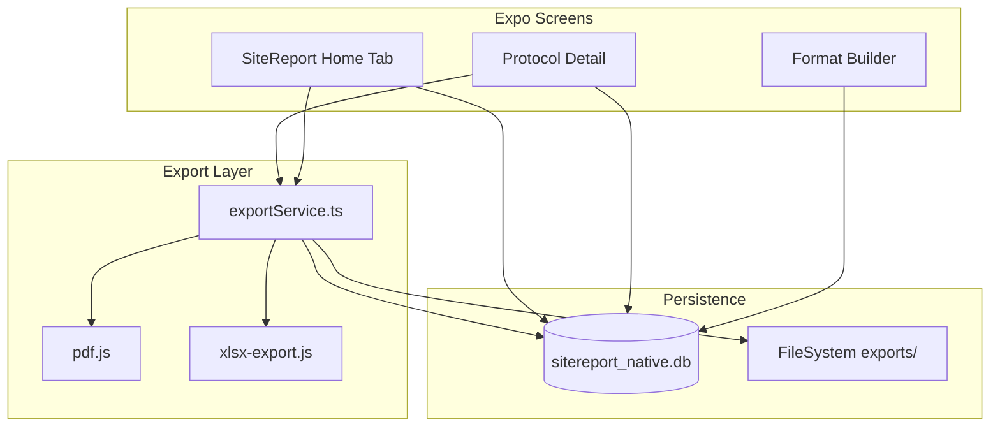

# SiteReport — Technische IST-Dokumentation (Expo APK)

> **Stand:** Juli 2026  
> **Zweck:** Vollständige Beschreibung des SiteReport-Moduls in der **BÜW-Toolbox Expo-App** für Weiterentwicklung ohne Quellcode-Zugriff.  
> **Scope:** Ausschließlich die native Android-APK (`expo-toolbox/`). Keine PWA, kein WebView, keine SvelteKit-Referenz.

---

## Inhaltsverzeichnis

1. [Projektübersicht](#1-projektübersicht)
2. [UI/UX](#2-uiux)
3. [Navigation](#3-navigation)
4. [Funktionen](#4-funktionen)
5. [Datenmodell](#5-datenmodell)
6. [Datenhaltung](#6-datenhaltung)
7. [Einstellungen](#7-einstellungen)
8. [Komponenten](#8-komponenten)
9. [Custom Hooks](#9-custom-hooks)
10. [State Management](#10-state-management)
11. [Services](#11-services)
12. [Sicherheit](#12-sicherheit)
13. [Bekannte Probleme](#13-bekannte-probleme)
14. [Architektur](#14-architektur)
15. [Verbesserungspotential](#15-verbesserungspotential)
16. [Zusammenfassung](#16-zusammenfassung)

---

## 1. Projektübersicht

### 1.1 Zweck der Anwendung

**SiteReport** ist ein **offline-fähiges Baustellen-Protokoll-Tool** innerhalb der **BÜW-Toolbox Expo-App**. Nutzer erstellen Foto-basierte Protokolleinträge auf der Baustelle, erfassen strukturierte Zusatzdaten (Kilometer, Beschreibung, Status, benutzerdefinierte Spalten) und exportieren das Ergebnis als **Excel (XLSX)** und/oder **PDF** — optional mit **Firmenlogo** im Export.

Kernworkflow:

1. Tabellenformat (Spaltenvorlage) wählen oder anlegen
2. Protokoll-Stammdaten erfassen (Titel, Projekt, Datum)
3. Einträge mit Foto + Feldern erfassen
4. Export (PDF/XLSX) und optional erneutes Teilen aus dem Export-Cache

Die App wird als **standalone Release-APK** verteilt (eingebettetes JS-Bundle, kein Metro-Server nötig).

### 1.2 Zielgruppe

- Bauleitung, Polier, Projektleitung auf Baustellen
- Mitarbeitende, die **Foto-Protokolle** mit tabellarischer Struktur führen
- Nutzer der **BÜW-Toolbox** (SiteReport ist eines von zwei Werkzeugen neben Bautagebuch)

### 1.3 Aktueller Entwicklungsstand

| Bereich | Status |
|---------|--------|
| Protokoll erstellen/bearbeiten | ✅ Vollständig |
| Format-Builder (Spaltenvorlagen) | ✅ inkl. Up/Down-Reorder |
| Firmenlogo | ✅ |
| PDF-Export | ✅ |
| XLSX-Export | ✅ |
| Export-Cache (Dateipfade + Re-Share) | ✅ |
| Offline-Betrieb | ✅ |
| Multi-DB-Backup (Toolbox-Ebene) | ✅ |
| Guided Entry Flow (Schritt-für-Schritt) | ❌ |
| Bulk-Auswahl Protokolle/Exporte | ❌ |
| Protokoll löschen (UI) | ⚠️ API vorhanden, keine UI |
| Titel/Projekt nachträglich bearbeiten | ❌ |
| Foto-Persistenz (permanenter Speicher) | ⚠️ Kamera-URIs, nicht kopiert |
| Dark Mode | ⚠️ Tokens vorbereitet, nicht aktiv |

**Fazit:** Kernfunktionen sind produktionsreif. UX-Lücken betreffen vor allem Verwaltung (Löschen, Stammdaten bearbeiten) und Foto-Persistenz.

### 1.4 Verwendete Technologien

| Technologie | Version (ca.) | Verwendung |
|-------------|---------------|------------|
| Expo SDK | ~57 | App-Framework |
| React Native | 0.86.x | UI |
| React | 19.2.x | UI |
| TypeScript | 5.9.x | Typsicherheit |
| Expo Router | ~57 | File-based Navigation |
| expo-sqlite | ~57 | SQLite-Datenbank |
| expo-image-picker | ~57 | Kamera / Galerie |
| expo-file-system | ~57 | Dateispeicher |
| expo-sharing | ~57 | System-Share-Sheet |
| expo-image-manipulator | ~57 | (vorhanden, SiteReport nutzt es noch nicht) |
| ExcelJS | 4.4.x | XLSX-Generierung |
| pdf-lib | 1.17.x | PDF-Generierung |
| Space Grotesk | Google Fonts | Typografie |

**Nicht verwendet in SiteReport:** Redux, Zustand, React Query, MobX, WebViews, Drawer-Navigation, Bottom Sheets, Cloud-Sync.

### 1.5 APK-Build & Verteilung

| Aspekt | Detail |
|--------|--------|
| Projekt | `expo-toolbox/` |
| CI-Workflow | `.github/workflows/android-apk.yml` |
| Trigger | Push auf `main` bei Änderungen in `expo-toolbox/**` oder `shared/**` |
| Build | `npx expo prebuild --platform android` → `./gradlew assembleRelease` |
| Release-Asset | `buew-toolbox-<version>-<sha>.apk` |
| GitHub-Tag | `apk-v<version>.<run_number>` |
| PR-Checks | Nur Typecheck, **keine APK** |

**Wichtig:** Debug-APKs erwarten Metro (`localhost:8081`). Die CI baut **Release-APKs** mit eingebettetem JS-Bundle — die App läuft ohne Entwicklungsrechner.

Details: [`ANDROID_APK.md`](ANDROID_APK.md)

### 1.6 Projektstruktur

```
/workspace/
└── expo-toolbox/                              # BÜW-Toolbox Expo-App
    ├── app/
    │   ├── _layout.tsx                        # Root Stack, DB-Init, Backup-Banner
    │   ├── (tabs)/
    │   │   ├── index.tsx                      # Toolbox-Home
    │   │   └── sitereport/index.tsx           # SiteReport-Startseite (Tab)
    │   └── sitereport/
    │       ├── protocol/[id].tsx              # Protokoll-Detail
    │       └── format-builder.tsx             # Format-Editor
    ├── src/
    │   ├── native/sitereport/
    │   │   ├── db/database.ts                 # SQLite + Typen
    │   │   ├── services/exportService.ts      # Export + Cache
    │   │   └── lib/
    │   │       ├── pdf.js                     # PDF-Generierung
    │   │       ├── xlsx-export.js             # XLSX-Generierung
    │   │       └── native-image.ts            # Bild-Hilfen RN
    │   ├── components/mobile/                 # Shared UI (Screen, Button, …)
    │   ├── constants/theme.ts                 # Design Tokens
    │   ├── constants/tools.ts                 # Tab-Definition SiteReport/Bautagebuch
    │   ├── hooks/useOfflineBootstrap.ts       # Backup/Restore
    │   └── storage/backupService.ts           # Multi-DB-Backup
    ├── app.config.js                          # Expo-Konfiguration, Icons
    ├── eas.json                               # EAS-Build (buildType: apk)
    └── package.json
```

SiteReport ist **kein eigenständiges Expo-Projekt**, sondern ein Tab-Modul innerhalb der Toolbox-App.

---

## 2. UI/UX

### 2.1 Design Tokens

**Datei:** `expo-toolbox/src/constants/theme.ts`

| Token | Wert | Verwendung |
|-------|------|------------|
| `colors.bg` | `#F2F0EB` | Hintergrund |
| `colors.ink` | `#1A1916` | Primärtext |
| `colors.muted` | `#6B6560` | Sekundärtext |
| `colors.accent` | `#C44B32` | Primär-Aktion, Tab aktiv |
| `colors.accent2` | `#243240` | Meta-Text |
| `colors.panel` | `#FFFCF7` | Karten, Header |
| `colors.border` | `#E4DDD2` | Rahmen |
| `colors.danger` | `#A12C24` | Fehler, Löschen |
| Font | Space Grotesk 400/600/700 | Gesamte App |

`darkColors` existiert, ist aber **nicht aktiv** (kein Theme-Switch).

---

### 2.2 SiteReport-Startseite

**Datei:** `expo-toolbox/app/(tabs)/sitereport/index.tsx`  
**Route:** `/(tabs)/sitereport`  
**Tab-Titel:** „SiteReport"

#### Zweck

Zentrale Übersicht: Logo, Formatwahl, neues Protokoll starten, Export-Cache, Protokoll-Liste.

#### Aufbau (von oben nach unten)

1. **Screen-Header** — Titel „SiteReport", Untertitel „Foto-Protokolle mit Export"
2. **Karte: Firmenlogo**
3. **Karte: Tabellenformat**
4. **Karte: Neues Protokoll**
5. **Karte: Exporte** (nur wenn vorhanden)
6. **Abschnitt „Protokolle"** + Liste oder EmptyState
7. **FAB** (floating)

#### Komponenten

- `Screen` (scroll, pull-to-refresh)
- `TextField`, `PrimaryButton`, `ListItem`, `EmptyState`, `Fab`, `Image`

#### Buttons

| Label | Variante | Aktion |
|-------|----------|--------|
| Logo hochladen / ändern / entfernen | secondary/ghost | Galerie-Picker |
| Neues Format | secondary | → Format-Builder (`mode=new`) |
| Format bearbeiten | ghost | → Format-Builder (`mode=edit`) |
| Protokoll starten | primary | `createProtocol()` → Protokoll-Screen |
| PDF teilen / XLSX teilen | secondary | `shareCachedExport()` |
| Löschen (Export) | ghost | Bestätigungs-Alert → `deleteCachedExport()` |
| Template-Zeile tippen | ListItem | Template aktivieren |

#### Listen

- **Templates:** `ListItem` mit Name, Spaltenanzahl, Meta „Aktiv"
- **Protokolle:** `ListItem` mit Titel, Projekt, Meta „Datum · N Einträge"
- **Exporte:** eigene `exportCard` mit Titel, Projekt/Datum, Aktions-Buttons

#### FAB

- Label: `+`
- Position: unten rechts, über Tab-Bar (`bottom: insets.bottom + 64 + 12`)
- Farbe: `colors.accent`, Schatten `shadows.fab`
- Aktion: identisch mit „Protokoll starten"

#### Dialoge

- `Alert.alert` für: fehlende Template-Auswahl, Foto-Berechtigung, Export-Fehler, Export-Löschen-Bestätigung

#### BottomSheets / Modals

**Keine.** Nur native `Alert`-Dialoge.

#### Animationen

- Pull-to-Refresh (`RefreshControl`, Akzentfarbe)
- FAB Press: `scale(0.96)`, Hintergrund `accentPressed`
- ListItem Press: `opacity 0.92`, leichtes Scale

#### Ladezustände

- `loading=true` während `load()`: Screen `refreshing` Prop
- Kein Fullscreen-Spinner auf dieser Seite

#### Leere Zustände

- `EmptyState`: „Keine Protokolle" — wenn `protocols.length === 0`
- Templates: Text „Noch kein Format vorhanden." (nach Erststart nicht vorkommen — Seed legt Standard-Format an)
- Exporte: Sektion wird komplett ausgeblendet wenn leer

---

### 2.3 Protokoll-Detail

**Datei:** `expo-toolbox/app/sitereport/protocol/[id].tsx`  
**Route:** `/sitereport/protocol/:id`

#### Zweck

Einzelnes Protokoll bearbeiten: Stammdaten, Foto-Einträge, Export.

#### Aufbau

1. Header: Protokolltitel + Projektname, Zurück-Button
2. `TextField` Beschreibung (multiline, autosave)
3. `TextField` Teilnehmer (autosave)
4. Button „+ Eintrag mit Foto"
5. Liste der Einträge (Foto + dynamische Felder)
6. Footer: PDF exportieren | XLSX exportieren

#### Eintrag-Karte (`entryCard`)

- Foto: volle Breite, 180px Höhe, `borderRadius: 12`
- Pro **nicht-Foto-Spalte** aus `protocol.columns`:
  - `type: number` → `keyboardType: decimal-pad`
  - Spaltenname „Status" (case-insensitive) → `ListItem` Toggle `offen` ↔ `erledigt`
  - Sonst → `TextField` (multiline wenn Name > 12 Zeichen)

#### Besonderheiten

- **Kein Wizard:** alle Felder eines Eintrags auf einer Karte sichtbar
- Foto wird **vor** Feldern aufgenommen (Kamera zuerst, dann Felder ausfüllen)
- Jedes Feld-`onChangeText` triggert sofort `updateProtocol()` (kein Debounce)
- Titel/Projekt **nicht** auf diesem Screen editierbar

#### Ladezustand

- Wenn `protocol === null`: Screen mit Text „Protokoll wird geladen…"

---

### 2.4 Format-Builder

**Datei:** `expo-toolbox/app/sitereport/format-builder.tsx`  
**Route:** `/sitereport/format-builder?mode=new|edit&templateId=...`

#### Zweck

Spaltenvorlagen für Protokoll-Einträge und Export definieren.

#### Modi

| Modus | Query | Verhalten |
|-------|-------|-----------|
| Neu | `mode=new` | Leeres Format mit nur Foto-Spalte, Nameingabe erforderlich |
| Bearbeiten | `mode=edit&templateId=...` | Bestehendes Template laden |

#### Spalten-Karte

- Anzeige: Name, Typ (Text/Zahl) oder „Foto-Spalte"
- Aktionen: Bearbeiten, Entfernen (nicht bei Foto), ↑, ↓
- Foto-Spalte: **nicht löschbar**, immer vorhanden

#### Validierung

- Neues Format: `templateName` Pflicht → Alert
- Bearbeiten: Name der Vorlage unveränderbar (nur Spalten)

---

## 3. Navigation

### 3.1 Expo Router Struktur

```
Root Stack (_layout.tsx)
├── (tabs)                    # Tab-Navigator
│   ├── index                 # Toolbox-Home
│   ├── sitereport/           # → index.tsx (SiteReport-Home)
│   └── bautagebuch/
├── sitereport/protocol/[id]  # Protokoll-Detail (Stack, kein Tab)
└── sitereport/format-builder # Format-Editor (Stack)
```

### 3.2 Tab-Bar

| Tab | Icon | Route |
|-----|------|-------|
| Home | `⌂` Text | `/(tabs)/` |
| SiteReport | PNG `sitereport.png` | `/(tabs)/sitereport` |
| Bautagebuch | PNG | `/(tabs)/bautagebuch` |

Tab-Bar: Höhe 64px, Hintergrund `colors.panel`, aktive Farbe `colors.tabActive`.

### 3.3 Screen-Hierarchie

```
Toolbox Home
  └─ Tab SiteReport (Home)
       ├─ Push: Protocol Detail
       └─ Push: Format Builder
```

**Kein Drawer.** **Kein verschachtelter SiteReport-Stack** innerhalb des Tabs.

### 3.4 Deep Links

Expo Router Standard:

- `sitereport/protocol/<id>`
- `sitereport/format-builder?mode=new`
- `sitereport/format-builder?mode=edit&templateId=<id>`

---

## 4. Funktionen

### 4.1 Firmenlogo verwalten

| Aspekt | Detail |
|--------|--------|
| Speicher | Data-URL in SQLite `settings.id='logo'` |
| Eingabe | `expo-image-picker` Galerie, `base64: true` |
| Ausgabe | In PDF/XLSX Header eingebettet |
| Persistenz | Bleibt über Protokolle hinweg gespeichert |
| Einschränkung | Große Logos können DB aufblähen (Data-URL in SQLite) |

### 4.2 Tabellenformat (Template) verwalten

| Aspekt | Detail |
|--------|--------|
| Standard-Spalten | Bilder (Foto), Kilometer (number), Beschreibung (text), Status (text) |
| Foto-Spalte | Immer vorhanden, nicht löschbar |
| Neues Format | `addTemplate()` + `saveSettings()` |
| Bearbeiten | `updateTemplate()` |
| Reorder | ↑/↓ Buttons (kein Drag-and-Drop) |
| Validierung | Formatname Pflicht bei neu → Alert |
| Seed | Bei leerer DB: „Standard Baustelle" |

### 4.3 Protokoll erstellen

| Eingabe | Detail |
|---------|--------|
| `protocolTitle` | Pflicht (Home-Screen) |
| `projectName` | Optional |
| `protocolDate` | Auto `todayDe()` (DD-MM-YYYY) |
| `description`, `attendees` | Optional, später auf Detail-Screen |
| Spalten-Snapshot | `columnsJson` beim Create — spätere Template-Änderungen betreffen alte Protokolle nicht |

**Ablauf:** `createProtocol()` → SQLite INSERT → Navigate to `/sitereport/protocol/:id`

**Validierung:** Template Pflicht (Alert wenn keins gewählt)

### 4.4 Protokoll bearbeiten (Stammdaten)

| Feld | Editierbar | Autosave |
|------|------------|----------|
| protocolDescription | ✅ Detail-Screen | Sofort |
| attendees | ✅ Detail-Screen | Sofort |
| protocolTitle | ❌ nur beim Erstellen | — |
| projectName | ❌ nur beim Erstellen | — |
| protocolDate | ❌ nur beim Erstellen | — |

### 4.5 Eintrag hinzufügen

| Aspekt | Detail |
|--------|--------|
| Ablauf | Kamera → Entry mit leeren Feldern → Felder auf einer Karte |
| Foto | `launchCameraAsync({ quality: 0.75 })` |
| Speicherort | URI-String in `entry.photoPath` (Kamera-Cache/App-Sandbox) |
| Felder | Key = Spaltenname (`fields[col.name]`) |
| Status Default | `'offen'` wenn Spaltenname „Status" |
| Reihenfolge | Neueste oben (prepend) |

### 4.6 Eintrag bearbeiten / löschen

| Aktion | Status |
|--------|--------|
| Bearbeiten | Inline auf Detail-Screen |
| Löschen | **Nicht implementiert** |

### 4.7 PDF-Export

**Bibliothek:** `pdf-lib` (`src/native/sitereport/lib/pdf.js`)

**Eingabe-Payload:**

```typescript
{
  protocolTitle, projectName, protocolDate,
  protocolDescription, attendees,
  logoDataUrl, columns, entries
}
```

**Einträge:** `photoPath` → Base64 via `expo-file-system`

**Ausgabe:**

- Datei in `documentDirectory/sitereport/exports/`
- `expo-sharing` Share Sheet
- Export-Cache in SQLite (`exports`-Tabelle)

**PDF-Inhalt:**

- A4, Helvetica/HelveticaBold
- Header-Box mit Protokolltitel, Metadaten, optionalem Logo rechts
- Tabelle: Zeilennummer + Spalten, Foto eingebettet pro Zeile
- Issues-Array (max 20 Meldungen) bei Bild-Einbettungsfehlern

### 4.8 XLSX-Export

**Bibliothek:** ExcelJS (`src/native/sitereport/lib/xlsx-export.js`)

**Struktur:**

- Zeilen 1–5: Metadaten (merged über Spaltenbreite)
- Zeile 7+: Tabellenkopf
- Datenzeilen mit eingebetteten Bildern in Foto-Spalte
- Logo oben rechts (wenn `logoDataUrl`) — `getImageSizeFromDataUrl` für Skalierung

**Dateiname:** `{projekt}_{datum}.xlsx` (sanitized)

### 4.9 Export-Cache

| Aspekt | Detail |
|--------|--------|
| Speicher | SQLite `exports`, **Dateipfade** (nicht Base64) |
| Key | `protocolId` (upsert via `upsertExportByProtocol`) |
| Felder | `pdfPath`, `pdfFilename`, `xlsxPath`, `xlsxFilename` |
| Re-Share | `shareCachedExport(exportId, format)` |
| Löschen | `deleteCachedExport` + Dateien löschen |
| Regenerierung | `ensurePdfExport` / `ensureXlsxExport` wenn Datei fehlt |

### 4.10 Einstellungen persistieren (Template-Auswahl)

```typescript
// settings.id = 'current'
{
  selectedTemplateId: string,
  columns: SiteReportColumn[]
}
```

Beim Template-Wechsel: Spalten-Konfiguration wird in Settings gespiegelt (für nächsten Protokollstart).

---

## 5. Datenmodell

### 5.1 TypeScript-Typen

```typescript
type SiteReportColumn = {
  id: string;
  name: string;
  type: 'text' | 'number';
  isPhoto: boolean;
};

type SiteReportEntry = {
  id: string;
  createdAt: string;  // ISO
  fields: Record<string, string | number>;  // Key = Spaltenname
  photoPath: string | null;  // file:// URI
};

type SiteReportProtocol = {
  id: string;           // protocol_{timestamp}_{random}
  createdAt: string;
  updatedAt: string;
  protocolTitle: string;
  projectName: string;
  protocolDate: string; // DD-MM-YYYY
  protocolDescription: string;
  attendees: string;
  columns: SiteReportColumn[];  // Snapshot
  entries: SiteReportEntry[];
  deleted_at: string | null;
};

type SiteReportTemplate = {
  id: string;           // tpl_{timestamp}_{random}
  createdAt: string;
  name: string;
  columns: SiteReportColumn[];
};

type SiteReportSettings = {
  selectedTemplateId: string;
  columns: SiteReportColumn[];
};

type SiteReportExport = {
  id: string;           // export_{protocolId}
  protocolId: string;
  protocolTitle: string;
  projectName: string;
  protocolDate: string;
  createdAt: string;
  updatedAt: string;
  pdfPath: string | null;
  pdfFilename: string | null;
  xlsxPath: string | null;
  xlsxFilename: string | null;
};
```

### 5.2 SQLite-Tabellen

**Datenbank:** `sitereport_native.db`

#### `protocols`

| Spalte | Typ | PK | Beschreibung |
|--------|-----|----|--------------|
| id | TEXT | ✅ | |
| createdAt | TEXT | | ISO |
| updatedAt | TEXT | | ISO |
| protocolTitle | TEXT | | |
| projectName | TEXT | | |
| protocolDate | TEXT | | DD-MM-YYYY |
| protocolDescription | TEXT | | Default '' |
| attendees | TEXT | | Default '' |
| columnsJson | TEXT | | JSON `SiteReportColumn[]` |
| entriesJson | TEXT | | JSON `SiteReportEntry[]` |
| deleted_at | TEXT | | NULL = aktiv |

**Keine FK.** Entries sind denormalisiert in JSON.

#### `settings`

| Spalte | Typ | PK | Beschreibung |
|--------|-----|----|--------------|
| id | TEXT | ✅ | `'current'` oder `'logo'` |
| value | TEXT | | JSON (current) oder Data-URL (logo) |

#### `templates`

| Spalte | Typ | PK |
|--------|-----|----|
| id | TEXT | ✅ |
| createdAt | TEXT | |
| name | TEXT | |
| columnsJson | TEXT | JSON |

#### `exports`

| Spalte | Typ | PK | Index |
|--------|-----|----|-------|
| id | TEXT | ✅ | |
| protocolId | TEXT | | idx_exports_protocol |
| protocolTitle | TEXT | | |
| projectName | TEXT | | |
| protocolDate | TEXT | | |
| createdAt | TEXT | | |
| updatedAt | TEXT | | idx_exports_updated |
| pdfPath | TEXT | | nullable |
| pdfFilename | TEXT | | nullable |
| xlsxPath | TEXT | | nullable |
| xlsxFilename | TEXT | | nullable |

**Beziehung:** `exports.protocolId` → `protocols.id` (logisch, nicht als FK enforced)

---

## 6. Datenhaltung

### 6.1 SQLite

| Aspekt | Detail |
|--------|--------|
| Dateiname | `sitereport_native.db` |
| Pfad | `{documentDirectory}/SQLite/sitereport_native.db` |
| Init | `initSiteReportDatabase()` beim App-Start (`app/_layout.tsx`) |
| Schema | `CREATE TABLE IF NOT EXISTS` — **keine Versions-Migrationen** |
| Seed | `seedDefaultTemplate()` bei leerer `templates`-Tabelle |

### 6.2 Dateispeicherung

| Pfad | Inhalt |
|------|--------|
| `sitereport/exports/*.pdf` | PDF-Exporte |
| `sitereport/exports/*.xlsx` | XLSX-Exporte |
| Kamera-URIs | In `entry.photoPath` (expo-image-picker temporär/App-Sandbox) |

**Hinweis:** Fotos werden **nicht** explizit nach `documentDirectory` kopiert — sie verweisen auf Kamera/Picker-URI. App-Neustart oder Cache-Clear kann Fotos ungültig machen.

### 6.3 Backup (Toolbox-Ebene)

`backupService.ts` sichert **3 Datenbanken** mit gemeinsamem Zeitstempel:

- `buew_toolbox.db`
- `sitereport_native.db`
- `bautagebuch_v2_native.db`

| Aspekt | Detail |
|--------|--------|
| Trigger | App-Hintergrund (`useOfflineBootstrap`), manuell, throttled 60s |
| Restore | `OfflineStatusBanner` bei DB-Fehler |
| Rotation | max. 3 Backup-Sets |
| Pfad | `backups/sitereport_native_backup_{stamp}.db` |

### 6.4 Autosave

| Bereich | Verhalten |
|---------|-----------|
| Protokoll-Felder (Detail) | Sofort bei jeder Änderung (`updateProtocol`) |
| Logo | Sofort nach Picker |
| Template-Auswahl | Sofort `saveSettings` |

**Kein Debounce** auf Protokoll-Detail.

### 6.5 Offlinefähigkeit

- **Vollständig offline** nach Erst-Setup
- **Keine Cloud-Synchronisation**
- **Keine Netzwerk-Calls** für SiteReport-Kerndaten

---

## 7. Einstellungen

| Einstellung | Status | Speicherort |
|-------------|--------|-------------|
| Aktives Template | ✅ | settings `current` |
| Spalten-Konfiguration | ✅ | settings `current.columns` |
| Firmenlogo | ✅ | settings `logo` |
| Theme / Dark Mode | ❌ (Tokens vorbereitet) | `darkColors` in theme.ts |
| Sprache | ❌ Deutsch fest | — |
| Sicherheit/PIN | ❌ | — |
| Export-Defaults | ❌ | — |
| Backup | ✅ (App-weit) | Dateisystem `backups/` |

---

## 8. Komponenten

### 8.1 Shared UI (`expo-toolbox/src/components/mobile/`)

#### `Screen`

| Prop | Typ | Zweck |
|------|-----|-------|
| title | string | Header-Titel |
| subtitle? | string | Untertitel |
| scroll? | boolean | ScrollView vs. View (default true) |
| showBack? | boolean | Zurück-Button |
| footer? | ReactNode | Fixierter Footer (Export-Buttons) |
| refreshing? | boolean | Pull-to-refresh Indikator |
| onRefresh? | () => void | Reload |

SafeArea, KeyboardAvoidingView, Header mit Border.

#### `PrimaryButton`

| Prop | Typ |
|------|-----|
| label | string |
| onPress | () => void |
| variant? | `'primary' \| 'secondary' \| 'ghost' \| 'danger'` |
| disabled?, loading? | boolean |

Min-Höhe: 52px.

#### `TextField`

Label, value, onChangeText, multiline, keyboardType, hint, placeholder.

#### `ListItem`

title, subtitle, meta, onPress, trailing, badge — in `Card` gewrappt, Chevron `›`.

#### `EmptyState`

title, description — für leere Protokoll-Liste.

#### `Fab`

Floating Action Button, absolut positioniert, Akzentfarbe.

#### `Card`, `Section`, `StatCard`, `StatusBadge`

In SiteReport aktuell **nicht** direkt verwendet (außer Card intern in ListItem).

### 8.2 App-weite Komponenten

#### `OfflineStatusBanner`

Zeigt Backup/Restore-Status bei DB-Problemen. Nach Restore: erneutes `initSiteReportDatabase()`.

---

## 9. Custom Hooks

### SiteReport-spezifisch

**Keine.** Alles in Screen-Komponenten + `database.ts` + `exportService.ts`.

### App-weit (beeinflusst SiteReport)

#### `useOfflineBootstrap` (`expo-toolbox/src/hooks/useOfflineBootstrap.ts`)

| Rückgabe | Typ | Zweck |
|----------|-----|-------|
| ready | boolean | Integrity-Check abgeschlossen |
| report | IntegrityReport \| null | DB-Status, pendingRestore |
| error | string \| null | Fehlermeldung |
| restoreBusy | boolean | Restore läuft |
| acceptRestore | () => Promise | Backup einspielen |
| rejectRestore | () => void | Restore ablehnen |

**Nebenwirkung:** `requestDatabaseBackup('app_background')` bei App-Hintergrund.

---

## 10. State Management

| Ansatz | Verwendung |
|--------|------------|
| React `useState` | Alle SiteReport Screens |
| React `useCallback` / `useEffect` | Laden, Refresh |
| Kein Global Store | — |
| Kein Context (SiteReport) | — |
| Kein React Query | — |

**Datenfluss:**

```
UI Event → async DB/Service call → setState mit Ergebnis
```

---

## 11. Services

### 11.1 `database.ts`

| Funktion | Beschreibung |
|----------|--------------|
| initSiteReportDatabase | DB öffnen + Schema + Seed |
| resetSiteReportDatabaseConnection | Für Backup-Restore |
| loadSettings / saveSettings | Template-Auswahl |
| loadLogo / saveLogo / clearLogo | Firmenlogo |
| listTemplates / getTemplate / addTemplate / updateTemplate | Formate |
| getActiveColumns | Settings → Template → defaultColumns |
| listProtocols / getProtocol / createProtocol / updateProtocol | Protokolle |
| softDeleteProtocol | Soft-Delete (keine UI) |
| listExports / getExport / upsertExportByProtocol / deleteExport | Export-Cache |
| deleteExportsByProtocol | Exporte eines Protokolls löschen |
| todayDe | Aktuelles Datum DD-MM-YYYY |

### 11.2 `exportService.ts`

| Funktion | Beschreibung |
|----------|--------------|
| exportProtocolPdf | Generieren, cachen, teilen |
| exportProtocolXlsx | Generieren, cachen, teilen |
| shareCachedExport | Aus Cache teilen oder regenerieren |
| deleteCachedExport | Dateien + DB-Eintrag löschen |

### 11.3 `lib/pdf.js`

`exportToPdfData(payload)` → `{ filename, bytes, stats }`

### 11.4 `lib/xlsx-export.js`

`exportToXlsxData(payload)` → `{ filename, buffer, stats }`

### 11.5 `lib/native-image.ts`

- `base64ToBytes`, `guessImageExtension`, `getImageSizeFromDataUrl`

### 11.6 Kamera

`expo-image-picker`:

- `requestCameraPermissionsAsync` — Eintrag hinzufügen
- `requestMediaLibraryPermissionsAsync` — Logo

### 11.7 Dateien / Sharing

- `expo-file-system/legacy` — Lesen/Schreiben Base64
- `expo-sharing` — System Share Sheet

### 11.8 Standort

**Nicht verwendet** in SiteReport.

---

## 12. Sicherheit

### 12.1 Berechtigungen

| Permission | Wann | Fehler |
|------------|------|--------|
| Kamera | Eintrag mit Foto | Alert „Kamerazugriff ist erforderlich" |
| Fotobibliothek | Logo upload | Alert „Zugriff auf die Fotobibliothek ist erforderlich" |

### 12.2 Verschlüsselung

- **Keine** DB-Verschlüsselung (SQLite Klartext)
- **Keine** Dateiverschlüsselung
- Logo/Exporte liegen unverschlüsselt in App-Sandbox

### 12.3 Backup-Schutz

- Backups im App-Dokumentenverzeichnis
- Restore nur nach Nutzerbestätigung (Banner)
- Überschreibt lokale DBs

### 12.4 Datenschutz

- Alle Daten **lokal auf dem Gerät**
- Kein Tracking, keine Analytics in SiteReport-Code
- Keine Netzwerk-Calls für Kerndaten
- Fotos in Protokollen: lokal, nicht hochgeladen

---

## 13. Bekannte Probleme

### 13.1 Bugs / Risiken

| ID | Beschreibung |
|----|--------------|
| B1 | Foto-URIs nicht in permanenten Speicher kopiert — Einträge können „tote" Bilder nach Cache-Clear haben |
| B2 | `exportProtocolPdf` öffnet Share Sheet auch bei Cache-Regenerierung in `ensurePdfExport` (Doppel-Share möglich) |
| B3 | Spalten umbenennen in Template bricht `fields`-Keys in alten Einträgen |
| B4 | Kein Schema-Migrations-Framework — Schemaänderungen problematisch auf bestehenden Installationen |
| B5 | Logo als große Data-URL in SQLite — Performance/Größe |

### 13.2 TODOs / Unfertig

| Bereich | Status |
|---------|--------|
| Protokoll löschen (UI) | API da, UI fehlt |
| Titel/Projekt nachträglich bearbeiten | Detail-Screen |
| Guided Entry Wizard | fehlt |
| Bulk-Auswahl Protokolle/Exporte | fehlt |
| Dark Mode | Tokens da, nicht aktiv |
| Fotos in `documentDirectory` persistieren | fehlt |
| Bildkompression | `expo-image-manipulator` vorhanden, nicht genutzt |

---

## 14. Architektur

### 14.1 Ordnerstruktur

```
src/native/sitereport/
├── db/database.ts      # Single Source of Truth (SQLite)
├── services/
│   └── exportService.ts  # Export-Orchestrierung
└── lib/
    ├── pdf.js            # Pure Export-Logik
    ├── xlsx-export.js    # Pure Export-Logik
    └── native-image.ts   # RN-spezifische Bild-Helfer

app/
├── (tabs)/sitereport/index.tsx    # Presentation
└── sitereport/
    ├── protocol/[id].tsx
    └── format-builder.tsx
```

### 14.2 Verantwortlichkeiten

| Schicht | Verantwortung |
|---------|---------------|
| Screens (`app/`) | UI, lokaler State, Navigation |
| `database.ts` | Persistenz, Typen, Queries |
| `exportService.ts` | Export-Pipeline, Cache, Share |
| `lib/pdf.js`, `xlsx-export.js` | Format-Generierung |
| `theme.ts` | Design Tokens |
| `backupService.ts` | App-weite DB-Sicherung |

### 14.3 Datenfluss (Export)

```
Protocol (SQLite)
  → prepareEntries (photoPath → base64)
  → loadLogo
  → exportToPdfData / exportToXlsxData
  → writeFile (documentDirectory/sitereport/exports/)
  → upsertExportByProtocol (SQLite)
  → expo-sharing.shareAsync
```

### 14.4 Designprinzipien

1. **Offline-first** — keine Server-Abhängigkeit
2. **Spalten-Snapshot** — Protokoll unabhängig von späteren Template-Änderungen
3. **Kein WebView** — echte native UI in Expo-App
4. **Denormalisierung** — Entries als JSON in Protocol-Zeile (einfaches Schema)
5. **Standalone APK** — Release-Build mit eingebettetem Bundle

### 14.5 Architektur-Diagramm



---

## 15. Verbesserungspotential

### 15.1 Code-Smells

- **Denormalisierte JSON-Entries** — schwer abfragbar, keine Entry-Level-Indizes
- **Spaltenname als Field-Key** — fragil bei Umbenennung
- **Screens rufen DB direkt auf** — keine Repository-Schicht

### 15.2 Performance

- Große `entriesJson` bei vielen Einträgen → gesamtes Protokoll bei jedem Feld-Update neu serialisiert
- Logo-Data-URL bei jedem Export aus DB gelesen
- XLSX mit vielen eingebetteten Bildern → hoher Speicherbedarf
- Kein Bild-Downscaling (Kompression fehlt)

### 15.3 UX

- Kein Wizard — auf kleinen Screens viele Felder pro Eintrag
- Kein Protokoll-Löschen
- Titel nicht nachträglich änderbar
- Status nur `offen`/`erledigt` — nicht konfigurierbar
- Kein Fortschritt/Validierung vor Export

### 15.4 Architektur

- Fehlende Repository-Schicht (Screens rufen DB direkt auf)
- Keine Schema-Migration-Strategie
- Fotos sollten nach `documentDirectory/sitereport/photos/` kopiert werden
- `expo-image-manipulator` für Kompression vor Speicherung nutzen

---

## 16. Zusammenfassung

### Was funktioniert bereits?

| Feature | Status |
|---------|:------:|
| Protokoll erstellen | ✅ |
| Foto-Einträge | ✅ |
| Custom Spalten (Format-Builder) | ✅ |
| Firmenlogo in Export | ✅ |
| PDF-Export | ✅ |
| XLSX-Export | ✅ |
| Export-Cache | ✅ |
| Offline-Betrieb | ✅ |
| Multi-DB-Backup | ✅ |
| APK-Release via CI | ✅ |

### Was ist teilweise fertig?

- **Foto-Persistenz** — URIs, nicht kopiert
- **Protokoll-Verwaltung** — Liste ja, Löschen/Bearbeiten Titel nein
- **Dark Mode** — Design Tokens vorbereitet

### Was fehlt noch?

- Guided Entry Flow
- Protokoll löschen / Bulk-Export
- Stammdaten nachträglich bearbeiten (Titel, Projekt, Datum)
- Foto-Kompression + permanente Speicherung
- SQLite-Migrations-Framework
- Cloud-Sync, Multi-User, Rechteverwaltung

### Nächste sinnvolle Entwicklungsschritte

1. **Foto-Persistenz** — `photoPath` nach `documentDirectory/sitereport/photos/` kopieren bei Entry-Erstellung
2. **Protokoll-Löschen UI** — `softDeleteProtocol` + Export-Cleanup (`deleteExportsByProtocol`)
3. **Stammdaten bearbeiten** auf Protocol-Detail-Screen
4. **Repository-Pattern** — `protocolRepository.ts` zwischen UI und DB
5. **Schema-Versionierung** — `PRAGMA user_version` + Migrations
6. **Bildkompression** via `expo-image-manipulator` vor Speicherung
7. **On-Device-Test** der Export-Pipeline auf installierter Release-APK

---

## Anhang A: Standard-Spalten (defaultColumns)

```typescript
[
  { id: 'col_photo', name: 'Bilder', type: 'text', isPhoto: true },
  { id: 'col_km', name: 'Kilometer', type: 'number', isPhoto: false },
  { id: 'col_desc', name: 'Beschreibung', type: 'text', isPhoto: false },
  { id: 'col_status', name: 'Status', type: 'text', isPhoto: false }
]
```

## Anhang B: ID-Generierung

| Entität | Format |
|---------|--------|
| Protocol | `protocol_{timestamp}_{random6}` |
| Template | `tpl_{timestamp}_{random6}` |
| Entry | `entry_{timestamp}` |
| Column | `col_{timestamp}_{random6}` |
| Export | `export_{protocolId}` |

## Anhang C: Wichtige Dateipfade

| Pfad (relativ zu documentDirectory) | Inhalt |
|-------------------------------------|--------|
| `SQLite/sitereport_native.db` | Hauptdatenbank |
| `sitereport/exports/` | PDF/XLSX Exportdateien |
| `backups/sitereport_native_backup_{stamp}.db` | DB-Backup |

## Anhang D: Abhängigkeiten zwischen Toolbox-Modulen

SiteReport ist Tab innerhalb `expo-toolbox`:

- Teilt Root-Layout, Fonts, Theme, Backup
- Eigene SQLite-DB unabhängig von `buew_toolbox.db`
- Tab-Definition in `src/constants/tools.ts`
- Bautagebuch ist separates Modul mit eigener DB (`bautagebuch_v2_native.db`)

## Anhang E: APK-Installation & Test

1. GitHub → **Releases** → neuestes Pre-Release
2. Asset `buew-toolbox-*.apk` herunterladen (Endung `.apk`, nicht `.zip`)
3. Auf Android-Gerät installieren (ggf. „Unbekannte Quellen" erlauben)
4. SiteReport-Tab öffnen → Protokoll erstellen → Foto → PDF/XLSX exportieren → Share Sheet prüfen

---

*Ende der IST-Dokumentation (Expo APK)*
