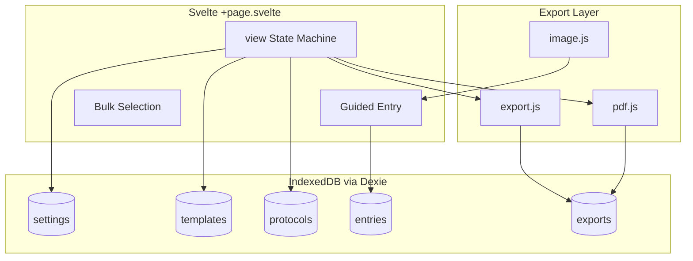

# SiteReport — Technische IST-Dokumentation (PWA)

> **Stand:** Juli 2026  
> **Zweck:** Vollständige Beschreibung des SiteReport-Systems als **Progressive Web App** für Weiterentwicklung ohne Quellcode-Zugriff.  
> **Scope:** Ausschließlich die PWA (`sitereport/`). Keine Expo-App, kein WebView-Wrapper der Toolbox-App.

---

## Inhaltsverzeichnis

1. [Projektübersicht](#1-projektübersicht)
2. [UI/UX](#2-uiux)
3. [Navigation](#3-navigation)
4. [Funktionen](#4-funktionen)
5. [Datenmodell](#5-datenmodell)
6. [Datenhaltung](#6-datenhaltung)
7. [Einstellungen](#7-einstellungen)
8. [Komponenten](#8-komponenten)
9. [Custom Hooks](#9-custom-hooks)
10. [State Management](#10-state-management)
11. [Services](#11-services)
12. [Sicherheit](#12-sicherheit)
13. [Bekannte Probleme](#13-bekannte-probleme)
14. [Architektur](#14-architektur)
15. [Verbesserungspotential](#15-verbesserungspotential)
16. [Zusammenfassung](#16-zusammenfassung)

---

## 1. Projektübersicht

### 1.1 Zweck der Anwendung

**SiteReport** ist eine **offline-fähige Progressive Web App** für Baustellen-Protokolle. Nutzer erstellen Foto-basierte Protokolleinträge, erfassen strukturierte Zusatzdaten über einen **Schritt-für-Schritt-Wizard** und exportieren das Ergebnis als **Excel (XLSX)** und/oder **PDF** — optional mit **Firmenlogo**.

Kernworkflow:

1. Tabellenformat (Spaltenvorlage) wählen oder anlegen
2. Protokoll-Stammdaten erfassen (Titel, Projekt, Datum, Beschreibung, Teilnehmer, Logo)
3. Einträge **schrittweise** erfassen (Foto → Feld → Feld → …)
4. Protokoll abschließen, speichern und exportieren
5. Gespeicherte Protokolle und Export-Cache verwalten (inkl. Bulk-Operationen)

### 1.2 Zielgruppe

- Bauleitung, Polier, Projektleitung auf Baustellen
- Mitarbeitende mit Smartphone/Tablet im Browser oder als installierte PWA
- Nutzer der **BÜW-Toolbox** (Link zurück zu `/baustellen-tools/`)

### 1.3 Aktueller Entwicklungsstand

| Bereich | Status |
|---------|--------|
| Protokoll erstellen/bearbeiten | ✅ Vollständig |
| Guided Entry Flow (Schritt-für-Schritt) | ✅ |
| Format-Builder inkl. Drag-Reorder | ✅ |
| Firmenlogo | ✅ |
| PDF-Export | ✅ |
| XLSX-Export | ✅ |
| Export-Cache (Base64 in IndexedDB) | ✅ |
| Bulk-Auswahl Protokolle/Exporte | ✅ |
| Protokoll löschen (Soft-Delete) | ✅ |
| Stammdaten nachträglich bearbeiten | ✅ (`edit-setup`) |
| PWA-Update-Banner | ✅ |
| Foto-Kompression | ✅ (`browser-image-compression`) |
| Offline-Betrieb | ✅ (Static Build + IndexedDB) |
| Multi-DB-Backup | ❌ |
| Capacitor Native Shell | ⚠️ Dependencies vorhanden, Hauptfokus Web/PWA |
| Cloud-Sync | ❌ |

**Fazit:** Die PWA ist **feature-reicher** als die native Expo-App (Wizard, Bulk, Abschluss-Flow, Stammdaten-Edit). Sie ist die **Referenz-Implementierung** für SiteReport-Funktionalität.

### 1.4 Verwendete Technologien

| Technologie | Version (ca.) | Verwendung |
|-------------|---------------|------------|
| SvelteKit | 2.5.x | SPA-Routing, Static Build |
| Svelte | 4.2.x | UI (monolithisch in einer Datei) |
| Vite | 5.4.x | Build/Dev-Server |
| Dexie | 4.0.x | IndexedDB (Offline-DB) |
| ExcelJS | 4.4.x | XLSX-Generierung |
| pdf-lib | 1.17.x | PDF-Generierung |
| browser-image-compression | 2.0.x | Fotokompression |
| Capacitor (optional) | 6.1.x | Native Datei/Share (iOS/Android Shell) |
| gh-pages | 6.3.x | Deployment |

**Nicht verwendet:** Redux, Zustand, React Query, separate UI-Komponenten-Dateien, Server-API für Kerndaten.

### 1.5 Build & Deployment

| Aspekt | Detail |
|--------|--------|
| Projekt | `sitereport/` |
| Build | `npm run build` → Static Output in `build/` |
| Adapter | `@sveltejs/adapter-static` mit `fallback: index.html` |
| Base Path | `/buew-toolbox/sitereport` (siehe `svelte.config.js`) |
| Deploy | `npm run deploy` → `gh-pages -d build` |
| Dev | `npm run dev` (Vite) |

**Capacitor (optional):**

| Script | Aktion |
|--------|--------|
| `cap:sync` | Web-Build in native Shell synchronisieren |
| `cap:open:android` / `cap:open:ios` | Native IDE öffnen |
| `webDir` | `build/` |
| `appId` | `com.buew.sitereport` |

### 1.6 Projektstruktur

```
/workspace/sitereport/
├── src/
│   ├── routes/
│   │   ├── +layout.svelte           # Globale CSS-Variablen, Body-Styles
│   │   └── +page.svelte             # Gesamte App (~2600 Zeilen, view-basiert)
│   ├── lib/
│   │   ├── db.js                    # Dexie/IndexedDB
│   │   ├── export.js                # XLSX + Browser-Download
│   │   ├── pdf.js                   # PDF-Generierung
│   │   ├── image.js                 # Kompression, Blob-Helfer
│   │   └── native.js                # Capacitor Filesystem/Share
│   └── app.html
├── svelte.config.js                 # Static adapter, base path
├── vite.config.js
├── capacitor.config.json
├── package.json
└── build/                           # Production-Output (nach build)
```

---

## 2. UI/UX

### 2.1 Design Tokens

**Datei:** `sitereport/src/routes/+layout.svelte` (CSS-Variablen)

| Variable | Wert | Verwendung |
|----------|------|------------|
| `--bg` | `#f6f3ee` | Hintergrund (mit radialen Gradients auf `body`) |
| `--ink` | `#151515` | Primärtext |
| `--muted` | `#6a625a` | Sekundärtext |
| `--accent` | `#e07a5f` | Primär-Aktion |
| `--accent-2` | `#3d405b` | Akzent 2 |
| `--panel` | `#fffdf9` | Karten/Panels |
| `--border` | `#e7dfd5` | Rahmen |
| `--radius` | `14px` | Border-Radius |
| Font | IBM Plex Sans | Gesamte App |

**CSS-Klassen (in `+page.svelte`):**

`.panel`, `.section`, `.field`, `.cta-row`, `.export-card`, `.entry-card`, `.modal`, `.modal-backdrop`, `.toast`, `.update-banner`, `.col-card`, `.drag-ghost`, `.summary`, `.table-preview`

---

### 2.2 Landing (`view === 'landing'`)

**Zweck:** Einstieg nach Toolbox-Link.

#### Aufbau

- Hero: „SiteReport", Untertitel „Schrittweise Dokumentation mit Foto und XLSX-Export"
- Link „Zur Toolbox" → `/baustellen-tools/`
- Panel „Protokoll starten":
  - Button „Neues Protokoll starten" (primary, full-width)
  - „Protokolle anzeigen" | „Exports anzeigen"

#### Buttons

| Label | Aktion |
|-------|--------|
| Neues Protokoll starten | `startNewProtocolSetup()` → `view = 'start'` |
| Protokolle anzeigen | `goToProtocols()` |
| Exports anzeigen | `goToExports()` |

---

### 2.3 Protokoll erstellen (`view === 'start'`)

**Zweck:** Stammdaten + Format vor Protokollstart.

#### Aufbau — Stammdaten

- Protokoll-Name (Pflicht, Validierung mit `protocolTitleTouched`)
- Projektname
- Beschreibung
- Anwesende Personen
- Datum (readonly, auto `today()` → DD-MM-YYYY)
- Firmenlogo (File-Input, Vorschau, ändern/entfernen)

#### Aufbau — Tabellenformat

- Info-Button `i` → Popover `showFormatInfo`
- Select: Format auswählen (`applyTemplate` bei change)
- Button „Neues Format anlegen" → Format-Builder
- Tabellenvorschau (HTML `<table>`)
- „Format bearbeiten" (wenn Template gewählt)

#### Buttons

| Label | Aktion |
|-------|--------|
| Protokoll starten | `startProtocol()` — **disabled** wenn kein `selectedTemplateId` |
| Zur Startseite | `view = 'landing'` |

#### Validierung / Fehler

- „Bitte zuerst ein Tabellenformat auswählen."
- „Bitte einen Protokoll-Namen eingeben."

---

### 2.4 Stammdaten bearbeiten (`view === 'edit-setup'`)

Identisch zu `start`, aber:

- Titel: „Vorgang bearbeiten"
- Buttons: „Änderungen speichern" (`saveSetup`) | „Zurück" (`view = 'main'`)
- Erreichbar aus aktiver Protokoll-Ansicht (`main`)

---

### 2.5 Format-Builder (`view === 'format-builder'`)

**Zweck:** Spaltenvorlagen definieren.

#### Modi

| Modus | Variable | Verhalten |
|-------|----------|-----------|
| Neu | `formatMode === 'new'` | Formatname Pflicht, `saveTemplate()` |
| Bearbeiten | `formatMode === 'edit'` | Name unveränderbar, `saveEditedFormat()` |

#### Spalten-Karte

- **Drag-and-Drop** Reorder (`startPointerDrag`, `movePointerDrag`, `endPointerDrag`)
- Drag-Handle `⋮⋮`, Ghost-Element während Drag
- Placeholder an Zielposition
- Inline-Editor: Name, Typ (text/number), Speichern/Abbrechen
- Foto-Spalte: nicht löschbar, Pill „Foto-Spalte"
- „Spalte hinzufügen" (Name + Typ)

#### Buttons

| Label | Aktion |
|-------|--------|
| Format speichern / Änderungen speichern | `saveTemplate` / `saveEditedFormat` |
| Abbrechen | `cancelFormatEdit` (stellt `formatBackup` wieder her) |

#### Besonderheit

Scroll-Lock während Drag (`document.body` fixed positioning).

---

### 2.6 Protokoll-Hauptansicht (`view === 'main'`)

**Zweck:** Aktives Protokoll während Erfassung.

#### Aufbau

- Summary-Grid: Name, Datum, Beschreibung, Teilnehmer, Eintragsanzahl
- Buttons: „Eintrag machen", „Stammdaten bearbeiten", „Protokoll abschließen", „Protokoll verlassen"
- Eintragsliste mit Foto, Feldern, Bearbeiten/Löschen

#### Abschluss-Dialog (`confirmDialog`)

Beim „Protokoll abschließen" (`closeProtocol`):

| Option | Aktion |
|--------|--------|
| Excel herunterladen | `saveAndExportProtocol({ format: 'xlsx' })` + Download |
| PDF herunterladen | `saveAndExportProtocol({ format: 'pdf' })` + Download |
| Nur speichern | `saveProtocol()` |
| Abbrechen | Dialog schließen |

Wenn bestehendes Protokoll ohne Änderungen (`!isDirty`): direkt zur Protokoll-Liste.

#### Verlassen-Dialog

„Protokoll verlassen" → Speichern oder Verwerfen (`cancelProtocol`).

---

### 2.7 Guided Entry — Foto (`view === 'photo'`)

**Zweck:** Wizard-Schritt für Foto-Spalte.

#### Aufbau

- File-Input `accept="image/*"`
- Bildvorschau
- Zurück | Abbrechen | Weiter/Speichern

#### Verarbeitung

`handlePhoto` → `compressImage()` → Blob in `entryDraft.photoFile` → `goNextStep()`

---

### 2.8 Guided Entry — Feld (`view === 'field'`)

**Zweck:** Ein Feld pro Screen im Wizard.

#### Aufbau

- Label = Spaltenname
- Input `text` oder `number`
- Auto-Focus auf Input (`entryInputRef`, `tick()`)
- Zurück | Abbrechen | Weiter/Speichern

#### Ablauf

`entrySteps` = Kopie von `columns` in Reihenfolge. `stepIndex` steuert aktuellen Schritt. Letzter Schritt → `finalizeEntry()` → Dexie `entries` + zurück zu `main`.

---

### 2.9 Protokoll-Ansicht (`view === 'protocol-view'`)

**Zweck:** Gespeichertes Protokoll (readonly-ähnlich) mit Download.

#### Buttons

| Label | Aktion |
|-------|--------|
| Bearbeiten | `view = 'main'` |
| Download | `downloadDialog` (Excel/PDF) |
| Zurück | `goToProtocols()` |

Einträge ohne Bearbeiten/Löschen-Buttons.

---

### 2.10 Protokoll-Liste (`view === 'protocols'`)

**Zweck:** Alle gespeicherten Protokolle.

#### Bulk-Modus

- `selectionModeProtocols` Toggle
- Checkboxen pro Protokoll
- „Auswahl herunterladen" (Excel/PDF-Dialog)
- „Alle auswählen"
- „Löschen" (Soft-Delete, `window.confirm`)

#### Karten

- Projektname, Datum, Beschreibung, Eintragsanzahl
- Button „Öffnen" → `openProtocol(id)` → `protocol-view`

---

### 2.11 Export-Liste (`view === 'exports'`)

**Zweck:** Gecachte Exporte aus IndexedDB.

#### Interaktion

- Klick auf Karte (wenn nicht Bulk-Modus) → `downloadDialog`
- Bulk: Auswahl, Download, Löschen
- Lazy Regenerierung: wenn `base64`/`pdfBase64` fehlt → `ensureExcelExport` / `ensurePdfExport`

#### Anzeige

Projektname, Zeitstempel, Datum.

---

### 2.12 Globale UI-Elemente

#### Update-Banner

- Prüft `/_app/version.json` alle 5 Min + bei `visibilitychange`
- Zeigt Banner „Neue Version verfügbar" + Button „Aktualisieren" (`location.reload()`)

#### Toast

- `toastMessage` unten, auto-hide nach 2s (`toastTimer`)
- Export-Feedback (z. B. „Excel: 5/5 Einträge exportiert")

#### Modals

| Modal | Trigger |
|-------|---------|
| `confirmDialog` | Abschluss, Verlassen, etc. |
| `downloadDialog` | Excel/PDF-Auswahl |

#### Browser-History

- `history.pushState({ view })` bei View-Wechsel
- `popstate` stellt View wieder her
- `suppressHistory` Flag für programmatische Navigation

---

## 3. Navigation

### 3.1 View-State (kein URL-Routing pro View)

Die gesamte App lebt in **einer Datei** (`+page.svelte`). Navigation über State-Variable `view`:

| view-Wert | Bedeutung |
|-----------|-----------|
| `landing` | Start |
| `start` | Neues Protokoll Setup |
| `edit-setup` | Stammdaten bearbeiten (aktives Protokoll) |
| `format-builder` | Spalten-Editor |
| `main` | Aktives Protokoll |
| `protocol-view` | Gespeichertes Protokoll |
| `photo` | Wizard Foto |
| `field` | Wizard Feld |
| `protocols` | Liste |
| `exports` | Export-Cache |

### 3.2 SvelteKit Routing

Technisch nur **eine Route** (`/`). SvelteKit liefert Static SPA; interne Navigation ist rein clientseitig.

**Base Path:** `/buew-toolbox/sitereport` — alle Assets relativ dazu.

### 3.3 Screen-Hierarchie

```
Landing
├── Start (neues Protokoll)
│   └── Format-Builder (modal-artig, view switch)
│       └── Main (aktive Erfassung)
│           ├── Edit-Setup
│           ├── Photo (Wizard)
│           └── Field (Wizard)
├── Protocols (Liste)
│   └── Protocol-View (gespeichert)
├── Exports (Cache)
└── Zur Toolbox (externer Link)
```

**Kein Drawer.** **Keine verschachtelten SvelteKit-Routes.**

---

## 4. Funktionen

### 4.1 Firmenlogo verwalten

| Aspekt | Detail |
|--------|--------|
| Speicher | Data-URL in IndexedDB `settings.id='logo'` |
| Eingabe | `<input type="file" accept="image/*">` → FileReader |
| Ausgabe | In PDF/XLSX Header eingebettet |
| Persistenz | Bleibt über Protokolle hinweg gespeichert |
| Entfernen | `clearLogo()` |

### 4.2 Tabellenformat (Template) verwalten

| Aspekt | Detail |
|--------|--------|
| Standard-Spalten | Bilder (Foto), Kilometer (number), Beschreibung (text), Status (text) |
| Foto-Spalte | Immer vorhanden, nicht löschbar |
| Neues Format | `saveTemplate()` → Dexie `templates` |
| Bearbeiten | `saveEditedFormat()` → `updateTemplate()` |
| Reorder | Drag-and-Drop (Pointer Events) |
| Validierung | Formatname Pflicht bei neu |
| Seed | **Kein Auto-Seed** — Nutzer muss Format anlegen |

### 4.3 Protokoll erstellen

| Eingabe | Detail |
|---------|--------|
| title, project, date, description, attendees | Stammdaten-Formular |
| columns | Snapshot aus gewähltem Template |
| Validierung | Template + Protokollname Pflicht |

**Ablauf:** `startProtocol()` → leert `entries` in IndexedDB, setzt `view='main'`

**Spalten-Snapshot:** `columns` werden ins Protokoll-Record kopiert bei `saveProtocol()`.

**Datum-Format:** `DD-MM-YYYY` via `today()`

### 4.4 Protokoll bearbeiten

| Feld | Editierbar | Wann |
|------|------------|------|
| protocolTitle, projectName, description, attendees | ✅ | `edit-setup` oder vor Start |
| protocolDate | readonly | Auto beim Start |
| Einträge | ✅ | `main` (Wizard) |

**Tracking:** `isDirty` Flag bei Änderungen.

### 4.5 Eintrag hinzufügen (Guided Flow)

| Aspekt | Detail |
|--------|--------|
| Ablauf | Wizard durch alle Spalten in Reihenfolge |
| Foto | Komprimiert via `browser-image-compression` (max 0.6MB, 1600px) |
| Speicherort | `Blob` in IndexedDB `entries` + `protocols.entries` |
| Felder | Key = Spaltenname (`fields[col.name]`) |
| Reihenfolge | Neueste oben (prepend in `entries` Array) |
| Bearbeiten | `editEntry()` → gleicher Wizard mit vorausgefüllten Werten |
| Löschen | `removeEntryItem()` → Dexie delete |

### 4.6 Protokoll abschließen

`closeProtocol()` → `confirmDialog` → `saveAndExportProtocol({ format })`:

1. `saveProtocol()` → Dexie `protocols`
2. Optional Export (XLSX/PDF) → `exportToXlsxData` / `exportToPdfData`
3. `upsertExportByProtocol()` → Export-Cache
4. Download via `downloadExportExcel` / `downloadExportPdf`
5. `resetProtocol()` → Session leeren, `view = 'protocols'`

### 4.7 PDF-Export

**Bibliothek:** `pdf-lib` (`src/lib/pdf.js`)

**Eingabe:** `photoBlob` pro Entry (nicht URI)

**Ausgabe:**

- Web: Base64 → Blob → `<a download>` oder Web Share API (iOS)
- Capacitor: `saveBase64File` + `shareFile`
- Export-Cache: `pdfBase64` in IndexedDB `exports`

**PDF-Inhalt:** A4, Header-Box, Tabelle mit eingebetteten Fotos, Issues-Array (max 20).

### 4.8 XLSX-Export

**Bibliothek:** ExcelJS (`src/lib/export.js`)

**Funktionen:**

| Funktion | Zweck |
|----------|-------|
| `exportToXlsx` | Direkter Download (Browser oder Capacitor) |
| `exportToXlsxData` | Nur Generierung → `{ filename, base64, stats }` |
| `exportToXlsxShare` | Mit externer Share-Funktion |

**Struktur:** Metadaten Zeilen 1–5, Tabellenkopf Zeile 7+, eingebettete Bilder, optionales Logo.

### 4.9 Export-Cache

| Aspekt | Detail |
|--------|--------|
| Speicher | IndexedDB `exports`, **Base64** in Record |
| Key | `id = export_{protocolId}` (upsert) |
| Felder | `filename`, `base64`, `pdfFilename`, `pdfBase64`, `xlsxStats`, `pdfStats` |
| Re-Download | `downloadExportExcel` / `downloadExportPdf` |
| Regenerierung | `ensureExcelExport` / `ensurePdfExport` wenn Base64 fehlt |
| Löschen | `deleteExport` / Bulk `deleteSelectedExports` |

### 4.10 Protokoll-Liste & Bulk

- `listProtocols()` gefiltert `!deleted_at`
- Bulk-Download/-Löschen für mehrere Protokolle
- `deleteProtocol()` = Soft-Delete (`deleted_at` Timestamp)

### 4.11 Einstellungen persistieren

```javascript
// settings.id = 'current'
{
  selectedTemplateId: string,
  columns: Column[]
}
```

`persistSettings()` bei Template-Wechsel und Protokollstart.

### 4.12 Download-Plattformlogik

`downloadFileFromBase64()`:

| Plattform | Verhalten |
|-----------|-----------|
| Capacitor iOS | `saveBase64File` + Share Sheet |
| Capacitor Android | `saveBase64File` + Toast |
| Web (iOS Safari) | Web Share API mit `File` |
| Web (Standard) | `<a download>` oder `window.open` Fallback |

---

## 5. Datenmodell

### 5.1 Spalten-Typ

```javascript
{
  id: string,           // col_{timestamp}_{random}
  name: string,
  type: 'text' | 'number',
  isPhoto: boolean
}
```

### 5.2 Entry

```javascript
{
  id: string,           // entry_{timestamp}_{random}
  createdAt: string,    // ISO
  fields: Record<string, string | number>,
  photoBlob: Blob | null
}
```

UI erweitert mit `photoPreview` (Object URL, nicht persistiert).

### 5.3 Protocol

```javascript
{
  id: string,           // protocol_{timestamp}_{random}
  createdAt: string,
  updatedAt: string,
  protocolTitle: string,
  projectName: string,
  protocolDate: string, // DD-MM-YYYY
  protocolDescription: string,
  attendees: string,
  columns: Column[],
  entries: Entry[],
  deleted_at?: string   // ISO, Soft-Delete
}
```

### 5.4 Template

```javascript
{
  id: string,           // tpl_{timestamp}_{random}
  createdAt: string,
  name: string,
  columns: Column[]
}
```

### 5.5 Export-Record

```javascript
{
  id: string,           // export_{protocolId}
  protocolId: string,
  createdAt: string,
  updatedAt: string,
  projectName: string,
  protocolDate: string,
  filename: string,     // XLSX
  base64: string,       // XLSX Base64
  pdfFilename: string,
  pdfBase64: string,
  xlsxStats: object,
  pdfStats: object
}
```

### 5.6 IndexedDB (Dexie)

**DB-Name:** `SiteReport` (Migration von Legacy `protokoll_app`)

| Store | Key | Indizes | Inhalt |
|-------|-----|---------|--------|
| settings | id | — | `{ id, value }` |
| entries | id | createdAt | **Aktive Session** + Legacy |
| exports | id | createdAt | Export-Cache inkl. Base64 |
| templates | id | createdAt, name | Spaltenvorlagen |
| protocols | id | createdAt, updatedAt | Gespeicherte Protokolle |

**Schema-Versionen:**

| Version | Änderung |
|---------|----------|
| v1 | settings, entries |
| v2 | + exports |
| v3 | + templates |
| v4 | + protocols |

**Legacy-Migration:** Bei Erststart wird `protokoll_app` nach `SiteReport` kopiert (wenn Ziel leer).

**Besonderheit:** `entries` Store dient **parallel** zur aktiven Session; beim Öffnen eines Protokolls werden Entries in `entries` Store gespiegelt (`openProtocol`).

---

## 6. Datenhaltung

### 6.1 IndexedDB

| Aspekt | Detail |
|--------|--------|
| Bibliothek | Dexie 4.x |
| Init | Automatisch bei erstem DB-Zugriff |
| Migration | Dexie `version(1..4)` + manuelle Legacy-Migration |
| Fotos | Als `Blob` in `entries` / `protocols.entries` |
| Exporte | Base64-Strings in `exports` (kann DB groß machen) |
| Logo | Data-URL String in `settings` |

### 6.2 Session vs. Persistenz

| Daten | Wo während Erfassung | Wo nach Abschluss |
|-------|---------------------|-------------------|
| Aktive Entries | `entries` Store + `entries` Array (RAM) | `protocols.entries` |
| Stammdaten | RAM-Variablen | `protocols` Record |
| Settings/Logo | `settings` Store | `settings` Store |

`resetProtocol()` ruft `clearEntries()` und `clearSettings()` auf.

### 6.3 Offlinefähigkeit

- Static Build — keine Server-API für Kerndaten
- IndexedDB für alle App-Daten
- Einziger Netzwerk-Call: `/_app/version.json` für Update-Check
- **Keine Service-Worker-Logik** explizit im Code (SvelteKit Standard-PWA-Verhalten je nach Konfiguration)

### 6.4 Synchronisation

**Nicht vorhanden.** Rein lokale Datenhaltung im Browser.

### 6.5 Autosave

| Bereich | Verhalten |
|---------|-----------|
| Settings/Template | `persistSettings()` bei Template-Wechsel |
| Logo | Sofort nach FileReader |
| Entries | Bei `finalizeEntry()` in Dexie |
| Protokoll | Bei Abschluss / explizitem Speichern |
| `isDirty` | Tracking ungespeicherter Session-Änderungen |

**Kein Debounce** auf Feld-Eingaben im Wizard.

---

## 7. Einstellungen

| Einstellung | Status | Speicherort |
|-------------|--------|-------------|
| Aktives Template | ✅ | settings `current` |
| Spalten-Konfiguration | ✅ | settings `current.columns` |
| Firmenlogo | ✅ | settings `logo` |
| Theme / Dark Mode | ❌ | — |
| Sprache | ❌ Deutsch fest | — |
| Sicherheit/PIN | ❌ | — |
| Export-Defaults | ❌ | — |
| Backup | ❌ | — |

---

## 8. Komponenten

### 8.1 Architektur

**Keine separaten Svelte-Komponenten-Dateien.** Die gesamte UI ist monolithisch in `+page.svelte` (~2624 Zeilen inkl. `<style>`).

### 8.2 UI-Bausteine (inline)

| Baustein | CSS-Klasse | Verwendung |
|----------|------------|------------|
| Panel | `.panel` | Hauptcontainer pro View |
| Section | `.section` | Unterabschnitte |
| Feld | `.field` | Label + Input |
| CTA-Zeile | `.cta-row` | Button-Gruppen |
| Export-Karte | `.export-card` | Protokoll/Export-Liste |
| Eintrag-Karte | `.entry-card` | Foto + Felder |
| Modal | `.modal` + `.modal-backdrop` | Dialoge |
| Toast | `.toast` | Kurz-Feedback |
| Spalten-Karte | `.col-card` | Format-Builder |
| Drag-Ghost | `.drag-ghost` | Drag-Feedback |
| Update-Banner | `.update-banner` | PWA-Update |

### 8.3 Layout

**Datei:** `+layout.svelte` — nur globale Styles und `<slot />`, kein App-Chrome.

---

## 9. Custom Hooks

**Keine.** Svelte verwendet:

- `onMount` für Init, Update-Check, History-Listener
- Reaktive Statements (`$:`) für View-History und Scroll-Lock
- Lokale `let`-Variablen für gesamten State

---

## 10. State Management

| Ansatz | Verwendung |
|--------|------------|
| Svelte `let` Variablen | Gesamter App-State in `+page.svelte` |
| Keine Svelte Stores | — |
| Kein Global Store | — |
| `isDirty` | Tracking ungespeicherter Änderungen |
| `activeProtocolId` | Unterscheidung neu vs. bestehend |
| `selectionModeProtocols/Exports` | Bulk-UI |
| `confirmDialog` / `downloadDialog` | Modal-State als Objekt |

**Datenfluss:**

```
UI Event → async db.js call → lokale Variable aktualisieren
```

---

## 11. Services

### 11.1 `db.js` (Dexie)

| Funktion | Beschreibung |
|----------|--------------|
| loadSettings / saveSettings / clearSettings | Template-Auswahl |
| loadLogo / saveLogo / clearLogo | Firmenlogo |
| listEntries / addEntry / clearEntries / deleteEntry | Session-Entries |
| listTemplates / addTemplate / updateTemplate | Formate |
| listProtocols / addProtocol / getProtocol / deleteProtocol | Protokolle (Soft-Delete) |
| listExports / addExport / deleteExport | Export-Cache |
| upsertExportByProtocol / deleteExportsByProtocol | Export pro Protokoll |

### 11.2 `export.js`

| Funktion | Beschreibung |
|----------|--------------|
| exportToXlsx | Generieren + Browser/Capacitor Download |
| exportToXlsxData | Nur Generierung (für Cache) |
| exportToXlsxShare | Mit Share-Callback |
| buildWorkbook (intern) | ExcelJS-Arbeitsmappe |

### 11.3 `pdf.js`

`exportToPdfData(payload)` → `{ filename, base64, bytes, stats }`

### 11.4 `image.js`

| Funktion | Beschreibung |
|----------|--------------|
| compressImage | browser-image-compression |
| blobToDataUrl | Blob → Data-URL |
| blobToObjectUrl | Blob → Object URL für Vorschau |

### 11.5 `native.js` (Capacitor)

| Funktion | Beschreibung |
|----------|--------------|
| isNativePlatform | Capacitor-Check |
| saveBase64File | Filesystem write (Documents/Cache) |
| shareFile | Capacitor Share Plugin |
| bufferToBase64 | ArrayBuffer → Base64 |
| saveXlsxToFiles / shareXlsx | XLSX-spezifische Helfer |

### 11.6 Kamera / Dateien (Web)

- `<input type="file" accept="image/*">` für Foto und Logo
- Kein direkter Kamera-API-Zugriff (Browser öffnet Kamera über File-Input)

### 11.7 Standort

**Nicht verwendet.**

---

## 12. Sicherheit

### 12.1 Berechtigungen

| Permission | Wann |
|------------|------|
| Datei/Kamera (implizit) | File-Input für Foto/Logo |
| Capacitor Storage (Android) | `Filesystem.requestPermissions` bei Export |

### 12.2 Verschlüsselung

- **Keine** IndexedDB-Verschlüsselung
- Daten liegen im Browser-Speicher des Geräts
- Export-Base64 in IndexedDB unverschlüsselt

### 12.3 Datenschutz

- Alle Daten **lokal im Browser**
- Kein Tracking, keine Analytics
- Einziger externer Request: `version.json` für Update-Check
- Fotos nicht hochgeladen (außer Nutzer teilt manuell)

### 12.4 Soft-Delete

Protokolle werden nicht physisch gelöscht — `deleted_at` gesetzt. Export-Records bleiben ggf. erhalten.

---

## 13. Bekannte Probleme

### 13.1 Bugs / Risiken

| ID | Beschreibung |
|----|--------------|
| B1 | `entries` Store parallel zu `protocols.entries` — historische Dualität, verwirrende Datenhaltung |
| B2 | Spalten umbenennen in Template bricht `fields`-Keys in alten Einträgen |
| B3 | Export-Cache mit Base64 kann IndexedDB sehr groß machen (Quota) |
| B4 | Monolithische `+page.svelte` — schwer wartbar, hohes Merge-Risiko |
| B5 | Kein Auto-Seed für Standard-Template — leerer Erststart ohne Format |
| B6 | `resetProtocol()` löscht `settings` (`clearSettings`) — Template-Auswahl geht verloren |

### 13.2 TODOs / Unfertig

| Bereich | Status |
|---------|--------|
| Multi-DB-Backup | fehlt |
| Cloud-Sync | fehlt |
| Komponenten-Aufspaltung | fehlt |
| Service Worker Caching-Strategie | nicht explizit dokumentiert/implementiert |
| Capacitor als Haupt-Distributionskanal | sekundär zu Web/PWA |

### 13.3 Capacitor vs. PWA

Capacitor-Dependencies sind installiert (`@capacitor/core`, `filesystem`, `share`), aber der **Hauptweg** ist Browser/PWA-Deployment via gh-pages. Native Shell ist vorbereitet, nicht der primäre Release-Pfad.

---

## 14. Architektur

### 14.1 Ordnerstruktur

```
sitereport/src/
├── routes/
│   ├── +layout.svelte      # Design Tokens, Body
│   └── +page.svelte        # UI + Logik + Styles (monolithisch)
└── lib/
    ├── db.js               # IndexedDB (Dexie)
    ├── export.js           # XLSX
    ├── pdf.js              # PDF
    ├── image.js            # Kompression
    └── native.js           # Capacitor
```

### 14.2 Verantwortlichkeiten

| Schicht | Verantwortung |
|---------|---------------|
| `+page.svelte` | UI, Navigation (view), State, Orchestrierung |
| `db.js` | Persistenz, Queries, Migration |
| `export.js` / `pdf.js` | Format-Generierung |
| `image.js` | Bildverarbeitung |
| `native.js` | Capacitor-Bridge für Dateien/Share |

### 14.3 Datenfluss (Export bei Abschluss)

```
entries (RAM + IndexedDB)
  → buildProtocolRecord()
  → addProtocol (protocols Store)
  → exportToXlsxData / exportToPdfData (photoBlob → Base64)
  → upsertExportByProtocol (exports Store, Base64)
  → downloadFileFromBase64 (Browser/Capacitor)
```

### 14.4 Designprinzipien

1. **Offline-first** — IndexedDB, Static Build
2. **Spalten-Snapshot** — Protokoll unabhängig von Template-Änderungen
3. **Guided UX** — ein Feld/Schritt pro Screen
4. **Monolith** — schnelle Entwicklung, eine Datei für alles
5. **Progressive Enhancement** — Web Share API, Capacitor optional

### 14.5 Architektur-Diagramm



---

## 15. Verbesserungspotential

### 15.1 Code-Smells

- **Monolithische PWA** — ~2600 Zeilen in einer Svelte-Datei
- **Dualität entries/protocols.entries** — Session-Store + Protokoll-Store
- **Spaltenname als Field-Key** — fragil bei Umbenennung
- **Base64 in IndexedDB** — Speicher- und Performance-Problem
- **`clearSettings` bei resetProtocol** — unerwarteter Seiteneffekt

### 15.2 Performance

- Große Export-Base64 in IndexedDB
- Viele Object URLs für Foto-Vorschau (kein explizites `revokeObjectURL` überall)
- XLSX mit vielen Bildern → hoher RAM-Bedarf im Browser
- Kein Lazy-Loading für Protokoll-Listen

### 15.3 UX

- Kein Dark Mode
- Status-Feld nicht speziell behandelt (kein Toggle offen/erledigt wie Native)
- `window.confirm` für Bulk-Löschen (nicht styled)
- Format muss manuell angelegt werden (kein Seed)

### 15.4 Architektur

- Komponenten extrahieren (FormatBuilder, EntryWizard, ProtocolList, …)
- Repository-Schicht zwischen UI und `db.js`
- Export-Cache mit Dateisystem (OPFS) statt Base64
- Einheitliches Datenmodell mit Expo-Native für spätere Migration
- Service Worker für explizites Offline-Caching

---

## 16. Zusammenfassung

### Was funktioniert bereits?

| Feature | Status |
|---------|:------:|
| Protokoll erstellen | ✅ |
| Guided Foto-Einträge (Wizard) | ✅ |
| Custom Spalten (Format-Builder + Drag) | ✅ |
| Firmenlogo in Export | ✅ |
| PDF-Export | ✅ |
| XLSX-Export | ✅ |
| Export-Cache | ✅ |
| Offline-Betrieb | ✅ |
| Bulk-Operationen | ✅ |
| Protokoll löschen | ✅ |
| Stammdaten bearbeiten | ✅ |
| PWA-Update-Banner | ✅ |
| Foto-Kompression | ✅ |

### Was fehlt noch?

- Multi-DB-Backup
- Cloud-Sync, Multi-User
- Komponenten-Modularisierung
- Auto-Seed Standard-Template
- Dark Mode
- Explizite Service-Worker-Strategie

### Nächste sinnvolle Entwicklungsschritte

1. **Komponenten-Aufspaltung** — `FormatBuilder.svelte`, `EntryWizard.svelte`, `ProtocolList.svelte`
2. **entries/protocols vereinheitlichen** — Session nur im RAM, Persistenz nur in `protocols`
3. **Export-Cache optimieren** — OPFS oder separate Blob-Storage statt Base64 in IndexedDB
4. **Standard-Template seeden** — wie in Expo-Native bei leerer DB
5. **`resetProtocol` fixen** — `clearSettings` entfernen oder selektiv
6. **Repository-Pattern** — `protocolRepository.js`
7. **Parität mit Expo** — gemeinsame Typen/Export-Payload in `shared/`

---

## Anhang A: Standard-Spalten (defaultColumns)

```javascript
[
  { name: 'Bilder', type: 'text', isPhoto: true },
  { name: 'Kilometer', type: 'number', isPhoto: false },
  { name: 'Beschreibung', type: 'text', isPhoto: false },
  { name: 'Status', type: 'text', isPhoto: false }
]
```

IDs werden via `withColumnIds()` beim Laden ergänzt.

## Anhang B: ID-Generierung

| Entität | Format |
|---------|--------|
| Protocol | `protocol_{timestamp}_{random6}` |
| Template | `tpl_{timestamp}_{random6}` |
| Entry | `entry_{timestamp}_{random10}` |
| Column | `col_{timestamp}_{random6}` |
| Export | `export_{protocolId}` |

## Anhang C: View-State-Machine (Übersicht)

```
landing → start → main ⇄ photo/field
              ↓
         format-builder
main → edit-setup
main → closeProtocol → protocols
protocols → protocol-view → main (bearbeiten)
landing → protocols | exports
```

## Anhang D: Deployment-Pfade

| Umgebung | URL-Pfad |
|----------|----------|
| GitHub Pages | `/buew-toolbox/sitereport/` |
| Toolbox-Link | `/baustellen-tools/` |
| Update-Check | `{base}/_app/version.json` |

## Anhang E: Capacitor-Konfiguration

```json
{
  "appId": "com.buew.sitereport",
  "appName": "SiteReport",
  "webDir": "build",
  "bundledWebRuntime": false
}
```

Workflow: `npm run build` → `npx cap sync` → native IDE.

---

*Ende der IST-Dokumentation (PWA)*
