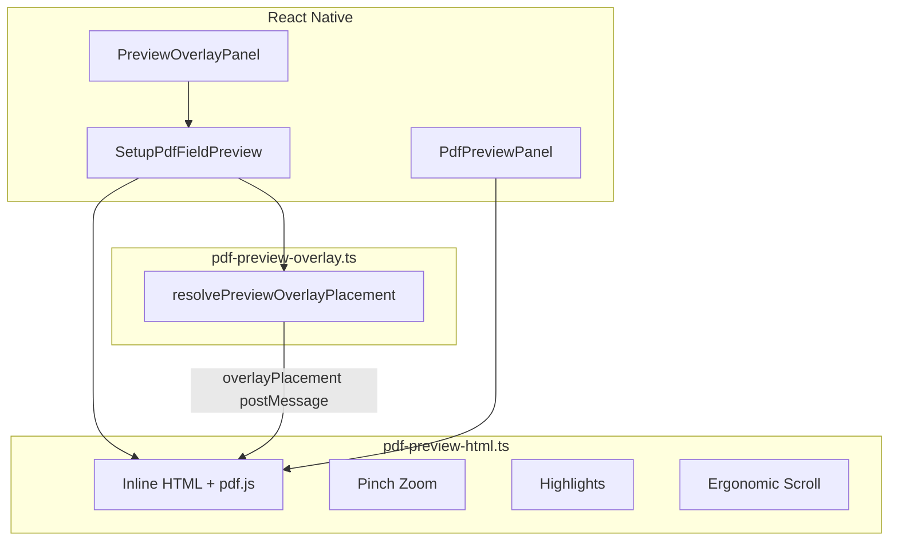

# STEP 2 – PDF Vollbildvorschau & Overlay Engine Auswertung

**Stand:** Nach Optimierung der PDF-Preview-Pipeline  
**Scope:** Nur PDF-Vorschau und Overlay — **keine** Änderungen an Mapping-Logik, Schritt 2, Legacy-Editor, ETB, Datenmodellen oder Wizard-State

---

## 1. Geänderte Dateien

| Datei | Änderung |
|-------|----------|
| `expo-toolbox/src/native/bautagebuch/lib/pdf-preview-html.ts` | **Neu** — zentrale HTML/PDF.js-Engine (Rendering, Zoom, Highlights, Scroll) |
| `expo-toolbox/src/native/bautagebuch/lib/pdf-preview-overlay.ts` | **Neu** — Preview-seitige Overlay-Platzierung inkl. Bottom-Sheet-Fallback |
| `expo-toolbox/src/native/bautagebuch/lib/pdf-preview-overlay.test.ts` | **Neu** — Unit-Tests Overlay-Platzierung |
| `expo-toolbox/src/native/bautagebuch/components/SetupPdfFieldPreview.tsx` | Refactor auf Engine, Safe Area, Overlay-Placement via postMessage |
| `expo-toolbox/src/native/bautagebuch/components/PdfPreviewPanel.tsx` | Gemeinsame Engine, höhere Renderqualität, Vollbild-flex |
| `expo-toolbox/src/native/bautagebuch/components/PreviewOverlayPanel.tsx` | Mobile Vollbild, Safe Area, kompakter Header |

**Unverändert:** `SetupMappingStep`, `SetupFieldSettingsStep`, `SetupEditor`, `setup-mapping.ts`, `types.ts`, ETB-Templates

---

## 2. Rendering-Änderungen

### Pipeline (unverändert grundsätzlich)

```
React Native → WebView (inline HTML) → pdf.js 3.11.174 (CDN) → Canvas
```

### Verbesserungen

| Aspekt | Vorher | Nachher |
|--------|--------|---------|
| **Breite** | max. 860 px CSS | Mapping/Overlay: volle `window.innerWidth` |
| **devicePixelRatio** | max. 3 | bis 4 im High-Quality-Modus |
| **Skalierungsobergrenze** | 2.8 (mapping) | 3.6 (mapping), adaptiv |
| **Canvas-Pixel-Cap** | kein Cap | max. 12 Mio. Pixel (Speicherschutz) |
| **Render-Abbruch** | nur Fallback-Panel | Cancel vor Re-Render (beide Panels) |
| **Scroll-Container** | body padding | `#viewport` 100 % Höhe, interner Scroll |
| **WebView scroll** | `scrollEnabled` | deaktiviert — Scroll nur im HTML-Viewport |

### Qualitätsziel

Kleinere Texte und Feldrahmen profitieren von höherer effektiver Auflösung (`pixelScale` mit DPR-Boost), ohne große PDFs unkontrolliert zu rendern (Pixel-Cap reduziert Scale automatisch).

### Render-Metrik

WebView postet optional `renderMs` in State-Nachrichten — für Performance-Analyse auf Gerät nutzbar.

---

## 3. Overlay-Änderungen

### Feld-Highlights

| Zustand | Darstellung |
|---------|-------------|
| **Aktiv** | 3 px Rand, stärkerer Schatten, Pulse-Animation, volle Opazität |
| **Inaktiv** | Opazität ~32 %, dezenter Rand („ausgegraut“) |

### Ergonomisches Scrollen (`scrollActiveFieldErgonomic`)

Beim Feldwechsel (Mapping-Modus):

1. Seite wechseln falls nötig (`setActive` → `renderPage`)
2. `overlayPlacement` aus React (via `resolvePreviewOverlayPlacement`) an WebView
3. Scroll-Offset berechnet — **nicht** Seitenmitte:

| Overlay-Panel | Feld-Zielposition im Viewport |
|---------------|------------------------------|
| unten (`bottom`) | oberes Drittel (~28 %) |
| oben (`top`) | unteres Drittel (~62 %) |
| links/rechts | ~38 % von oben |
| Bottom-Sheet-Fallback | wie unten |

### Preview-Overlay-Platzierung (`pdf-preview-overlay.ts`)

Spiegelt `resolveOverlayPlacement`-Logik für die Preview-Schicht. Zusätzlich:

- **`bottom-sheet`**: Feld in mittlerer vertikaler Bandzone → Panel als Bottom Sheet empfohlen (Scroll-Bias: unten)

> Hinweis: `GroupOverlayCards` in `SetupMappingStep` nutzt weiterhin `setup-mapping.resolveOverlayPlacement` — bewusst **nicht** geändert. Preview-Engine ist parallel für Scroll-Bias und Dokumentation.

---

## 4. Zoom-Verhalten

### Pinch-Zoom (neu, im HTML-Viewport)

- Zwei-Finger-Geste auf `#viewport`
- Skalierung 1× – 4× auf `#wrap` (Canvas + Overlays gemeinsam)
- Beim Feldwechsel: Zoom-Reset auf 1×
- Kurzer Hinweis „Zwei Finger zum Zoomen“

### Anforderungen

| Anforderung | Status |
|-------------|--------|
| In Feldbereiche hineinzoomen | ✓ Pinch |
| Aktive Markierung sichtbar | ✓ skaliert mit Wrap |
| Feldwechsel funktioniert | ✓ Reset + Re-Render + Scroll |

Native WebView-Zoom deaktiviert (`setBuiltInZoomControls={false}`, `user-scalable=no`).

---

## 5. Performance-Tests

> Cloud-Umgebung ohne Gerät — theoretische Bewertung + Testplan für manuelle Verifikation.

| PDF | Erwartung | Risiko |
|-----|-----------|--------|
| **1 Seite** | Render < 500 ms, flüssiger Feldwechsel | Gering |
| **10 Seiten** | Nur aktive Seite gerendert; Seitenwechsel ~300–800 ms | Mittel (CDN-Latenz) |
| **50 Seiten** | Gleich — Lazy pro Seite; Speicher ~1 Seiten-Canvas | Mittel bei großen Seiten |

### Speicher

- Canvas-Pixel-Cap (12 Mio.) verhindert OOM bei großen Formaten
- `renderTask.cancel()` bei schnellem Feldwechsel

### Manueller Testplan

```text
[ ] 1-Seiten-PDF: Schärfe bei 100 % und 200 % Zoom
[ ] 10-Seiten-PDF: Feld auf Seite 1 → 10 → 1
[ ] Feldwechsel < 500 ms gefühlt (Mid-Range Android)
[ ] Pinch-Zoom + Feldwechsel → Highlight korrekt
[ ] Offline (Flugmodus): CDN-Fallback-Verhalten prüfen
```

---

## 6. Screenshots vorher / nachher

Keine Geräte-Screenshots in der Cloud-Umgebung.

| Szenario | Vorher | Nachher (erwartet) |
|----------|--------|---------------------|
| Mapping-Ansicht | Feste Panel-Höhe ~62 % | PDF füllt verfügbaren Raum (`flex: 1`) |
| Highlight | Pulse, dim | Stärkerer Kontrast, klarere Dim-Darstellung |
| Zoom | nicht verfügbar | Pinch 1–4× |
| Overlay-Modal | ScrollView-Wrapper | Vollbild mit Safe Area |
| Feld unten | scrollIntoView center | Feld im oberen Drittel |

---

## 7. Offline-Prüfung (pdf.js CDN)

### Aktuell

| Ressource | Quelle |
|-----------|--------|
| `pdf.min.js` | CDN cdnjs 3.11.174 |
| `pdf.worker.min.js` | CDN cdnjs 3.11.174 |

### Bereits lokal im Projekt

| Datei | Pfad | Version |
|-------|------|---------|
| Worker | `expo-toolbox/assets/pdf.worker.min.mjs` | pdfjs-dist (Scan-Pipeline) |

### Migration möglich? **Ja — dokumentiert, nicht umgesetzt**

Schritte für vollständige Offline-Vorschau:

1. `pdf.min.js` (3.11.174) nach `expo-toolbox/assets/pdf.min.js` kopieren (CDN-Gleichstand mit WebView)
2. In `pdf-preview-html.ts` → `pdfJsScriptTags()`:
   - PDF via `expo-file-system` als String lesen
   - Inline `<script>${pdfJsSource}</script>` statt CDN-`<script src>`
3. Worker-URL auf `Asset.fromModule(require('.../pdf.worker.min.mjs')).localUri` setzen (wie `pdf-scan.web.ts`)
4. HTML-Größe steigt (~500 KB+) — WebView-Init langsamer, dafür offline-fähig

### Risiko bei CDN (bestehend)

- Flugmodus / blockiertes CDN → Fallback `PdfPreviewPanel` ohne Feld-Overlays
- Keine vollständige Offline-Migration in STEP 2 (laut Vorgabe)

---

## 8. Offene Probleme

| Problem | Schwere | Hinweis |
|---------|---------|---------|
| CDN-Abhängigkeit | Hoch (offline) | Siehe Migrationsplan oben |
| Native Scan ohne Rects | Hoch | Kein Preview-Problem — fehlende `rect`-Daten |
| Pinch + Panel-Overlay | Mittel | Bei starkem Zoom kann Footer-Panel PDF verdecken — Mapping-Footer außerhalb WebView |
| pdf.js Versionen | Niedrig | Preview 3.11.174 vs. Scan 4.8.69 — getrennte Pfade |
| Bottom-Sheet UI | Niedrig | `bottom-sheet` Placement nur in Preview-Logik — RN Bottom Sheet nicht implementiert |

---

## 9. Empfehlungen

1. **Offline-Bundle:** `pdf.min.js` + Worker lokal einbinden (Schritte oben) — höchste Priorität für Baustellen-Offline-Nutzung
2. **Native Vollscan:** Rects auf iOS/Android für Highlights (separates STEP, nicht Preview)
3. **Render-Cache:** Letzte N Seiten-Bitmaps cachen bei 50+ Seiten-PDFs
4. **Bottom-Sheet-Komponente:** Wenn `resolvePreviewOverlayPlacement` → `bottom-sheet`, `GroupOverlayCards` optional als echtes RN Bottom Sheet (nur wenn Mapping-UI erweiterbar)
5. **Performance-Telemetry:** `renderMs` optional an Analytics senden

---

## Architektur-Diagramm


